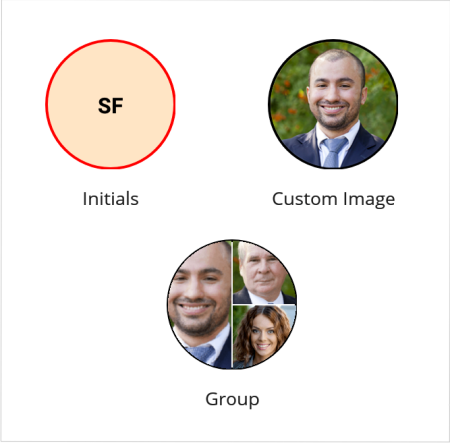

# .NET MAUI Avatar View (SfAvatarView) Overview

The [.NET MAUI Avatar View](https://help.syncfusion.com/cr/maui/Syncfusion.Maui.Core.SfAvatarView.html?tabs=tabid-1) control provides a graphical representation of a user's image. It allows customization of the view by adding an image, background color, icon, and text.

## Business use cases

- User profile images in social or business apps.  
- Chat or messaging interfaces showing user identity.  
- Team or group member displays for collaboration apps.  
- Notification icons with user badges or status indicators.  

## Key features

- **Image and initials** displays user avatars using profile images or fallback initials.
- **View** customizes size, background color, border, and corner radius.  
- **Group view support** combines up to three images or initials within a single view.
- **Visual styles** apply different appearance styles.  
- **BadgeView** integrates with BadgeView to display notifications or status indicators.

## Globalization

The following table summarizes the globalization support available in this control.

    
    Full Support

    
    Not Applicable

<table>
<tr>
<th align="center">Control</th>
<th align="center">Localization</th>
<th align="center">RTL</th>
<th align="center">Time zone</th>
<th align="center">Screen reader</th>
<th align="center">Keyboard navigation</th>
</tr>
<tr>
<td><a href="/maui/avatar-view/overview">Avatar View</a></td>
<td align="center"></td>
<td align="center"></td>
<td align="center"></td>
<td align="center"></td>
<td align="center"></td>
</tr> 
</table>

## Related controls

- [BadgeView](https://help.syncfusion.com/maui/badge-view/overview) for displaying notifications or status indicators on avatars.  
- [ListView](https://help.syncfusion.com/maui/listview/overview) for presenting user lists with avatar support.  
- [Chat](https://help.syncfusion.com/maui/chat/overview) for showing user avatars in conversations.  

## See Also

Explore further resources:

- [Getting Started](https://help.syncfusion.com/maui/avatar-view/getting-started) shows how to begin using AvatarView step by step.  
- [Content Type](https://help.syncfusion.com/maui/avatar-view/content-type) explains how to configure avatar content such as images or initials.  
- [Customization](https://help.syncfusion.com/maui/avatar-view/customization) shows how to style and customize AvatarView. 
- [UI Kit](https://www.syncfusion.com/demos/maui#maui-ui-control) provides interactive demos and ready-made UI examples.  

## Resources

<!-- Card 1 -->
<a href="https://www.syncfusion.com/maui-controls/maui-avatarview" class="form-card" target="_blank">
  

    <h3 class="form-title">Feature Tour</h3>
    

      Walk through highlights and core capabilities.
    

  

</a>
<!-- Card 2 -->
<a href="https://github.com/syncfusion/maui-demos/tree/master/MAUI/AvatarView" class="form-card" target="_blank">
  

    <h3 class="form-title">Showcase Samples</h3>
    

      Explore sample scenarios for real apps.
    

  

</a>
<!-- Card 3 -->
<a href="https://www.syncfusion.com/tutorial-videos/maui/avatarview" class="form-card" target="_blank">
  

    <h3 class="form-title">Tutorial Videos</h3>
    

      Step‑by‑step guidance through video tutorials.
    

  

</a>
<!-- Card 4 -->
<a href="https://support.syncfusion.com/kb/cross-platforms/category/76" class="form-card" target="_blank">
  

    <h3 class="form-title">Explore KB's</h3>
    

      Find quick solutions and step‑by‑step guidance.
    

  

</a>
<!-- Card 5 -->
<a href="https://www.syncfusion.com/blogs/category/net-maui" class="form-card" target="_blank">
  

    <h3 class="form-title">Explore Blogs</h3>
    

      Read insights, tutorials, and developer journeys.
    

  

</a>