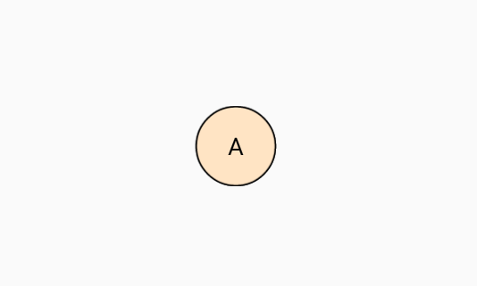
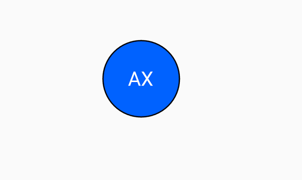
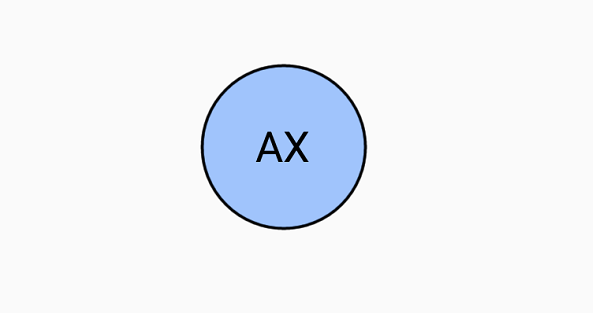
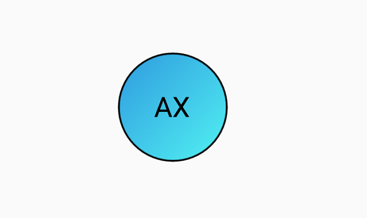

# Customization in SfAvatarView

## Customization in .NET MAUI Avatar View(SfAvatarView)

The [SfAvatarView](https://help.syncfusion.com/cr/maui/Syncfusion.Maui.Core.SfAvatarView.html?tabs=tabid-1) control provides options to customize the color and size. The control can be customized using the following properties:

## Aspect

The [Aspect](https://help.syncfusion.com/cr/maui/Syncfusion.Maui.Core.SfAvatarView.html#Syncfusion_Maui_Core_SfAvatarView_Aspect) property in [SfAvatarView](https://help.syncfusion.com/cr/maui/Syncfusion.Maui.Core.SfAvatarView.html?tabs=tabid-1) controls how the picture is adjusted to fit the display. By default, its set to `AspectFill`.

* AspectFit: Ensures the entire picture fits, adding space if needed.
* AspectFill: Clips the image to fill the display while keeping its shape.
* Fill: Stretches the image to fill the entire display, but it may look distorted.
* Center: Places the image in the center, maintaining its original shape.





<Grid>
    <sfavatar:SfAvatarView ContentType="Default"  
                           AvatarShape="Circle"
                           AvatarSize="Large"
                           StrokeThickness="1"
                           Stroke="Black"
                           HorizontalOptions="Center"
                           VerticalOptions="Center"
                           ImageSource="person.png"
                           Aspect="AspectFit">
    </sfavatar:SfAvatarView>
</Grid>





Grid mainGrid = new Grid();
SfAvatarView avatarview = new SfAvatarView();
avatarview.ContentType = ContentType.Default;
avatarview.AvatarShape = AvatarShape.Circle;
avatarview.AvatarSize = AvatarSize.Large;
avatarview.VerticalOptions = LayoutOptions.Center;
avatarview.HorizontalOptions = LayoutOptions.Center;
avatarview.ImageSource = "person.png";
avatarview.Aspect = Aspect.AspectFit;
avatarview.Stroke = Colors.Black;
avatarview.StrokeThickness = 1;
mainGrid.Children.Add(avatarview);
this.Content = mainGrid;





## Colors

Color in the [SfAvatarView](https://help.syncfusion.com/cr/maui/Syncfusion.Maui.Core.SfAvatarView.html?tabs=tabid-1) can be customized by the stroke, the default background color, and automatic background color.

### Stroke

The [Stroke](https://help.syncfusion.com/cr/maui/Syncfusion.Maui.Core.SfAvatarView.html#Syncfusion_Maui_Core_SfAvatarView_Stroke) property is used for setting color to the stroke of [SfAvatarView](https://help.syncfusion.com/cr/maui/Syncfusion.Maui.Core.SfAvatarView.html?tabs=tabid-1).





<Grid>
    <sfavatar:SfAvatarView ContentType="Default"  
                           AvatarShape="Circle"
                           AvatarSize="Large"
                           HorizontalOptions="Center"
                           VerticalOptions="Center"
                           ImageSource="ellanaa.png"
                           StrokeThickness="1"
                           Stroke="Red">
    </sfavatar:SfAvatarView>
</Grid>





Grid mainGrid = new Grid();
SfAvatarView avatarview = new SfAvatarView();
avatarview.ContentType = ContentType.Default;
avatarview.AvatarShape = AvatarShape.Circle;
avatarview.AvatarSize = AvatarSize.Large;
avatarview.VerticalOptions = LayoutOptions.Center;
avatarview.HorizontalOptions = LayoutOptions.Center;
avatarview.ImageSource = "ellanaa.png";
avatarview.Stroke = Colors.Red;
avatarview.StrokeThickness = 1;
mainGrid.Children.Add(avatarview);
this.Content = mainGrid;





### Default background color

The background color for the SfAvatarView control can be set using the [AvatarColorMode](https://help.syncfusion.com/cr/maui/Syncfusion.Maui.Core.SfAvatarView.html#Syncfusion_Maui_Core_SfAvatarView_AvatarColorMode) property. When the [AvatarColorMode](https://help.syncfusion.com/cr/maui/Syncfusion.Maui.Core.SfAvatarView.html#Syncfusion_Maui_Core_SfAvatarView_AvatarColorMode)  property is set to default, it displays the background color set in the [Background](https://help.syncfusion.com/cr/maui/Syncfusion.Maui.Core.SfAvatarView.html#Syncfusion_Maui_Core_SfAvatarView_Background) property.





<Grid>
    <sfavatar:SfAvatarView ContentType="Initials"
                           AvatarShape="Circle"
                           AvatarSize="Large"
                           HorizontalOptions="Center"
                           VerticalOptions="Center"
                           AvatarName="Alex"          
                           Background="Bisque"
                           AvatarColorMode="Default"
                           StrokeThickness="1"
                           Stroke="Black"
                           InitialsColor="Black">
    </sfavatar:SfAvatarView>
</Grid>
      





Grid mainGrid = new Grid();
SfAvatarView avatarview = new SfAvatarView();
avatarview.ContentType = ContentType.Initials;
avatarview.AvatarShape = AvatarShape.Circle;
avatarview.AvatarSize = AvatarSize.Large;
avatarview.VerticalOptions = LayoutOptions.Center;
avatarview.HorizontalOptions = LayoutOptions.Center;
avatarview.AvatarName = "Alex";
avatarview.Stroke = Colors.Black;
avatarview.StrokeThickness = 1;
avatarview.InitialsColor = Colors.Black;
avatarview.AvatarColorMode = AvatarColorMode.Default;
avatarview.Background = Colors.Bisque;
mainGrid.Children.Add(avatarview);
this.Content = mainGrid;





### Automatic background color

The [SfAvatarView](https://help.syncfusion.com/cr/maui/Syncfusion.Maui.Core.SfAvatarView.html) control allows automatic background color while initializing. It contains the following properties:

* `DarkBackground`: Shows a dark color for the initials and background color.
* `LightBackground`: Shows a light color for the initials and background color.

#### Dark color

The dark background color can be set using `DarkBackground` in the [AvatarColorMode](https://help.syncfusion.com/cr/maui/Syncfusion.Maui.Core.SfAvatarView.html#Syncfusion_Maui_Core_SfAvatarView_AvatarColorMode) property.





<Grid>
    <sfavatar:SfAvatarView ContentType="Initials"
                           InitialsType="DoubleCharacter"
                           AvatarShape="Circle"
                           AvatarSize="Large"
                           HorizontalOptions="Center"
                           VerticalOptions="Center"
                           AvatarName="Alex"
                           AvatarColorMode="DarkBackground"
                           StrokeThickness="1"
                           Stroke="Black">
    </sfavatar:SfAvatarView>
</Grid>





Grid mainGrid = new Grid();
SfAvatarView avatarview = new SfAvatarView();
avatarview.VerticalOptions = LayoutOptions.Center;
avatarview.HorizontalOptions = LayoutOptions.Center;
avatarview.AvatarShape = AvatarShape.Circle;
avatarview.AvatarSize = AvatarSize.Large;
avatarview.ContentType = ContentType.Initials;
avatarview.InitialsType = InitialsType.DoubleCharacter;
avatarview.AvatarName = "Alex";
avatarview.Stroke = Colors.Black;
avatarview.StrokeThickness = 1;
avatarview.AvatarColorMode = AvatarColorMode.DarkBackground;
mainGrid.Children.Add(avatarview);
this.Content = mainGrid;





#### Light color

The light background color can be set using `LightBackground` in the [AvatarColorMode](https://help.syncfusion.com/cr/maui/Syncfusion.Maui.Core.SfAvatarView.html#Syncfusion_Maui_Core_SfAvatarView_AvatarColorMode)   property.





<Grid>
    <sfavatar:SfAvatarView ContentType="Initials"
                           InitialsType="DoubleCharacter"
                           VerticalOptions="Center"
                           AvatarName="Alex"
                           AvatarShape="Circle"
                           AvatarSize="Large"
                           AvatarColorMode="LightBackground"
                           Stroke="Black"
                           StrokeThickness="1"
                           HorizontalOptions="Center" >
    </sfavatar:SfAvatarView>
</Grid>




  
Grid mainGrid = new Grid();
SfAvatarView avatarview = new SfAvatarView();
avatarview.VerticalOptions = LayoutOptions.Center;
avatarview.HorizontalOptions = LayoutOptions.Center;
avatarview.AvatarShape = AvatarShape.Circle;
avatarview.AvatarSize = AvatarSize.Large;
avatarview.ContentType = ContentType.Initials;
avatarview.InitialsType = InitialsType.DoubleCharacter;
avatarview.AvatarName = "Alex";
avatarview.Stroke = Colors.Black;
avatarview.AvatarColorMode = AvatarColorMode.LightBackground;
avatarview.Stroke = Colors.Black;
avatarview.StrokeThickness = 1;
mainGrid.Children.Add(avatarview);
this.Content = mainGrid;





### Gradients

You can also specify a range of colors using `LinearGradientBrush` in [Background](https://help.syncfusion.com/cr/maui/Syncfusion.Maui.Core.SfAvatarView.html#Syncfusion_Maui_Core_SfAvatarView_Background) Property as demonstrated in the following code example.





<sfavatar:SfAvatarView ContentType="Initials" 
                       AvatarName="Alex"
                       AvatarShape="Circle"
                       AvatarSize="Large"
                       HorizontalOptions="Center"
                       VerticalOptions="Center"      
                       InitialsType="DoubleCharacter"
                       StrokeThickness="1"
                       Stroke="Black">
    <sfavatar:SfAvatarView.Background>
        <LinearGradientBrush StartPoint="0,0"
                 EndPoint="1,0">
            <GradientStop Color="#2F9BDF" Offset="0"/>
            <GradientStop Color="#51F1F2" Offset="1"/>
        </LinearGradientBrush>
    </sfavatar:SfAvatarView.Background>
</sfavatar:SfAvatarView>
  





Grid mainGrid = new Grid();
SfAvatarView avatarview = new SfAvatarView();
avatarview.VerticalOptions = LayoutOptions.Center;
avatarview.HorizontalOptions = LayoutOptions.Center;
avatarview.AvatarShape = AvatarShape.Circle;
avatarview.AvatarSize = AvatarSize.Large;
avatarview.ContentType = ContentType.Initials;
avatarview.InitialsType = InitialsType.DoubleCharacter;
avatarview.AvatarName = "Alex";
avatarview.Stroke = Colors.Black;
avatarview.StrokeThickness = 1;
avatarview.Background = new LinearGradientBrush()
{
    StartPoint = new Point(0, 0),
    EndPoint = new Point(1, 0),
    GradientStops = new GradientStopCollection()
    {
        new GradientStop() { Color = Color.FromArgb("#2F9BDF"), Offset = 0 },
        new GradientStop() { Color = Color.FromArgb("#51F1F2"), Offset = 1 }
    }
};
mainGrid.Children.Add(avatarview);
this.Content = mainGrid;





## Sizing

In the [SfAvatarView](https://help.syncfusion.com/cr/maui/Syncfusion.Maui.Core.SfAvatarView.html) control, size of the view can be controlled using width, height, stroke thickness, and corner radius.

### Width

You can customize the width of the avatar view using the [WidthRequest](https://help.syncfusion.com/cr/maui/Syncfusion.Maui.Core.SfAvatarView.html#Syncfusion_Maui_Core_SfAvatarView_WidthRequest) property.

### Height

You can customize the height of the avatar view using the  [HeightRequest](https://help.syncfusion.com/cr/maui/Syncfusion.Maui.Core.SfAvatarView.html#Syncfusion_Maui_Core_SfAvatarView_HeightRequest) property.

### Stroke Thickness

You can customize the thickness of the avatar view using the [StrokeThickness](https://help.syncfusion.com/cr/maui/Syncfusion.Maui.Core.SfAvatarView.html#Syncfusion_Maui_Core_SfAvatarView_StrokeThickness) property.





<Grid>
    <sfavatar:SfAvatarView ContentType="Default"
                           AvatarShape="Circle"
                           AvatarSize="Large"
                           ImageSource="ellanaa.png"
                           Stroke="Black" 
                           VerticalOptions="Center"
                           StrokeThickness="4"
                           HorizontalOptions="Center" >
    </sfavatar:SfAvatarView>
</Grid>





Grid mainGrid = new Grid();
SfAvatarView avatarview = new SfAvatarView();
avatarview.HorizontalOptions = LayoutOptions.Center;
avatarview.VerticalOptions = LayoutOptions.Center;
avatarview.AvatarShape = AvatarShape.Circle;
avatarview.AvatarSize = AvatarSize.Large;
avatarview.StrokeThickness = 4;
avatarview.Stroke = Colors.Black;
avatarview.ContentType = ContentType.Default;
avatarview.ImageSource = "ellanaa.png";
mainGrid.Children.Add(avatarview);
this.Content = mainGrid;





### Corner radius

You can customize the corner radius of the avatar view using the [CornerRadius](https://help.syncfusion.com/cr/maui/Syncfusion.Maui.Core.SfAvatarView.html#Syncfusion_Maui_Core_SfAvatarView_CornerRadius) property.





<Grid>
    <sfavatar:SfAvatarView ContentType="Default"
                           ImageSource="ellanaa.png"
                           HorizontalOptions="Center"
                           VerticalOptions="Center"   
                           WidthRequest="60"
                           HeightRequest="60"
                           CornerRadius="20"
                           StrokeThickness="1"
                           Stroke="Black">
    </sfavatar:SfAvatarView>
</Grid>





Grid mainGrid = new Grid();
SfAvatarView avatarview = new SfAvatarView();
avatarview.HorizontalOptions = LayoutOptions.Center;
avatarview.VerticalOptions = LayoutOptions.Center;
avatarview.WidthRequest = 60;
avatarview.HeightRequest = 60;
avatarview.CornerRadius = 20;
avatarview.ImageSource = "ellanaa.png";
avatarview.ContentType = ContentType.Default;
avatarview.Stroke = Colors.Black;
avatarview.StrokeThickness = 1;
mainGrid.Children.Add(avatarview);
this.Content = mainGrid;





### Content Padding

You can customize the spacig between the stroke and content in view using the [ContentPadding](https://help.syncfusion.com/cr/maui/Syncfusion.Maui.Core.SfAvatarView.html#Syncfusion_Maui_Core_SfAvatarView_ContentPadding) property.





 <Grid>
     <sfavatar:SfAvatarView ContentType="Default"
                            ImageSource="twitter.png"
                            HorizontalOptions="Center"
                            VerticalOptions="Center"  
                            Stroke="Black"
                            StrokeThickness="1"
                            ContentPadding="10"
                            AvatarShape="Circle">
     </sfavatar:SfAvatarView>
 </Grid>





Grid mainGrid = new Grid();
SfAvatarView avatarview = new SfAvatarView();
avatarview.ImageSource = "twitter.png";
avatarview.StrokeThickness = 1;
avatarview.Stroke = Colors.Black;
avatarview.ContentPadding = 10;
avatarview.ContentType = ContentType.Default;
avatarview.AvatarShape = AvatarShape.Circle;
mainGrid.Children.Add(avatarview);
this.Content = mainGrid;





