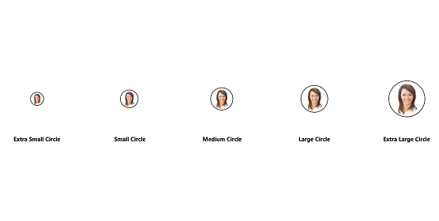
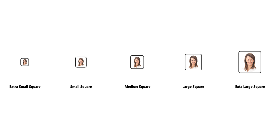

# Visual Style in .NET MAUI Avatar View(SfAvatarView) 

## Visual styles in .NET MAUI Avatar View(SfAvatarView)
The [SfAvatarView](https://help.syncfusion.com/cr/maui/Syncfusion.Maui.Core.SfAvatarView.html?tabs=tabid-1) control supports customization using the following built-in visual styles:

* Custom
* Circle
* Square

## Custom

Custom type allows you to customize the control, where you can handle the size, colors, images, etc. of the control. Refer to this Customization documentation in [SfAvatarView](https://help.syncfusion.com/cr/maui/Syncfusion.Maui.Core.SfAvatarView.html?tabs=tabid-1)

N> The default visual type is custom.

## Circle

You can directly set value to the circle in the [SfAvatarView](https://help.syncfusion.com/cr/maui/Syncfusion.Maui.Core.SfAvatarView.html?tabs=tabid-1) using the following styles:

* ExtraLargeCircle
* LargeCircle
* MediumCircle
* SmallCircle
* ExtraSmallCircle

The following code sample demonstrates how to define visual style of circle AvatarView.





<ContentPage.Resources>
    <ResourceDictionary>
        
    </ResourceDictionary>
</ContentPage.Resources>

<ContentPage.Content>
<StackLayout Orientation="Vertical" HorizontalOptions="CenterAndExpand" VerticalOptions="CenterAndExpand">
    <Grid >
            <Grid.RowDefinitions>
                <RowDefinition Height="*"/>
                <RowDefinition Height="*"/>
            </Grid.RowDefinitions>
            <Grid.ColumnDefinitions>
                <ColumnDefinition Width="*"/>
                <ColumnDefinition Width="*"/>
                <ColumnDefinition Width="*"/>
                <ColumnDefinition Width="*"/>
                <ColumnDefinition Width="*"/>
            </Grid.ColumnDefinitions>

            <sfavatar:SfAvatarView AvatarShape="Circle" AvatarSize="ExtraLarge" Grid.Row="0" Grid.Column="4" Style="{StaticResource AvatarViewStyle}"/>
            <Label Text="ExtraLargeCircle" FontAttributes="Bold" Grid.Row="1" HorizontalOptions="Center" VerticalOptions="Center" HorizontalTextAlignment="Center" VerticalTextAlignment="Center" Grid.Column="4" FontSize="10"/>
            <sfavatar:SfAvatarView AvatarShape="Circle" AvatarSize="Large" Grid.Row="0" Grid.Column="3" Style="{StaticResource AvatarViewStyle}"/>
            <Label Text="LargeCircle" FontAttributes="Bold" Grid.Row="1" HorizontalOptions="Center" VerticalOptions="Center" HorizontalTextAlignment="Center" VerticalTextAlignment="Center" Grid.Column="3" FontSize="10"/>
            <sfavatar:SfAvatarView AvatarShape="Circle" AvatarSize="Medium" Grid.Row="0" Grid.Column="2" Style="{StaticResource AvatarViewStyle}"/>
            <Label Text="MediumCircle" FontAttributes="Bold" Grid.Row="1" HorizontalOptions="Center" VerticalOptions="Center" HorizontalTextAlignment="Center" VerticalTextAlignment="Center" Grid.Column="2" FontSize="10"/>
            <sfavatar:SfAvatarView AvatarShape="Circle" AvatarSize="Small" Grid.Row="0" Grid.Column="1" Style="{StaticResource AvatarViewStyle}"/>
            <Label Text="SmallCircle" FontAttributes="Bold" Grid.Row="1" HorizontalOptions="Center" VerticalOptions="Center" HorizontalTextAlignment="Center" VerticalTextAlignment="Center" Grid.Column="1" FontSize="10"/>
            <sfavatar:SfAvatarView AvatarShape="Circle" AvatarSize="ExtraSmall" Grid.Row="0" Grid.Column="0" Style="{StaticResource AvatarViewStyle}"/>
            <Label Text="ExtraSmallCircle" FontAttributes="Bold" Grid.Row="1" HorizontalOptions="Center" VerticalOptions="Center" HorizontalTextAlignment="Center" VerticalTextAlignment="Center" Grid.Column="0" FontSize="10"/>
    </Grid>
</StackLayout>
</ContentPage.Content>





StackLayout stack = new StackLayout();
stack.Orientation = StackOrientation.Vertical;
stack.HorizontalOptions = LayoutOptions.CenterAndExpand;
stack.VerticalOptions = LayoutOptions.CenterAndExpand;

Grid mainGrid = new Grid();
mainGrid.RowDefinitions.Add(new RowDefinition { Height = new GridLength(1, GridUnitType.Star) });
mainGrid.RowDefinitions.Add(new RowDefinition { Height = new GridLength(1, GridUnitType.Star) });

mainGrid.ColumnDefinitions.Add(new ColumnDefinition { Width = new GridLength(1, GridUnitType.Star) });
mainGrid.ColumnDefinitions.Add(new ColumnDefinition { Width = new GridLength(1, GridUnitType.Star) });
mainGrid.ColumnDefinitions.Add(new ColumnDefinition { Width = new GridLength(1, GridUnitType.Star) });
mainGrid.ColumnDefinitions.Add(new ColumnDefinition { Width = new GridLength(1, GridUnitType.Star) });
mainGrid.ColumnDefinitions.Add(new ColumnDefinition { Width = new GridLength(1, GridUnitType.Star) });

Label XLargeCirclelabel = new Label();
XLargeCirclelabel.Text = "ExtraLargeCircle";
XLargeCirclelabel.FontSize = 12;
XLargeCirclelabel.FontAttributes = FontAttributes.Bold;
XLargeCirclelabel.HorizontalOptions = LayoutOptions.Center;
XLargeCirclelabel.VerticalOptions = LayoutOptions.Center;
XLargeCirclelabel.HorizontalTextAlignment = TextAlignment.Center;
XLargeCirclelabel.VerticalTextAlignment = TextAlignment.Center;
XLargeCirclelabel.FontSize = 10;

SfAvatarView avatarview1 = new SfAvatarView();
avatarview1.VerticalOptions = LayoutOptions.Center;
avatarview1.HorizontalOptions = LayoutOptions.Center;
avatarview1.AvatarShape = AvatarShape.Circle;
avatarview1.AvatarSize = AvatarSize.ExtraLarge;
avatarview1.ContentType = ContentType.Default;
avatarview1.ImageSource = "ellanaa.png";
avatarview1.Stroke = Colors.Black;
avatarview1.StrokeThickness = 1;

Label LargeCirclelabel = new Label();
LargeCirclelabel.Text = "LargeCircle";
LargeCirclelabel.FontSize = 12;
LargeCirclelabel.FontAttributes = FontAttributes.Bold;
LargeCirclelabel.HorizontalOptions = LayoutOptions.Center;
LargeCirclelabel.VerticalOptions = LayoutOptions.Center;
LargeCirclelabel.HorizontalTextAlignment = TextAlignment.Center;
LargeCirclelabel.VerticalTextAlignment = TextAlignment.Center;
LargeCirclelabel.FontSize = 10;

SfAvatarView avatarview2 = new SfAvatarView();
avatarview2.VerticalOptions = LayoutOptions.Center;
avatarview2.HorizontalOptions = LayoutOptions.Center;
avatarview2.AvatarShape = AvatarShape.Circle;
avatarview2.AvatarSize = AvatarSize.Large;
avatarview2.ContentType = ContentType.Default;
avatarview2.ImageSource = "ellanaa.png";
avatarview2.Stroke = Colors.Black;
avatarview2.StrokeThickness = 1;

Label MediumCirclelabel = new Label();
MediumCirclelabel.Text = "MediumCircle";
MediumCirclelabel.FontSize = 12;
MediumCirclelabel.FontAttributes = FontAttributes.Bold;
MediumCirclelabel.HorizontalOptions = LayoutOptions.Center;
MediumCirclelabel.VerticalOptions = LayoutOptions.Center;
MediumCirclelabel.HorizontalTextAlignment = TextAlignment.Center;
MediumCirclelabel.VerticalTextAlignment = TextAlignment.Center;
MediumCirclelabel.FontSize = 10;

SfAvatarView avatarview3 = new SfAvatarView();
avatarview3.VerticalOptions = LayoutOptions.Center;
avatarview3.HorizontalOptions = LayoutOptions.Center;
avatarview3.AvatarShape = AvatarShape.Circle;
avatarview3.AvatarSize = AvatarSize.Medium;
avatarview3.ContentType = ContentType.Default;
avatarview3.ImageSource = "ellanaa.png";
avatarview3.Stroke = Colors.Black;
avatarview3.StrokeThickness = 1;

Label SmallCirclelabel = new Label();
SmallCirclelabel.Text = "SmallCircle";
SmallCirclelabel.FontSize = 12;
SmallCirclelabel.FontAttributes = FontAttributes.Bold;
SmallCirclelabel.HorizontalOptions = LayoutOptions.Center;
SmallCirclelabel.VerticalOptions = LayoutOptions.Center;
SmallCirclelabel.HorizontalTextAlignment = TextAlignment.Center;
SmallCirclelabel.VerticalTextAlignment = TextAlignment.Center;
SmallCirclelabel.FontSize = 10;

SfAvatarView avatarview4 = new SfAvatarView();
avatarview4.VerticalOptions = LayoutOptions.Center;
avatarview4.HorizontalOptions = LayoutOptions.Center;
avatarview4.AvatarShape = AvatarShape.Circle;
avatarview4.AvatarSize = AvatarSize.Small;
avatarview4.ContentType = ContentType.Default;
avatarview4.ImageSource = "ellanaa.png";
avatarview4.Stroke = Colors.Black;
avatarview4.StrokeThickness = 1;

Label XSmallCirclelabel = new Label();
XSmallCirclelabel.Text = "ExtraSmallCircle";
XSmallCirclelabel.FontSize = 12;
XSmallCirclelabel.FontAttributes = FontAttributes.Bold;
XSmallCirclelabel.HorizontalOptions = LayoutOptions.Center;
XSmallCirclelabel.VerticalOptions = LayoutOptions.Center;
XSmallCirclelabel.HorizontalTextAlignment = TextAlignment.Center;
XSmallCirclelabel.VerticalTextAlignment = TextAlignment.Center;
XSmallCirclelabel.FontSize = 10;

SfAvatarView avatarview5 = new SfAvatarView();
avatarview5.VerticalOptions = LayoutOptions.Center;
avatarview5.HorizontalOptions = LayoutOptions.Center;
avatarview5.AvatarShape = AvatarShape.Circle;
avatarview5.ImageSource = "ellanaa.png";
avatarview5.AvatarSize = AvatarSize.ExtraSmall;
avatarview5.ContentType = ContentType.Default;
avatarview5.Stroke = Colors.Black;
avatarview5.StrokeThickness = 1;

mainGrid.Children.Add(XLargeCirclelabel);
mainGrid.Children.Add(avatarview1);
mainGrid.Children.Add(LargeCirclelabel);
mainGrid.Children.Add(avatarview2);
mainGrid.Children.Add(MediumCirclelabel);
mainGrid.Children.Add(avatarview3);
mainGrid.Children.Add(SmallCirclelabel);
mainGrid.Children.Add(avatarview4);
mainGrid.Children.Add(XSmallCirclelabel);
mainGrid.Children.Add(avatarview5);

Grid.SetRow(avatarview5, 0);
Grid.SetRow(avatarview4, 0);
Grid.SetRow(avatarview3, 0);
Grid.SetRow(avatarview2, 0);
Grid.SetRow(avatarview1, 0);

Grid.SetColumn(avatarview5, 0);
Grid.SetColumn(avatarview4, 1);
Grid.SetColumn(avatarview3, 2);
Grid.SetColumn(avatarview2, 3);
Grid.SetColumn(avatarview1, 4);

Grid.SetRow(XSmallCirclelabel, 1);
Grid.SetRow(SmallCirclelabel, 1);
Grid.SetRow(MediumCirclelabel, 1);
Grid.SetRow(LargeCirclelabel, 1);
Grid.SetRow(XLargeCirclelabel, 1);

Grid.SetColumn(XSmallCirclelabel, 0);
Grid.SetColumn(SmallCirclelabel, 1);
Grid.SetColumn(MediumCirclelabel, 2);
Grid.SetColumn(LargeCirclelabel, 3);
Grid.SetColumn(XLargeCirclelabel, 4);

stack.Children.Add(mainGrid);
this.Content = stack;





## Square

You can directly set value to the square in the [SfAvatarView](https://help.syncfusion.com/cr/maui/Syncfusion.Maui.Core.SfAvatarView.html?tabs=tabid-1) using the following styles:

* ExtraLargeSquare
* LargeSquare
* MediumSquare
* SmallSquare
* ExtraSmallSquare

The following code sample demonstrates how to define visual style of square AvatarView.





<ContentPage.Resources>
    <ResourceDictionary>
        
    </ResourceDictionary>
</ContentPage.Resources>

<ContentPage.Content>
    <StackLayout Orientation="Vertical" HorizontalOptions="CenterAndExpand" VerticalOptions="CenterAndExpand">
        <Grid>
            <Grid.RowDefinitions>
                <RowDefinition Height="*"/>
                <RowDefinition Height="*"/>
            </Grid.RowDefinitions>
            <Grid.ColumnDefinitions>
                <ColumnDefinition Width="*"/>
                <ColumnDefinition Width="*"/>
                <ColumnDefinition Width="*"/>
                <ColumnDefinition Width="*"/>
                <ColumnDefinition Width="*"/>
            </Grid.ColumnDefinitions>

            <sfavatar:SfAvatarView AvatarShape="Square" AvatarSize="ExtraLarge" Grid.Row="0" Grid.Column="4" Style="{StaticResource AvatarViewStyle}"/>
            <Label Text="ExtraLargeSquare" FontAttributes="Bold" Grid.Row="1" HorizontalOptions="Center" VerticalOptions="Center" HorizontalTextAlignment="Center" VerticalTextAlignment="Center" Grid.Column="4" FontSize="10"/>
            <sfavatar:SfAvatarView AvatarShape="Square" AvatarSize="Large" Grid.Row="0" Grid.Column="3" Style="{StaticResource AvatarViewStyle}"/>
            <Label Text="LargeSquare" FontAttributes="Bold" Grid.Row="1" HorizontalOptions="Center" VerticalOptions="Center" HorizontalTextAlignment="Center" VerticalTextAlignment="Center" Grid.Column="3" FontSize="10"/>
            <sfavatar:SfAvatarView  AvatarShape="Square" AvatarSize="Medium" Grid.Row="0" Grid.Column="2" Style="{StaticResource AvatarViewStyle}"/>
            <Label Text="MediumSquare" FontAttributes="Bold" Grid.Row="1" HorizontalOptions="Center" VerticalOptions="Center" HorizontalTextAlignment="Center" VerticalTextAlignment="Center" Grid.Column="2" FontSize="10"/>
            <sfavatar:SfAvatarView AvatarShape="Square" AvatarSize="Small" Grid.Row="0" Grid.Column="1" Style="{StaticResource AvatarViewStyle}"/>
            <Label Text="SmallSquare" FontAttributes="Bold" Grid.Row="1" HorizontalOptions="Center" VerticalOptions="Center" HorizontalTextAlignment="Center" VerticalTextAlignment="Center" Grid.Column="1" FontSize="10"/>
            <sfavatar:SfAvatarView AvatarShape="Square" AvatarSize="ExtraSmall" Grid.Row="0" Grid.Column="0" Style="{StaticResource AvatarViewStyle}"/>
            <Label Text="ExtraSmallSquare" FontAttributes="Bold" Grid.Row="1" HorizontalOptions="Center" VerticalOptions="Center" HorizontalTextAlignment="Center" VerticalTextAlignment="Center" Grid.Column="0" FontSize="10"/>
        </Grid>
    </StackLayout>
</ContentPage.Content>





StackLayout stack = new StackLayout();
stack.Orientation = StackOrientation.Vertical;
stack.HorizontalOptions = LayoutOptions.CenterAndExpand;
stack.VerticalOptions = LayoutOptions.CenterAndExpand;

Grid mainGrid = new Grid();
mainGrid.RowDefinitions.Add(new RowDefinition { Height = new GridLength(1, GridUnitType.Star) });
mainGrid.RowDefinitions.Add(new RowDefinition { Height = new GridLength(1, GridUnitType.Star) });

mainGrid.ColumnDefinitions.Add(new ColumnDefinition { Width = new GridLength(1, GridUnitType.Star) });
mainGrid.ColumnDefinitions.Add(new ColumnDefinition { Width = new GridLength(1, GridUnitType.Star) });
mainGrid.ColumnDefinitions.Add(new ColumnDefinition { Width = new GridLength(1, GridUnitType.Star) });
mainGrid.ColumnDefinitions.Add(new ColumnDefinition { Width = new GridLength(1, GridUnitType.Star) });
mainGrid.ColumnDefinitions.Add(new ColumnDefinition { Width = new GridLength(1, GridUnitType.Star) });

Label XLargeSquarelabel = new Label();
XLargeSquarelabel.Text = "ExtraLargeSquare";
XLargeSquarelabel.FontSize = 12;
XLargeSquarelabel.FontAttributes = FontAttributes.Bold;
XLargeSquarelabel.HorizontalOptions = LayoutOptions.Center;
XLargeSquarelabel.VerticalOptions = LayoutOptions.Center;
XLargeSquarelabel.HorizontalTextAlignment = TextAlignment.Center;
XLargeSquarelabel.VerticalTextAlignment = TextAlignment.Center;
XLargeSquarelabel.FontSize = 10;

SfAvatarView avatarviewsquare1 = new SfAvatarView();
avatarviewsquare1.VerticalOptions = LayoutOptions.Center;
avatarviewsquare1.HorizontalOptions = LayoutOptions.Center;
avatarviewsquare1.AvatarShape = AvatarShape.Square;
avatarviewsquare1.AvatarSize = AvatarSize.ExtraLarge;
avatarviewsquare1.ContentType = ContentType.Default;
avatarviewsquare1.ImageSource = "ellanaa.png";
avatarviewsquare1.Stroke = Colors.Black;
avatarviewsquare1.StrokeThickness = 2;

Label LargeSquarelabel = new Label();
LargeSquarelabel.Text = "LargeSquare";
LargeSquarelabel.FontSize = 12;
LargeSquarelabel.FontAttributes = FontAttributes.Bold;
LargeSquarelabel.HorizontalOptions = LayoutOptions.Center;
LargeSquarelabel.VerticalOptions = LayoutOptions.Center;
LargeSquarelabel.HorizontalTextAlignment = TextAlignment.Center;
LargeSquarelabel.VerticalTextAlignment = TextAlignment.Center;
LargeSquarelabel.FontSize = 10;

SfAvatarView avatarviewsquare2 = new SfAvatarView();
avatarviewsquare2.VerticalOptions = LayoutOptions.Center;
avatarviewsquare2.HorizontalOptions = LayoutOptions.Center;
avatarviewsquare2.AvatarShape = AvatarShape.Square;
avatarviewsquare2.AvatarSize = AvatarSize.Large;
avatarviewsquare2.ContentType = ContentType.Default;
avatarviewsquare2.ImageSource = "ellanaa.png";
avatarviewsquare2.Stroke = Colors.Black;
avatarviewsquare2.StrokeThickness = 2;

Label MediumSquarelabel = new Label();
MediumSquarelabel.Text = "MediumSquare";
MediumSquarelabel.FontSize = 12;
MediumSquarelabel.FontAttributes = FontAttributes.Bold;
MediumSquarelabel.HorizontalOptions = LayoutOptions.Center;
MediumSquarelabel.VerticalOptions = LayoutOptions.Center;
MediumSquarelabel.HorizontalTextAlignment = TextAlignment.Center;
MediumSquarelabel.VerticalTextAlignment = TextAlignment.Center;
MediumSquarelabel.FontSize = 10;

SfAvatarView avatarviewsquare3 = new SfAvatarView();
avatarviewsquare3.VerticalOptions = LayoutOptions.Center;
avatarviewsquare3.HorizontalOptions = LayoutOptions.Center;
avatarviewsquare3.AvatarShape = AvatarShape.Square;
avatarviewsquare3.AvatarSize = AvatarSize.Medium;
avatarviewsquare3.ContentType = ContentType.Default;
avatarviewsquare3.ImageSource = "ellanaa.png";
avatarviewsquare3.Stroke = Colors.Black;
avatarviewsquare3.StrokeThickness = 2;

Label SmallSquarelabel = new Label();
SmallSquarelabel.Text = "SmallSquare";
SmallSquarelabel.FontSize = 12;
SmallSquarelabel.FontAttributes = FontAttributes.Bold;
SmallSquarelabel.HorizontalOptions = LayoutOptions.Center;
SmallSquarelabel.VerticalOptions = LayoutOptions.Center;
SmallSquarelabel.HorizontalTextAlignment = TextAlignment.Center;
SmallSquarelabel.VerticalTextAlignment = TextAlignment.Center;
SmallSquarelabel.FontSize = 10;

SfAvatarView avatarviewsquare4 = new SfAvatarView();
avatarviewsquare4.VerticalOptions = LayoutOptions.Center;
avatarviewsquare4.HorizontalOptions = LayoutOptions.Center;
avatarviewsquare4.AvatarShape = AvatarShape.Square;
avatarviewsquare4.AvatarSize = AvatarSize.Small;
avatarviewsquare4.ContentType = ContentType.Default;
avatarviewsquare4.ImageSource = "ellanaa.png";
avatarviewsquare4.Stroke = Colors.Black;
avatarviewsquare4.StrokeThickness = 2;

Label XSmallSquarelabel = new Label();
XSmallSquarelabel.Text = "ExtraSmallSquare";
XSmallSquarelabel.FontSize = 12;
XSmallSquarelabel.FontAttributes = FontAttributes.Bold;
XSmallSquarelabel.HorizontalOptions = LayoutOptions.Center;
XSmallSquarelabel.VerticalOptions = LayoutOptions.Center;
XSmallSquarelabel.HorizontalTextAlignment = TextAlignment.Center;
XSmallSquarelabel.VerticalTextAlignment = TextAlignment.Center;
XSmallSquarelabel.FontSize = 10;

SfAvatarView avatarviewsquare5 = new SfAvatarView();
avatarviewsquare5.VerticalOptions = LayoutOptions.Center;
avatarviewsquare5.HorizontalOptions = LayoutOptions.Center;
avatarviewsquare5.AvatarShape = AvatarShape.Square;
avatarviewsquare5.AvatarSize = AvatarSize.ExtraSmall;
avatarviewsquare5.ContentType = ContentType.Default;
avatarviewsquare5.ImageSource = "ellanaa.png";
avatarviewsquare5.Stroke = Colors.Black;
avatarviewsquare5.StrokeThickness = 2;

mainGrid.Children.Add(XLargeCirclelabel);
mainGrid.Children.Add(avatarview1);
mainGrid.Children.Add(LargeCirclelabel);
mainGrid.Children.Add(avatarview2);
mainGrid.Children.Add(MediumCirclelabel);
mainGrid.Children.Add(avatarview3);
mainGrid.Children.Add(SmallCirclelabel);
mainGrid.Children.Add(avatarview4);
mainGrid.Children.Add(XSmallCirclelabel);
mainGrid.Children.Add(avatarview5);

Grid.SetRow(avatarview5, 0);
Grid.SetRow(avatarview4, 0);
Grid.SetRow(avatarview3, 0);
Grid.SetRow(avatarview2, 0);
Grid.SetRow(avatarview1, 0);

Grid.SetColumn(avatarview5, 0);
Grid.SetColumn(avatarview4, 1);
Grid.SetColumn(avatarview3, 2);
Grid.SetColumn(avatarview2, 3);
Grid.SetColumn(avatarview1, 4);

Grid.SetRow(XSmallCirclelabel, 1);
Grid.SetRow(SmallCirclelabel, 1);
Grid.SetRow(MediumCirclelabel, 1);
Grid.SetRow(LargeCirclelabel, 1);
Grid.SetRow(XLargeCirclelabel, 1);

Grid.SetColumn(XSmallCirclelabel, 0);
Grid.SetColumn(SmallCirclelabel, 1);
Grid.SetColumn(MediumCirclelabel, 2);
Grid.SetColumn(LargeCirclelabel, 3);
Grid.SetColumn(XLargeCirclelabel, 4);

stack.Children.Add(mainGrid);
this.Content = stack;




