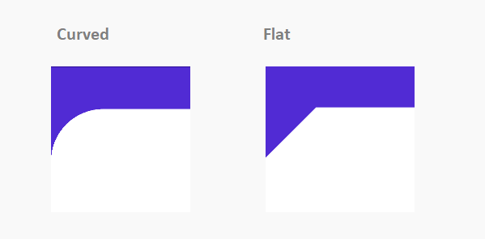

# Corner Shape Customization in .NET MAUI Backdrop Page (SfBackdropPage)

The backdrop allows you to customize the shapes on the top corners of the front layer. Curved and cut (flat) shape options are available. It can be switched by setting the [`EdgeShape`](https://help.syncfusion.com/cr/maui/Syncfusion.Maui.Backdrop.BackdropFrontLayer.html#Syncfusion_Maui_Backdrop_BackdropFrontLayer_EdgeShape) property of the front layer.

N> The backdrop can only be shaped on the top left and top right corners.

N> If you need to set the background color for the back layer, set the `BackgroundColor` property to the content of the BackdropBackLayer instead of the BackdropBackLayer itself.

Both sides of the corner radius can be customized separately by setting the [`LeftCornerRadius`](https://help.syncfusion.com/cr/maui/Syncfusion.Maui.Backdrop.BackdropFrontLayer.html#Syncfusion_Maui_Backdrop_BackdropFrontLayer_LeftCornerRadius) and [`RightCornerRadius`](https://help.syncfusion.com/cr/maui/Syncfusion.Maui.Backdrop.BackdropFrontLayer.html#Syncfusion_Maui_Backdrop_BackdropFrontLayer_RightCornerRadius) properties of the [`BackdropFrontLayer`](https://help.syncfusion.com/cr/maui/Syncfusion.Maui.Backdrop.BackdropFrontLayer.html).

 

 

<backdrop:SfBackdropPage.FrontLayer>
		<backdrop:BackdropFrontLayer LeftCornerRadius="30" RightCornerRadius="0" EdgeShape="Flat">
			<Grid />
		</backdrop:BackdropFrontLayer>
</backdrop:SfBackdropPage.FrontLayer> 



 

this.FrontLayer = new BackdropFrontLayer()
{
	Content = new Grid(),
	LeftCornerRadius = 30,
	RightCornerRadius = 0,
	EdgeShape = EdgeShape.Flat
};



