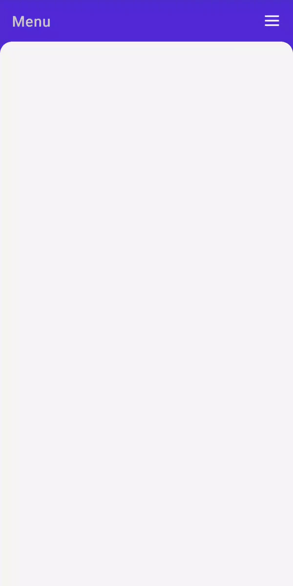

# Getting started with .NET MAUI Backdrop Page

This section explains the steps required to add the Backdrop page and its elements such as BackLayer and FrontLayer in the project. This section covers only the basic features needed to know and gets started with the Syncfusion&reg; backdrop page. Follow the steps below to add a .NET MAUI Backdrop page to your project.

To get start quickly with our .NET MAUI Backdrop, you can check the below video.






## Prerequisites

Before proceeding, ensure the following are set up:
1. Install .NET SDK
  - [.NET 9 SDK](https://dotnet.microsoft.com/en-us/download/dotnet/9.0) or later must be installed.
2. Set up a .NET MAUI Environment with Visual Studio. Supported Visual Studio Versions:
  - Visual Studio 2022: Version 17.13 or later (e.g., 17.14.7) for .NET 9 development.
  - Visual Studio 2026: Required for .NET 10 development.

## Step 1: Create a New .NET MAUI Project

1. Go to **File > New > Project** and choose the **.NET MAUI App** template.
2. Name the project and choose a location. Then click **Next**.
3. Select the .NET framework version and click **Create**.

## Step 2: Install the Syncfusion&reg; .NET MAUI Backdrop NuGet Package

1. In **Solution Explorer,** right-click the project and choose **Manage NuGet Packages.**
2. Search for [Syncfusion.Maui.Backdrop](https://www.nuget.org/packages/Syncfusion.Maui.Backdrop/) and install the latest version.
3. Ensure the necessary dependencies are installed correctly, and the project is restored.

## Step 3: Register the handler

The [Syncfusion.Maui.Core](https://www.nuget.org/packages/Syncfusion.Maui.Core/) NuGet is a dependent package for all Syncfusion&reg; controls of .NET MAUI. In the **MauiProgram.cs** file, register the handler for Syncfusion core.




using Syncfusion.Maui.Core.Hosting;
namespace GettingStarted
{
    public static class MauiProgram
    {
        public static MauiApp CreateMauiApp()
        {
            var builder = MauiApp.CreateBuilder();

            builder.ConfigureSyncfusionCore();
            builder
            .UseMauiApp<App>()
            .ConfigureFonts(fonts =>
            {
                fonts.AddFont("OpenSans-Regular.ttf", "OpenSansRegular");
            });

            return builder.Build();
        }
    }
}




## Step 4: Add .NET MAUI Backdrop page control

1. To initialize the control, import the `Syncfusion.Maui.Backdrop` namespace into your code.
2. Initialize [SfBackdropPage](https://help.syncfusion.com/cr/maui/Syncfusion.Maui.Backdrop.SfBackdropPage.html).





<backdrop:SfBackdropPage xmlns="http://schemas.microsoft.com/dotnet/2021/maui"
                         xmlns:x="http://schemas.microsoft.com/winfx/2009/xaml"
                         x:Class="BackdropGettingStarted.BackdropSamplePage"
                         Title="Menu"
                         xmlns:backdrop="clr-namespace:Syncfusion.Maui.Backdrop;assembly=Syncfusion.Maui.Backdrop"
                         >
    
</backdrop:SfBackdropPage>





using Syncfusion.Maui.Backdrop;
namespace BackdropGettingStarted;

public partial class BackdropSamplePage : SfBackdropPage
{
    public BackdropSamplePage()
    {
        InitializeComponent();
        this.Title = "Menu";
    }
}








## Prerequisites

Before proceeding, ensure the following are set up:
1. Install [.NET 9 SDK](https://dotnet.microsoft.com/en-us/download/dotnet/9.0) or later is installed.
2. Set up a .NET MAUI environment with Visual Studio Code. 
3. Ensure that the .NET MAUI extension is installed and configured as described [here.](https://learn.microsoft.com/en-us/dotnet/maui/get-started/installation?view=net-maui-8.0&tabs=visual-studio-code)

## Step 1: Create a New .NET MAUI Project

1. Open the command palette by pressing `Ctrl+Shift+P` and type **.NET:New Project** and enter.
2. Choose the **.NET MAUI App** template.
3. Select the project location, type the project name and press **Enter**.
4. Then choose **Create project.**

## Step 2: Install the Syncfusion&reg; .NET MAUI Backdrop NuGet Package

1. Press <kbd>Ctrl</kbd> + <kbd>`</kbd> (backtick) to open the integrated terminal in Visual Studio Code.
2. Ensure you're in the project root directory where your .csproj file is located.
3. Run the command `dotnet add package Syncfusion.Maui.Backdrop` to install the Syncfusion® .NET MAUI Backdrop NuGet package.
4. To ensure all dependencies are installed, run `dotnet restore`.

## Step 3: Register the handler

The [Syncfusion.Maui.Core](https://www.nuget.org/packages/Syncfusion.Maui.Core/) NuGet is a dependent package for all Syncfusion controls of .NET MAUI. In the **MauiProgram.cs** file, register the handler for Syncfusion core.




using Syncfusion.Maui.Core.Hosting;
namespace GettingStarted
{
    public static class MauiProgram
    {
        public static MauiApp CreateMauiApp()
        {
            var builder = MauiApp.CreateBuilder();

            builder.ConfigureSyncfusionCore();
            builder
            .UseMauiApp<App>()
            .ConfigureFonts(fonts =>
            {
                fonts.AddFont("OpenSans-Regular.ttf", "OpenSansRegular");
            });

            return builder.Build();
        }
    }
}




## Step 4: Add .NET MAUI Backdrop page control

1. To initialize the control, import the `Syncfusion.Maui.Backdrop` namespace into your code.
2. Initialize [SfBackdropPage](https://help.syncfusion.com/cr/maui/Syncfusion.Maui.Backdrop.SfBackdropPage.html).





<backdrop:SfBackdropPage xmlns="http://schemas.microsoft.com/dotnet/2021/maui"
                         xmlns:x="http://schemas.microsoft.com/winfx/2009/xaml"
                         x:Class="BackdropGettingStarted.BackdropSamplePage"
                         Title="Menu"
                         xmlns:backdrop="clr-namespace:Syncfusion.Maui.Backdrop;assembly=Syncfusion.Maui.Backdrop"
                         >
    
</backdrop:SfBackdropPage>





using Syncfusion.Maui.Backdrop;
namespace BackdropGettingStarted;

public partial class BackdropSamplePage : SfBackdropPage
{
    public BackdropSamplePage()
    {
        InitializeComponent();
        this.Title = "Menu";
    }
}









## Prerequisites

Before proceeding, ensure the following are set up:

1. Ensure you have the latest version of JetBrains Rider.
2. Install [.NET 9 SDK](https://dotnet.microsoft.com/en-us/download/dotnet/9.0) or later is installed.
3. Make sure the MAUI workloads are installed and configured as described [here.](https://www.jetbrains.com/help/rider/MAUI.html#before-you-start)

## Step 1: Create a new .NET MAUI Project

1. Go to **File > New Solution,** Select .NET (C#) and choose the .NET MAUI App template.
2. Enter the Project Name, Solution Name, and Location.
3. Select the .NET framework version and click Create.

## Step 2: Install the Syncfusion® MAUI Backdrop NuGet Package

1. In **Solution Explorer,** right-click the project and choose **Manage NuGet Packages.**
2. Search for [Syncfusion.Maui.Backdrop](https://www.nuget.org/packages/Syncfusion.Maui.Backdrop/) and install the latest version.
3. Ensure the necessary dependencies are installed correctly, and the project is restored. If not, Open the Terminal in Rider and manually run: `dotnet restore`

## Step 3: Register the handler

The [Syncfusion.Maui.Core](https://www.nuget.org/packages/Syncfusion.Maui.Core/) NuGet is a dependent package for all Syncfusion controls of .NET MAUI. In the **MauiProgram.cs** file, register the handler for Syncfusion core.




using Syncfusion.Maui.Core.Hosting;
namespace GettingStarted
{
    public static class MauiProgram
    {
        public static MauiApp CreateMauiApp()
        {
            var builder = MauiApp.CreateBuilder();

            builder.ConfigureSyncfusionCore();
            builder
            .UseMauiApp<App>()
            .ConfigureFonts(fonts =>
            {
                fonts.AddFont("OpenSans-Regular.ttf", "OpenSansRegular");
            });

            return builder.Build();
        }
    }
}




## Step 4: Add .NET MAUI Backdrop page control

1. To initialize the control, import the `Syncfusion.Maui.Backdrop` namespace into your code.
2. Initialize [SfBackdropPage](https://help.syncfusion.com/cr/maui/Syncfusion.Maui.Backdrop.SfBackdropPage.html).





<backdrop:SfBackdropPage xmlns="http://schemas.microsoft.com/dotnet/2021/maui"
                         xmlns:x="http://schemas.microsoft.com/winfx/2009/xaml"
                         x:Class="BackdropGettingStarted.BackdropSamplePage"
                         Title="Menu"
                         xmlns:backdrop="clr-namespace:Syncfusion.Maui.Backdrop;assembly=Syncfusion.Maui.Backdrop"
                         >
    
</backdrop:SfBackdropPage>





using Syncfusion.Maui.Backdrop;
namespace BackdropGettingStarted;

public partial class BackdropSamplePage : SfBackdropPage
{
    public BackdropSamplePage()
    {
        InitializeComponent();
        this.Title = "Menu";
    }
}









N> The [`Title`](https://learn.microsoft.com/en-us/dotnet/api/microsoft.maui.controls.page.title?view=net-maui-6.0) and [`ToolBarItems`](https://learn.microsoft.com/en-us/dotnet/api/microsoft.maui.controls.page.toolbaritems?view=net-maui-6.0) properties of the [`Page`](https://learn.microsoft.com/en-us/dotnet/api/microsoft.maui.controls.page?view=net-maui-6.0) can be used to customize the appearance of the header.

### Configure header

The page header for the backdrop appears only when adding a backdrop as a child of the NavigationPage. To know more about it, refer to the [`header configuration`](https://help.syncfusion.com/maui/backdrop/header-configuration).

## Add back layer content

The back layer holds actionable content (navigation or filtration), which is relevant to the front layer. The back layer will either fill the entire background or occupy the background based on the content height.

 

 

<backdrop:SfBackdropPage.BackLayer>
    <backdrop:BackdropBackLayer>
        <Grid>
            <Grid.RowDefinitions>
                <RowDefinition Height="Auto"/>
            </Grid.RowDefinitions>
            <ListView>
                <ListView.ItemsSource>
                    <x:Array Type="{x:Type x:String}">
                        <x:String>Appetizers</x:String>
                        <x:String>Soups</x:String>
                        <x:String>Desserts</x:String>
                        <x:String>Salads</x:String>
                    </x:Array>
                </ListView.ItemsSource>
            </ListView>
        </Grid>
    </backdrop:BackdropBackLayer>
</backdrop:SfBackdropPage.BackLayer> 



 

this.BackLayer = new BackdropBackLayer
{
    Content = new Grid
    {
        RowDefinitions =
        {
            new RowDefinition () { Height = GridLength.Auto}
        },
        Children =
        {
            new ListView
            {
                ItemsSource = new string[] { "Appetizers", "Soups", "Desserts" ,"Salads"}
            }
        }
    }
};





## Add front layer content
The front layer always appears in front of the back layer. It is displayed to the full width and holds primary content.

 

 

<backdrop:SfBackdropPage.FrontLayer>
        <backdrop:BackdropFrontLayer>
            <Grid BackgroundColor="WhiteSmoke" />
        </backdrop:BackdropFrontLayer>
</backdrop:SfBackdropPage.FrontLayer> 



 

this.FrontLayer = new BackdropFrontLayer()
{
    Content = new Grid
    {
        BackgroundColor = Colors.WhiteSmoke,
    }
};





## Reveal and conceal the back layer

The following options are provided in the backdrop to reveal and conceal the back layer.

* **Programmatically** - Reveals the back layer by setting the [`IsBackLayerRevealed`](https://help.syncfusion.com/cr/maui/Syncfusion.Maui.Backdrop.SfBackdropPage.html#Syncfusion_Maui_Backdrop_SfBackdropPage_IsBackLayerRevealed) property to true. By default, it is set to false.
* **Touch interaction** - Reveals the back layer by clicking the toolbar icon at the top-right corner of the navigation bar header. The Hamburger (or menu ) icon reveals, and the Close icon conceals the back layer. When adding the backdrop as a child of the Fly out Page, the Hamburger and Close icons will be replaced by expand (or down arrow) and collapse (or up arrow) icons respectively.
* **Swipe or fling action** - Reveals the back layer by swipe or fling action on the front layer to the required direction. Swipe downwards to reveal, and swipe upwards to conceal the back layer.  The swipe or fling action will be handled only on the top of the front layer to the [`RevealedHeight`](https://help.syncfusion.com/cr/maui/Syncfusion.Maui.Backdrop.BackdropFrontLayer.html#Syncfusion_Maui_Backdrop_BackdropFrontLayer_RevealedHeight).

For more information about reveal height customization, please refer to this [`link`](https://help.syncfusion.com/maui/backdrop/reveal-height-customization).

 

 

<backdrop:SfBackdropPage xmlns="http://schemas.microsoft.com/dotnet/2021/maui"
                         xmlns:x="http://schemas.microsoft.com/winfx/2009/xaml"
                         x:Class="BackdropGettingStarted.BackdropSamplePage"
                         Title="Menu"
                         xmlns:backdrop="clr-namespace:Syncfusion.Maui.Backdrop;assembly=Syncfusion.Maui.Backdrop"
                         IsBackLayerRevealed="True">

</backdrop:SfBackdropPage>
 


 

#region Constructor

public BackdropSamplePage()
{
    this.IsBackLayerRevealed = true;
}

#endregion





N> 
* Get the complete getting started sample from GitHub [link](https://github.com/SyncfusionExamples/Getting-started-with-.NET-MAUI-Backdrop-).
* Refer to Syncfusion [.NET MAUI Backdrop](https://www.syncfusion.com/maui-controls/maui-backdrop) feature tour page for its groundbreaking feature representations.