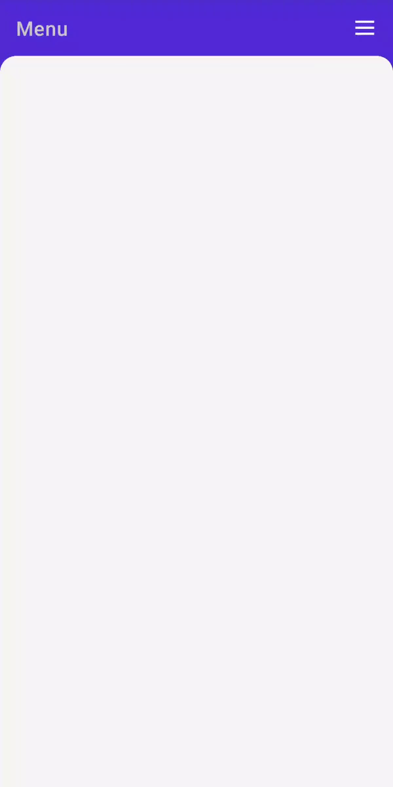

# Getting started with .NET MAUI Backdrop Page

This section explains the steps required to add the Backdrop page and its elements such as BackLayer and FrontLayer in the project. This section covers only the basic features needed to know and gets started with the Syncfusion&reg; backdrop page. Follow the steps below to add a .NET MAUI Backdrop page to your project.

To get start quickly with our .NET MAUI Backdrop, you can check the below video.






## Prerequisites

Before proceeding, ensure the following are set up:

1. Install [.NET 9 SDK](https://dotnet.microsoft.com/en-us/download/dotnet/9.0) or later.
2. Set up a .NET MAUI environment with Visual Studio 2022 v17.12 or later.

## Step 1: Create a New .NET MAUI Project

1. Go to **File > New > Project** and choose the **.NET MAUI App** template.
2. Name the project and choose a location. Then click **Next**.
3. Select the .NET framework version and click **Create**.

## Step 2: Install the Syncfusion&reg; .NET MAUI Backdrop NuGet Package

1. In **Solution Explorer,** right-click the project and choose **Manage NuGet Packages.**
2. Search for [Syncfusion.Maui.Backdrop](https://www.nuget.org/packages/Syncfusion.Maui.Backdrop/) and install the latest version.
3. Ensure the necessary dependencies are installed correctly, and the project is restored.




## Prerequisites

Before proceeding, ensure the following are set up:

1. Install [.NET 9 SDK](https://dotnet.microsoft.com/en-us/download/dotnet/9.0) or later.
2. Set up a .NET MAUI environment with Visual Studio Code.
3. Ensure that the .NET MAUI workloads are installed and configured as described [here](https://learn.microsoft.com/en-us/dotnet/maui/get-started/installation?view=net-maui-9.0&tabs=visual-studio-code).

## Step 1: Create a New .NET MAUI Project

1. Open the command palette by pressing `Ctrl+Shift+P` and type **.NET:New Project** and enter.
2. Choose the **.NET MAUI App** template.
3. Select the project location, type the project name and press **Enter**.
4. Then choose **Create project.**

## Step 2: Install the Syncfusion&reg; .NET MAUI Backdrop NuGet Package

1. Press <kbd>Ctrl</kbd> + <kbd>`</kbd> (backtick) to open the integrated terminal in Visual Studio Code.
2. Ensure you're in the project root directory where your .csproj file is located.
3. Run the command `dotnet add package Syncfusion.Maui.Backdrop` to install the Syncfusion® .NET MAUI Backdrop NuGet package.
4. To ensure all dependencies are installed, run `dotnet restore`.




## Prerequisites

Before proceeding, ensure the following are set up:

1. Install [.NET 9 SDK](https://dotnet.microsoft.com/en-us/download/dotnet/9.0) or later.
2. Set up a .NET MAUI environment with JetBrains Rider 2024.3 or later.
3. Make sure the MAUI workloads are installed and configured as described [here.](https://www.jetbrains.com/help/rider/MAUI.html#before-you-start)

## Step 1: Create a new .NET MAUI Project

1. Go to **File > New Solution,** Select .NET (C#) and choose the .NET MAUI App template.
2. Enter the Project Name, Solution Name, and Location.
3. Select the .NET framework version and click Create.

## Step 2: Install the Syncfusion® MAUI Backdrop NuGet Package

1. In **Solution Explorer,** right-click the project and choose **Manage NuGet Packages.**
2. Search for [Syncfusion.Maui.Backdrop](https://www.nuget.org/packages/Syncfusion.Maui.Backdrop/) and install the latest version.
3. Ensure the necessary dependencies are installed correctly, and the project is restored. If not, Open the Terminal in Rider and manually run: `dotnet restore`




## Step 3: Register Syncfusion handler

Make sure to add the namespace.


using Syncfusion.Maui.Core.Hosting;
 

Register the Syncfusion core handler in your `CreateMauiApp` method of `MauiProgram.cs` file to use Syncfusion controls.


builder.ConfigureSyncfusionCore();
 

## Step 4: Import the Backdrop page namespace

Add the following namespace in your XAML or C#.



xmlns:backdrop="clr-namespace:Syncfusion.Maui.Backdrop;assembly=Syncfusion.Maui.Backdrop"


using Syncfusion.Maui.Backdrop;



## Step 5: Add the Backdrop page component

Create an instance for the Backdrop page control, and add it as content. Configure the layout and content structure of the [SfBackdropPage](https://help.syncfusion.com/cr/maui/Syncfusion.Maui.Backdrop.SfBackdropPage.html) by defining the back layer and front layer.

Reveals the back layer by setting the [`IsBackLayerRevealed`](https://help.syncfusion.com/cr/maui/Syncfusion.Maui.Backdrop.SfBackdropPage.html#Syncfusion_Maui_Backdrop_SfBackdropPage_IsBackLayerRevealed) property to true. By default, it is set to false.





<backdrop:SfBackdropPage xmlns="http://schemas.microsoft.com/dotnet/2021/maui"
                         xmlns:x="http://schemas.microsoft.com/winfx/2009/xaml"
                         x:Class="BackdropGettingStarted.BackdropSamplePage"
                         Title="Menu"
                         xmlns:backdrop="clr-namespace:Syncfusion.Maui.Backdrop;assembly=Syncfusion.Maui.Backdrop"
                         IsBackLayerRevealed="True">

    <backdrop:SfBackdropPage.BackLayer>
        <backdrop:BackdropBackLayer>
            <Grid>
                <Grid.RowDefinitions>
                    <RowDefinition Height="Auto"/>
                </Grid.RowDefinitions>
                <ListView >
                    <ListView.ItemsSource>
                        <x:Array Type="{x:Type x:String}">
                            <x:String>Appetizers</x:String>
                            <x:String>Soups</x:String>
                            <x:String>Desserts</x:String>
                            <x:String>Salads</x:String>
                        </x:Array>
                    </ListView.ItemsSource>
                </ListView>
            </Grid>
        </backdrop:BackdropBackLayer>
    </backdrop:SfBackdropPage.BackLayer>

    <backdrop:SfBackdropPage.FrontLayer>
        <backdrop:BackdropFrontLayer>
            <Grid BackgroundColor="WhiteSmoke" />
        </backdrop:BackdropFrontLayer>
    </backdrop:SfBackdropPage.FrontLayer> 

</backdrop:SfBackdropPage>





this.Title = "Menu";
this.IsBackLayerRevealed = true;
this.BackLayer = new BackdropBackLayer
{
    Content = new Grid
    {
        RowDefinitions =
        {
            new RowDefinition () { Height = GridLength.Auto}
        },
        Children =
        {
            new ListView
            {
                ItemsSource = new string[] { "Appetizers", "Soups", "Desserts" ,"Salads"}
            }
        }
    }
};

this.FrontLayer = new BackdropFrontLayer()
{
    Content = new Grid
    {
        BackgroundColor = Colors.WhiteSmoke,
    }
};




The following screenshot illustrates the result of the above code.

You can download the Backdrop page Getting Started sample from [GitHub](https://github.com/SyncfusionExamples/Getting-started-with-.NET-MAUI-Backdrop-).

For more information about reveal height customization, please refer to this [`link`](https://help.syncfusion.com/maui/backdrop/reveal-height-customization).

N> The [`Title`](https://learn.microsoft.com/en-us/dotnet/api/microsoft.maui.controls.page.title?view=net-maui-6.0) and [`ToolBarItems`](https://learn.microsoft.com/en-us/dotnet/api/microsoft.maui.controls.page.toolbaritems?view=net-maui-6.0) properties of the [`Page`](https://learn.microsoft.com/en-us/dotnet/api/microsoft.maui.controls.page?view=net-maui-6.0) can be used to customize the appearance of the header.

N> Refer to Syncfusion [.NET MAUI Backdrop](https://www.syncfusion.com/maui-controls/maui-backdrop) feature tour page for its groundbreaking feature representations.