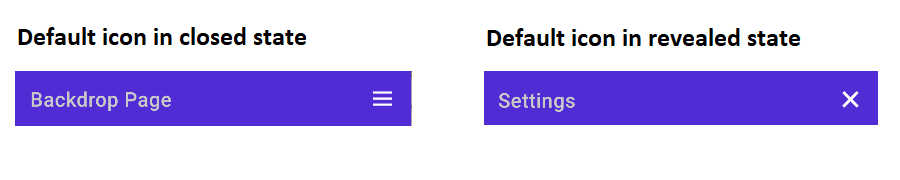
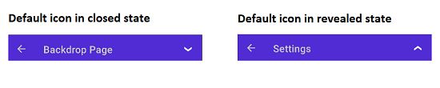
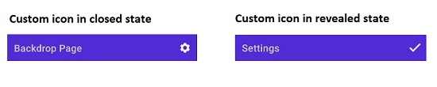
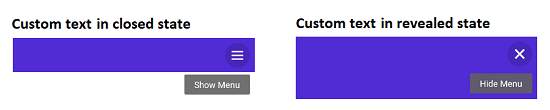

# Header Configuration

Add backdrop page as a children of [`NavigationPage`](https://learn.microsoft.com/en-us/dotnet/maui/user-interface/pages/navigationpage?view=net-maui-6.0) in App.xaml.cs class. Also, `BarBackgroundColor`, `BarTextColor` and other properties of [`NavigationPage`](https://learn.microsoft.com/en-us/dotnet/maui/user-interface/pages/navigationpage?view=net-maui-6.0) can be set to customize the default appearance of header.
 
 

// In App.xaml.cs 
#region Constructor

public App()
{ 
   … 
  MainPage = new NavigationPage(new BackdropSamplePage());
   … 
}

#endregion 



N> Page header for the backdrop will appear only when adding backdrop as a children of [`NavigationPage`](https://learn.microsoft.com/en-us/dotnet/maui/user-interface/pages/navigationpage?view=net-maui-6.0).
 
## Icon customization

The default icons in the navigation header can be customized using the following ways:

### Default icons in NavigationPage

When the backdrop page contained within the [NavigationPage](https://learn.microsoft.com/en-us/dotnet/maui/user-interface/pages/navigationpage?view=net-maui-6.0) , hamburger icon and close icon (X mark ) will be used by default.

### Default icons in FlyoutPage

When the backdrop page placed in the [FlyoutPage](https://learn.microsoft.com/en-us/dotnet/maui/user-interface/pages/flyoutpage?view=net-maui-6.0), down arrow icon and up arrow icon will be used by default.

### Custom icons

Customize the default icons in the navigation header by setting the `OpenIconImageSource` and `CloseIconImageSource` properties in `SfBackdropPage`. It accepts following inputs:
* FileImageSource
* UriImageSource
* FontImageSource
* StreamImageSource

 

 

<backdrop:SfBackdropPage xmlns="http://schemas.microsoft.com/dotnet/2021/maui"
                         xmlns:x="http://schemas.microsoft.com/winfx/2009/xaml"
                         x:Class="BackdropGettingStarted.BackdropSamplePage"
                         xmlns:backdrop="clr-namespace:Syncfusion.Maui.Backdrop;assembly=Syncfusion.Maui.Backdrop"
                         OpenIconImageSource="open.png"
                         CloseIconImageSource="close.png">

</backdrop:SfBackdropPage>



 

using Syncfusion.Maui.Backdrop;
namespace BackdropGettingStarted;

public partial class BackdropSamplePage : SfBackdropPage
{
    public BackdropSamplePage()
    {
        InitializeComponent();
        this.OpenIconImageSource = "open.png";
        this.CloseIconImageSource = "close.png";
    }
}





 
## Icon text customization

You can customize the icon text in the navigation header by setting the `OpenText` and `CloseText` properties in `SfBackdropPage`.

 

 

<backdrop:SfBackdropPage xmlns="http://schemas.microsoft.com/dotnet/2021/maui"
                         xmlns:x="http://schemas.microsoft.com/winfx/2009/xaml"
                         x:Class="BackdropGettingStarted.BackdropSamplePage"
                         xmlns:backdrop="clr-namespace:Syncfusion.Maui.Backdrop;assembly=Syncfusion.Maui.Backdrop"
                         OpenText="Show Menu"
                         CloseText="Hide Menu">

</backdrop:SfBackdropPage>



 

using Syncfusion.Maui.Backdrop;
namespace BackdropGettingStarted;
public partial class BackdropSamplePage : SfBackdropPage
{
    public BackdropSamplePage()
    {
        InitializeComponent();
        this.OpenText = "Show Menu";
        this.CloseText = "Hide Menu";
    }
}





