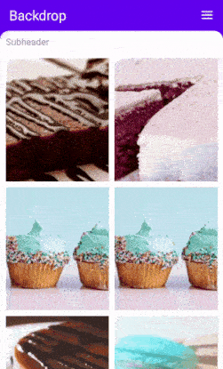

# .NET MAUI Backdrop Page (SfBackdropPage) Overview

The .NET MAUI Backdrop page is composed of two surfaces, a back layer and a front layer. The back layer holds actionable content (like navigation or filtration), which is relevant to the front layer.

### Key features

 * Allows to add with NavigationPage and supports seamless navigation and toolbar customizations.
 
 * Adjusts the height of back layer automatically based on its content and provides an option to expand the content to fit the screen.
 
 * Supports curved and flat edge shapes for the front layer with corner radius customization options.
 
 * Provides smooth animations for revealing and concealing the back layer content.
 
 * Allows users to customize the icons of navigation header in the revealed and closed states separately.

 