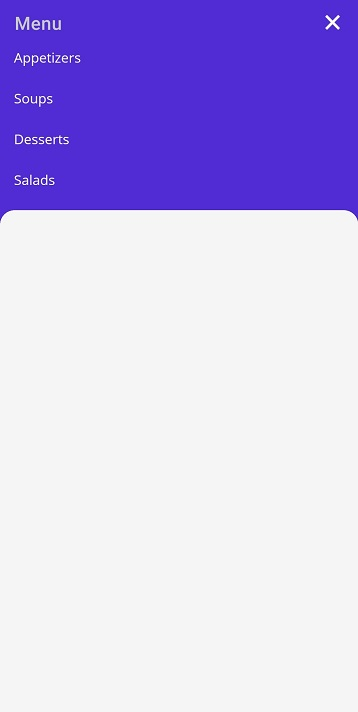

# Reveal Height Customization in MAUI Backdrop Page (SfBackdropPage)

When revealing the back layer, the front layer will be moved downwards. By setting the [`BackLayerRevealOption`](https://help.syncfusion.com/cr/maui/Syncfusion.Maui.Backdrop.SfBackdropPage.html#Syncfusion_Maui_Backdrop_SfBackdropPage_BackLayerRevealOption) property of the backdrop, customize how far the front layer can be moved from the header when revealing the back layer.

The following options are provided to move the front layer:

[`Fill`](https://help.syncfusion.com/cr/maui/Syncfusion.Maui.Backdrop.RevealOption.html#Syncfusion_Maui_Backdrop_RevealOption_Fill) – Moves the front layer downwards to the entire height of the page, excluding the [`RevealedHeight`](https://help.syncfusion.com/cr/maui/Syncfusion.Maui.Backdrop.BackdropFrontLayer.html#Syncfusion_Maui_Backdrop_BackdropFrontLayer_RevealedHeight).

[`Auto`](https://help.syncfusion.com/cr/maui/Syncfusion.Maui.Backdrop.RevealOption.html#Syncfusion_Maui_Backdrop_RevealOption_Auto) – Moves the front layer downwards to the height of the back layer content.

 

 

<backdrop:SfBackdropPage xmlns="http://schemas.microsoft.com/dotnet/2021/maui"
                         xmlns:x="http://schemas.microsoft.com/winfx/2009/xaml"
                         x:Class="BackdropGettingStarted.BackdropSamplePage"
                         Title="Menu"
                         xmlns:backdrop="clr-namespace:Syncfusion.Maui.Backdrop;assembly=Syncfusion.Maui.Backdrop"
                         BackLayerRevealOption="Auto"
                         IsBackLayerRevealed="True">

    <backdrop:SfBackdropPage.BackLayer>
        <backdrop:BackdropBackLayer>
            <Grid>
                <Grid.RowDefinitions>
                    <RowDefinition Height="Auto"/>
                </Grid.RowDefinitions>
                <ListView >
                    <ListView.ItemsSource>
                        <x:Array Type="{x:Type x:String}">
                            <x:String>Appetizers</x:String>
                            <x:String>Soups</x:String>
                            <x:String>Desserts</x:String>
                            <x:String>Salads</x:String>
                        </x:Array>
                    </ListView.ItemsSource>
                </ListView>
            </Grid>
        </backdrop:BackdropBackLayer>
    </backdrop:SfBackdropPage.BackLayer>

    <backdrop:SfBackdropPage.FrontLayer>
        <backdrop:BackdropFrontLayer>
            <Grid BackgroundColor="WhiteSmoke" />
        </backdrop:BackdropFrontLayer>
    </backdrop:SfBackdropPage.FrontLayer> 

</backdrop:SfBackdropPage>



 

this.IsBackLayerRevealed = true;
this.BackLayerRevealOption = RevealOption.Auto;
this.BackLayer = new BackdropBackLayer
{
    Content = new Grid
    {
        RowDefinitions =
        {
            new RowDefinition () { Height = GridLength.Auto}
        },
        Children =
        {
            new ListView
            {
                ItemsSource = new string[] { "Appetizers", "Soups", "Desserts" ,"Salads"}
            }
        }
    }
};

this.FrontLayer = new BackdropFrontLayer()
{
    Content = new Grid
    {
        BackgroundColor = Colors.WhiteSmoke,
    }
};





