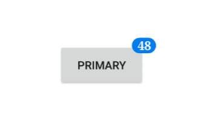
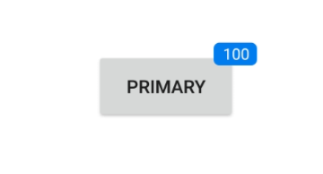
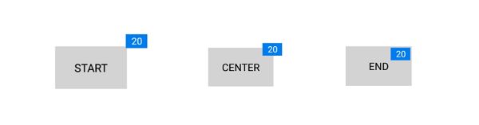

---

layout: post
title: Customization of Syncfusion® .NET MAUI Badge View
description: This section explains how to customize the font, stroke, and text in the Syncfusion® .NET MAUI Badge View control.
platform: MAUI
control: SfBadgeView
documentation: UG

---

# Badge Customization in .NET MAUI Badge View (SfBadgeView)

The [BadgeSettings](https://help.syncfusion.com/cr/maui/Syncfusion.Maui.Core.SfBadgeView.html#Syncfusion_Maui_Core_SfBadgeView_BadgeSettings) property helps you to customize the basic look and feel of the Badge View. 

The [BadgeSettings](https://help.syncfusion.com/cr/maui/Syncfusion.Maui.Core.BadgeSettings.html) contains the sub-elements such as badge types, positions and colors. You can customize various aspects, including background color, text color, stroke, width, offset, and font attributes.

## Font customization

Customize the font using the [FontSize](https://help.syncfusion.com/cr/maui/Syncfusion.Maui.Core.BadgeSettings.html#Syncfusion_Maui_Core_BadgeSettings_FontSizeProperty), [FontAttributes](https://help.syncfusion.com/cr/maui/Syncfusion.Maui.Core.BadgeSettings.html#Syncfusion_Maui_Core_BadgeSettings_FontAttributesProperty), and [FontFamily](https://help.syncfusion.com/cr/maui/Syncfusion.Maui.Core.BadgeSettings.html#Syncfusion_Maui_Core_BadgeSettings_FontFamilyProperty) properties.





<badge:SfBadgeView BadgeText="48"  WidthRequest="120" HeightRequest="80"  HorizontalOptions="Center" VerticalOptions="Center">
            <badge:SfBadgeView.Content>
                <Button Text ="Primary" BackgroundColor="#d6d8d7" TextColor="Black"  WidthRequest="120" HeightRequest="60" />
            </badge:SfBadgeView.Content>
            <badge:SfBadgeView.BadgeSettings>
                <badge:BadgeSettings FontSize="15" FontAttributes="Bold" FontFamily="serif">
                </badge:BadgeSettings>
            </badge:SfBadgeView.BadgeSettings>
 </badge:SfBadgeView>





SfBadgeView sfBadgeView = new SfBadgeView();
sfBadgeView.WidthRequest = 120;
sfBadgeView.HeightRequest = 50;
sfBadgeView.HorizontalOptions = LayoutOptions.Center;
sfBadgeView.VerticalOptions = LayoutOptions.Center;
sfBadgeView.BadgeText = "48";
Button button = new Button();
button.Text = "Primary";
button.TextColor = Colors.Black;
button.BackgroundColor =Color.FromRgba(214, 216, 215, 255);
button.WidthRequest = 120;
button.HeightRequest = 60;
sfBadgeView.Content = button;
BadgeSettings badgeSetting = new BadgeSettings();
badgeSetting.FontAttributes = FontAttributes.Bold;
badgeSetting.FontSize = 15;
badgeSetting.FontFamily = "serif";
sfBadgeView.BadgeSettings = badgeSetting;
Content = sfBadgeView;
    




## Stroke customization

The stroke and stroke thickness of the Badge View can be customized using the [Stroke](https://help.syncfusion.com/cr/maui/Syncfusion.Maui.Core.BadgeSettings.html#Syncfusion_Maui_Core_BadgeSettings_Stroke) and [StrokeThickness](https://help.syncfusion.com/cr/maui/Syncfusion.Maui.Core.BadgeSettings.html#Syncfusion_Maui_Core_BadgeSettings_StrokeThickness) properties, respectively.





<badge:SfBadgeView BadgeText="30"  WidthRequest="120" HeightRequest="60" HorizontalOptions="Center" VerticalOptions="Center">
    <badge:SfBadgeView.Content>
        <Button Text ="Primary" BackgroundColor="#d6d8d7" TextColor="Black" WidthRequest="120" HeightRequest="60"/>
    </badge:SfBadgeView.Content>
    <badge:SfBadgeView.BadgeSettings>
        <badge:BadgeSettings Stroke="Orange" StrokeThickness="2" />
    </badge:SfBadgeView.BadgeSettings>
</badge:SfBadgeView>





SfBadgeView sfBadgeView = new SfBadgeView();
sfBadgeView.WidthRequest = 120;
sfBadgeView.HeightRequest = 80;
sfBadgeView.BadgeText = "30";
sfBadgeView.HorizontalOptions = LayoutOptions.Center;
sfBadgeView.VerticalOptions = LayoutOptions.Center;
Button button = new Button();
button.TextColor = Colors.Black;
button.BackgroundColor = Color.FromRgba(214, 216, 215, 255);
button.Text = "Primary";
button.WidthRequest = 120;
button.HeightRequest = 60;
sfBadgeView.Content = button;
BadgeSettings badgeSetting = new BadgeSettings();
badgeSetting.Stroke = Colors.Orange;
badgeSetting.StrokeThickness = 2;
sfBadgeView.BadgeSettings = badgeSetting;
Content = sfBadgeView;
    




## Text customization

The text color and margin of the Badge View can be changed using the [TextColor](https://help.syncfusion.com/cr/maui/Syncfusion.Maui.Core.BadgeSettings.html#Syncfusion_Maui_Core_BadgeSettings_TextColorProperty) and [TextPadding](https://help.syncfusion.com/cr/maui/Syncfusion.Maui.Core.BadgeSettings.html#Syncfusion_Maui_Core_BadgeSettings_TextPaddingProperty) properties, respectively.





<badge:SfBadgeView BadgeText="45"  WidthRequest="120" HeightRequest="80" HorizontalOptions="Center" VerticalOptions="Center">
    <badge:SfBadgeView.Content>
        <Button Text ="Primary" BackgroundColor="#d6d8d7" TextColor="Black" WidthRequest="120" HeightRequest="60"/>
    </badge:SfBadgeView.Content>
    <badge:SfBadgeView.BadgeSettings>
        <badge:BadgeSettings TextColor="LightYellow"  TextPadding ="10" />
    </badge:SfBadgeView.BadgeSettings>
</badge:SfBadgeView>





SfBadgeView sfBadgeView = new SfBadgeView();
sfBadgeView.HorizontalOptions = LayoutOptions.Center;
sfBadgeView.VerticalOptions = LayoutOptions.Center;
sfBadgeView.WidthRequest = 120;
sfBadgeView.HeightRequest = 80;
sfBadgeView.BadgeText = "45";
Button button = new Button();
button.WidthRequest = 120;
button.HeightRequest = 60;
button.BackgroundColor = Color.FromRgba(214, 216, 215, 255);
button.Text = "Primary";
button.Text = "Primary";
sfBadgeView.Content = button;
BadgeSettings badgeSetting = new BadgeSettings();
badgeSetting.TextColor = Color.LightYellow;
badgeSetting.TextPadding = 10;
sfBadgeView.BadgeSettings = badgeSetting;
Content = sfBadgeView;
    




## Predefined styles

The colors of the badge can be customized using the [Type](https://help.syncfusion.com/cr/maui/Syncfusion.Maui.Core.BadgeSettings.html#Syncfusion_Maui_Core_BadgeSettings_Type) property of the [BadgeSettings](https://help.syncfusion.com/cr/maui/Syncfusion.Maui.Core.BadgeSettings.html#properties). The badge supports the following essential colors for different scenarios:

 * Dark
 * Error
 * Info
 * Light
 * Primary
 * Secondary
 * Success
 * Warning





<badge:SfBadgeView BadgeText="8" HeightRequest="70" WidthRequest="60" HorizontalOptions="Center" VerticalOptions="Center">
        <badge:SfBadgeView.Content>
            <Image Source="badgefacebook.png"  HeightRequest="70" WidthRequest="60"/>
        </badge:SfBadgeView.Content>
        <badge:SfBadgeView.BadgeSettings>
            <badge:BadgeSettings Type="Error" />
        </badge:SfBadgeView.BadgeSettings>
</badge:SfBadgeView>





 SfBadgeView sfBadgeView = new SfBadgeView();
            sfBadgeView.HeightRequest = 70;
            sfBadgeView.WidthRequest = 60;
            sfBadgeView.HorizontalOptions = LayoutOptions.Center;
            sfBadgeView.VerticalOptions = LayoutOptions.Center;
            sfBadgeView.BadgeText = "8";
            Image image = new Image();
            image.Source = "badgefacebook.png";
            image.HeightRequest = 70;
            image.WidthRequest = 60;
            sfBadgeView.Content = image;
            BadgeSettings badgeSetting = new BadgeSettings();
            badgeSetting.Type = BadgeType.Error;
            sfBadgeView.BadgeSettings = badgeSetting;
            Content = sfBadgeView;
    




## Badge background customization

Other than the predefined styles, the color of the badge can be customized using the [Type](https://help.syncfusion.com/cr/maui/Syncfusion.Maui.Core.BadgeSettings.html#Syncfusion_Maui_Core_BadgeSettings_Type) property of the[BadgeSettings](https://help.syncfusion.com/cr/maui/Syncfusion.Maui.Core.BadgeSettings.html#properties) which has to be set as [None](https://help.syncfusion.com/cr/maui/Syncfusion.Maui.Core.BadgeType.html#Syncfusion_Maui_Core_BadgeType_None). Then the color of the Badge View can be set using the [Background](https://help.syncfusion.com/cr/maui/Syncfusion.Maui.Core.BadgeSettings.html#Syncfusion_Maui_Core_BadgeSettings_Background) property.




 <badge:SfBadgeView BadgeText="48" WidthRequest="120" HeightRequest="60" HorizontalOptions="Center" VerticalOptions="Center" >
    <badge:SfBadgeView.Content>
        <Button Text ="Primary"  BackgroundColor="#d6d8d7" TextColor="Black" WidthRequest="120" HeightRequest="60"/>
    </badge:SfBadgeView.Content>
    <badge:SfBadgeView.BadgeSettings>
        <badge:BadgeSettings Type="None" Background="Green" />
    </badge:SfBadgeView.BadgeSettings>
</badge:SfBadgeView>





SfBadgeView sfBadgeView = new SfBadgeView();
sfBadgeView.HeightRequest = 60;
sfBadgeView.WidthRequest = 120;
sfBadgeView.HorizontalOptions = LayoutOptions.Center;
sfBadgeView.VerticalOptions = LayoutOptions.Center;
sfBadgeView.BadgeText = "48";
Button button = new Button();
button.Text = "Primary";
button.TextColor = Colors.Black;
button.BackgroundColor = Color.FromRgba(214, 216, 215, 255);
button.HeightRequest = 60;
button.WidthRequest = 120;
sfBadgeView.Content = button;
BadgeSettings badgeSetting = new BadgeSettings();
badgeSetting.Type = BadgeType.None;
badgeSetting.Background = new SolidColorBrush(Colors.Green);
sfBadgeView.BadgeSettings = badgeSetting;
Content = sfBadgeView;
    




## Setting corner radius of the badge

The [CornerRadius](https://help.syncfusion.com/cr/maui/Syncfusion.Maui.Core.BadgeSettings.html#Syncfusion_Maui_Core_BadgeSettings_CornerRadius) property reduces the corners' radius.





<badge:SfBadgeView BadgeText="100" WidthRequest="120" HeightRequest="60" HorizontalOptions="Center" VerticalOptions="Center" >
        <badge:SfBadgeView.Content>
            <Button Text ="Primary" BackgroundColor="#d6d8d7" TextColor="Black" WidthRequest="120" HeightRequest="60"/>
        </badge:SfBadgeView.Content>
        <badge:SfBadgeView.BadgeSettings>
            <badge:BadgeSettings CornerRadius="5,5,5,5"/>
        </badge:SfBadgeView.BadgeSettings>
</badge:SfBadgeView>





SfBadgeView sfBadgeView = new SfBadgeView();
sfBadgeView.HeightRequest = 60;
sfBadgeView.WidthRequest = 120;
sfBadgeView.HorizontalOptions = LayoutOptions.Center;
sfBadgeView.VerticalOptions = LayoutOptions.Center;
sfBadgeView.BadgeText = "100";
Button button = new Button();
button.Text = "Primary";
button.HeightRequest = 60;
button.WidthRequest = 120;
button.TextColor = Colors.Black;
button.BackgroundColor = Color.FromRgba(214, 216, 215, 255);
sfBadgeView.Content = button;
BadgeSettings badgeSetting = new BadgeSettings();
badgeSetting.CornerRadius = new Microsoft.Maui.CornerRadius(5, 5, 5, 5);
sfBadgeView.BadgeSettings = badgeSetting;
Content = sfBadgeView;
    




## Alignment of badge

Align the Badge View using the Center, Start, and End properties of the [BadgeAlignment](https://help.syncfusion.com/cr/maui/Syncfusion.Maui.Core.BadgeSettings.html#Syncfusion_Maui_Core_BadgeSettings_BadgeAlignment) property.





<badge:SfBadgeView BadgeText="20" HorizontalOptions="Center" VerticalOptions="Center" >
    <badge:SfBadgeView.Content>
        <Label Text="CENTER" BackgroundColor="LightGray" HorizontalTextAlignment="Center" VerticalTextAlignment="Center"
                WidthRequest="100" HeightRequest="60" TextColor="Black" />
    </badge:SfBadgeView.Content>
    <badge:SfBadgeView.BadgeSettings>
        <badge:BadgeSettings BadgeAlignment="Center" CornerRadius="0"/>
    </badge:SfBadgeView.BadgeSettings>
</badge:SfBadgeView>    





SfBadgeView sfBadgeView = new SfBadgeView();
sfBadgeView.HorizontalOptions = LayoutOptions.Center;
sfBadgeView.VerticalOptions = LayoutOptions.Center;
sfBadgeView.BadgeText = "20";
Label label = new Label();
label.Text = "CENTER";
label.HeightRequest = 60;
label.WidthRequest = 100;
label.BackgroundColor = Colors.LightGray;
label.HorizontalTextAlignment = TextAlignment.Center;
label.VerticalTextAlignment = TextAlignment.Center;
label.TextColor = Colors.Black;
sfBadgeView.Content = label;
BadgeSettings badgeSetting = new BadgeSettings();
badgeSetting.BadgeAlignment = BadgeAlignment.Center;
badgeSetting.CornerRadius = 0;
sfBadgeView.BadgeSettings = badgeSetting;
Content = sfBadgeView;
    




## FontAutoScalingEnabled

The [FontAutoScalingEnabled](https://help.syncfusion.com/cr/maui/Syncfusion.Maui.Core.BadgeSettings.html#Syncfusion_Maui_Core_BadgeSettings_FontAutoScalingEnabled) property automatically scales the badge text's font size based on the operating system's text size. The default value is `false`.





<badge:SfBadgeView>
    <badge:SfBadgeView.BadgeSettings>
        <badge:BadgeSettings FontAutoScalingEnabled="True"/>
    </badge:SfBadgeView.BadgeSettings>
</badge:SfBadgeView>    





SfBadgeView sfBadgeView = new SfBadgeView();
BadgeSettings badgeSetting = new BadgeSettings();
badgeSetting.FontAutoScalingEnabled = true;
sfBadgeView.BadgeSettings = badgeSetting;
    




## Visibility of badge

Show or hide the badges in the .NET MAUI Badge View by setting the [IsVisible](https://help.syncfusion.com/cr/maui/Syncfusion.Maui.Core.BadgeSettings.html#Syncfusion_Maui_Core_BadgeSettings_IsVisible) property in the [BadgeSetting](https://help.syncfusion.com/cr/maui/Syncfusion.Maui.Core.SfBadgeView.html?tabs=tabid-1#Syncfusion_Maui_Core_SfBadgeView_BadgeSettings). By default, the badge will be visible.




<badge:SfBadgeView BadgeText="20">
    <badge:SfBadgeView.Content>
        <Button Text="Message"/>
    </badge:SfBadgeView.Content>
    <badge:SfBadgeView.BadgeSettings>
        <badge:BadgeSettings IsVisible="True"/>
    </badge:SfBadgeView.BadgeSettings>
</badge:SfBadgeView>




Button button=new Button();
button.Text="Message";
BadgeSettings badgeSettings=bew BadgeSettings();
badgeSettings.IsVisible=true;
BadgeView badgeView=new BadgeView();
badgeView.BadgeText=20;
badgeView.BadgeSettings=badgeSettings;
badgeVuew.Content=button;
Content=badgeView;


