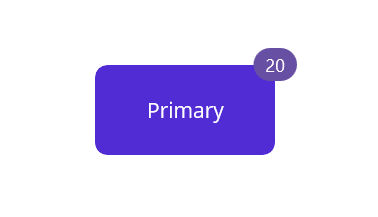

# Getting Started with .NET MAUI Badge View

This section guides you through setting up and configuring a [BadgeView](https://help.syncfusion.com/cr/maui/Syncfusion.Maui.Core.SfBadgeView.html?tabs=tabid-1) in your .NET MAUI application. Follow the steps below to add a basic Badge View to your project.

To quickly get started with the .NET MAUI Badge View, watch this video.



## Prerequisites

Before proceeding, ensure the following are set up:
1. Install [.NET 8 SDK](https://dotnet.microsoft.com/en-us/download/dotnet/8.0) or later is installed.
1. Set up a .NET MAUI environment with Visual Studio 2022 (v17.3 or later) or Visual Studio Code. For Visual Studio Code users, ensure that the .NET MAUI workload is installed and configured as described [here.](https://learn.microsoft.com/en-us/dotnet/maui/get-started/installation?view=net-maui-8.0&tabs=visual-studio-code)

## Step 1: Create a New MAUI Project




1. Go to **File > New > Project** and choose the **.NET MAUI App** template.
1. Name the project and choose a location. Then, click **Next.**
1. Select the .NET framework version and click **Create**.




1. Open the command palette by pressing `Ctrl+Shift+P` and type **.NET:New Project** and enter.
1. Choose the **.NET MAUI App** template.
1. Select the project location, type the project name and press **Enter.**
1. Then choose **Create project.**




## Step 2: Install the Syncfusion® MAUI Core NuGet Package

1. In **Solution Explorer,** right-click the project and choose **Manage NuGet Packages.**
1. Search for [Syncfusion.Maui.Core](https://www.nuget.org/packages/Syncfusion.Maui.Core/) and install the latest version.
1. Ensure the necessary dependencies are installed correctly, and the project is restored.

## Step 3: Register the handler

[Syncfusion.Maui.Core](https://www.nuget.org/packages/Syncfusion.Maui.Core/) NuGet is a dependent package for all Syncfusion® controls of .NET MAUI. In the MauiProgram.cs file, register the handler for Syncfusion® core.


using Microsoft.Maui;
using Microsoft.Maui.Hosting;
using Microsoft.Maui.Controls.Compatibility;
using Microsoft.Maui.Controls.Hosting;
using Microsoft.Maui.Controls.Xaml;
using Syncfusion.Maui.Core.Hosting;

namespace BadgeViewMauiSample
{
  public static class MauiProgram
  {
	public static MauiApp CreateMauiApp()
	{
		var builder = MauiApp.CreateBuilder();
		builder
		.UseMauiApp<App>()
		.ConfigureSyncfusionCore()
		.ConfigureFonts(fonts =>
		{
			fonts.AddFont("OpenSans-Regular.ttf", "OpenSansRegular");
		});

		return builder.Build();
	 }
   
  }

}     



## Step 4:  Add a Basic Badge View

1. To initialize the control, import the Core namespace into your code.
1. Initialize [SfBadgeView](https://help.syncfusion.com/cr/maui/Syncfusion.Maui.Core.SfBadgeView.html?tabs=tabid-1).





   <ContentPage
    . . .    
    xmlns:badgeView="clr-namespace:Syncfusion.Maui.Core;assembly=Syncfusion.Maui.Core">
    <Grid>
        <badgeView:SfBadgeView />
    </Grid>
</ContentPage>





    using Syncfusion.Maui.Core;
    namespace BadgeViewGettingStarted
    {
        public partial class MainPage : ContentPage
        {
            public MainPage()
            {
                InitializeComponent();           
                SfBadgeView badgeView = new SfBadgeView();
            }
        }   
    }





## Step 5: Adding a badge notification text

Add text to Badge View using the [BadgeText](https://help.syncfusion.com/cr/maui/Syncfusion.Maui.Core.SfBadgeView.html#Syncfusion_Maui_Core_SfBadgeView_BadgeText) property.





<badgeView:SfBadgeView>        
    <badgeView:SfBadgeView BadgeText="20" />          
</badgeView:SfBadgeView>




   
SfBadgeView badgeView = new SfBadgeView();

//Adding text to the badge view.

badgeView.BadgeText = "20";

this.Content = badgeView;





## Step 6: Adding a content

An Image, button, or label or any view can be added to the Badge View using the [Content](https://help.syncfusion.com/cr/maui/Syncfusion.Maui.Core.SfBadgeView.html#Syncfusion_Maui_Core_SfBadgeView_Content) property.If you need to display a custom icon or image in the badge, ensure the image is included correctly in your project resources.





<badgeView:SfBadgeView HorizontalOptions="Center" VerticalOptions="Center" >
        <badgeView:SfBadgeView.Content>
            <Button Text="Primary" WidthRequest="120"  HeightRequest="60"/>
        </badgeView:SfBadgeView.Content>
</badgeView:SfBadgeView>   




	
SfBadgeView badgeView = new SfBadgeView();
badgeView.HorizontalOptions = LayoutOptions.Center;
badgeView.VerticalOptions = LayoutOptions.Center;
//Adding image to the content of the badge view.
Button button = new Button();
button.Text = "Primary";
button.WidthRequest = 120;
button.HeightRequest = 60;
badgeView.Content = button;
Content = badgeView;


 


The following code sample gives you the complete code for Badge View with badge notification types and text.





<badgeView:SfBadgeView HorizontalOptions="Center" VerticalOptions="Center" BadgeText="20">
        <badgeView:SfBadgeView.Content>
            <Button Text="Primary" WidthRequest="120"  HeightRequest="60"/>
        </badgeView:SfBadgeView.Content>
</badgeView:SfBadgeView>





public MainPage()
{
    InitializeComponent();
    SfBadgeView badgeView = new SfBadgeView();
    badgeView.HorizontalOptions = LayoutOptions.Center;
    badgeView.VerticalOptions = LayoutOptions.Center;
    badgeView.BadgeText = "20";

    //Adding image to the content of the badge view.
    Button button = new Button();
    button.Text = "Primary";
    button.WidthRequest = 120;
    button.HeightRequest = 60;
    badgeView.Content = button;
    Content = badgeView;
}





The following screenshot illustrates the result of the above code.

 

N> You can refer to our [.NET MAUI Badge View](https://www.syncfusion.com/maui-controls/maui-badge-view) feature tour page for its groundbreaking feature representations. You can also explore our [.NET MAUI Badge View Example](https://github.com/syncfusion/maui-demos/tree/master/MAUI/BadgeView/SampleBrowser.Maui.BadgeView/Samples/BadgeView) that shows you how to render the Badge View in .NET MAUI.
