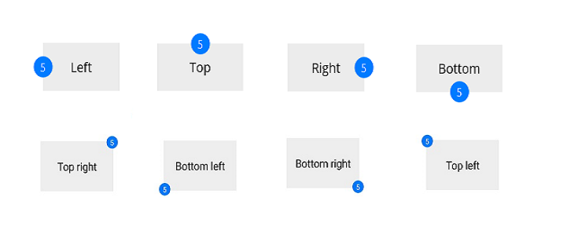

# Position customization

The default position of notification is [TopRight](https://help.syncfusion.com/cr/maui/Syncfusion.Maui.Core.BadgePosition.html#Syncfusion_Maui_Core_BadgePosition_TopRight). The position can be customized as [TopLeft](https://help.syncfusion.com/cr/maui/Syncfusion.Maui.Core.BadgePosition.html#Syncfusion_Maui_Core_BadgePosition_TopLeft), [BottomLeft](https://help.syncfusion.com/cr/maui/Syncfusion.Maui.Core.BadgePosition.html#Syncfusion_Maui_Core_BadgePosition_BottomLeft), [BottomRight](https://help.syncfusion.com/cr/maui/Syncfusion.Maui.Core.BadgePosition.html#Syncfusion_Maui_Core_BadgePosition_BottomRight), `Left`, `Top`, `Right`, and `Bottom` using the [Position](https://help.syncfusion.com/cr/maui/Syncfusion.Maui.Core.BadgeSettings.html#Syncfusion_Maui_Core_BadgeSettings_Position) property. 





  <badge:SfBadgeView BadgeText="5" HorizontalOptions="Center"  VerticalOptions="Center">
      <badge:SfBadgeView.Content>
          <Button Text="Top Right" CornerRadius="0" BackgroundColor="#d6d8d7" TextColor="Black" WidthRequest="120" HeightRequest="60"/>
      </badge:SfBadgeView.Content>
      <badge:SfBadgeView.BadgeSettings>
          <badge:BadgeSettings Background="CornflowerBlue"  Position="TopRight"/>
      </badge:SfBadgeView.BadgeSettings>
  </badge:SfBadgeView>





SfBadgeView sfBadgeView = new SfBadgeView();
sfBadgeView.WidthRequest = 120;
sfBadgeView.HeightRequest = 60;
sfBadgeView.HorizontalOptions = LayoutOptions.Center;
sfBadgeView.VerticalOptions = LayoutOptions.Center;
sfBadgeView.BadgeText = "NEW";
Button button = new Button();
button.Text = "Primary";
button.WidthRequest = 120;
button.TextColor = Colors.Black;
button.BackgroundColor = Color.FromRgba(214, 216, 215, 255);
button.HeightRequest = 60;
sfBadgeView.Content = button;
BadgeSettings badgeSetting = new BadgeSettings();
badgeSetting.Position = BadgePosition.TopRight;
sfBadgeView.BadgeSettings = badgeSetting;
Content = sfBadgeView;
    




## Setting a badge Offset

The x,y position of the Badge View can be adjusted using the [Offset](https://help.syncfusion.com/cr/maui/Syncfusion.Maui.Core.BadgeSettings.html#Syncfusion_Maui_Core_BadgeSettings_Offset) property to achieve precise placement.





  <badge:SfBadgeView BadgeText="8" HeightRequest="70" WidthRequest="60" HorizontalOptions="Center" VerticalOptions="Center">
        <badge:SfBadgeView.Content>
            <Image Source="BadgeImage9.png" HeightRequest="70" WidthRequest="60"/>
        </badge:SfBadgeView.Content>
        <badge:SfBadgeView.BadgeSettings>
            <badge:BadgeSettings Type="Success" Offset="-5,-10" Position="BottomRight"/>
        </badge:SfBadgeView.BadgeSettings>
</badge:SfBadgeView>





SfBadgeView sfBadgeView = new SfBadgeView();
sfBadgeView.WidthRequest = 70;
sfBadgeView.HeightRequest = 60;
sfBadgeView.HorizontalOptions = LayoutOptions.Center;
sfBadgeView.VerticalOptions = LayoutOptions.Center;
sfBadgeView.BadgeText = "8";
Image image = new Image();
image.Source = "BadgeImage9.png";
image.HeightRequest = 70;
image.WidthRequest = 60;
sfBadgeView.Content = image;
BadgeSettings badgeSetting = new BadgeSettings();
badgeSetting.Type = BadgeType.Success;
badgeSetting.Position = BadgePosition.BottomRight;
badgeSetting.Offset = new Point(-5, -10);
sfBadgeView.BadgeSettings = badgeSetting;
Content = sfBadgeView;





