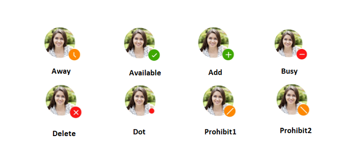

---

layout: post
title: Predefined symbols of Syncfusion® Badge view control for .NET MAUI
description: Learn how to set Syncfusion® badge view predefined symbols and types of badge icons in .NET MAUI platform
platform: maui
control: SfBadgeView
documentation: ug

---

# Predefined symbols in .NET MAUI Badge View (SfBadgeView)

The [.NET MAUI Badge View](https://www.syncfusion.com/maui-controls/maui-badge-view) icon has been changed using the `Icon` property. Badge icons will be visible when you do not set the badge text. The badge supports the following types of `Icon`.

* Add
* Available
* Away
* Busy
* Delete 
* Dot
* None
* Prohibit1
* Prohibit2

N> When both the `Icon` and `BadgeText` are set for badge view, then badge text has a higher priority. The badge text will be rendered in output.





<badge:SfBadgeView  HorizontalOptions="Center" VerticalOptions="Center" >
        <badge:SfBadgeView.Content>
            <Image Source="friends.jpg" HeightRequest="70" WidthRequest="60"/>
        </badge:SfBadgeView.Content>
        <badge:SfBadgeView.BadgeSettings>
            <badge:BadgeSettings Type="Warning"  Offset="0, -10" Position="BottomRight" Icon="Away"/>
        </badge:SfBadgeView.BadgeSettings>
</badge:SfBadgeView>





 SfBadgeView sfBadgeView = new SfBadgeView();
		sfBadgeView.HorizontalOptions = LayoutOptions.Center;
		sfBadgeView.VerticalOptions = LayoutOptions.Center;
		Image image = new Image();
		image.Source = "friends.jpg";
		image.HeightRequest = 70;
		image.WidthRequest = 60;
		sfBadgeView.Content = image;
		BadgeSettings badgeSetting = new BadgeSettings();
		badgeSetting.Type = BadgeType.Warning;
		badgeSetting.Icon = BadgeIcon.Away;
		badgeSetting.Position = BadgePosition.BottomRight;
		badgeSetting.Offset = new Point(0, -10);
		sfBadgeView.BadgeSettings = badgeSetting;
		Content = sfBadgeView;
    




