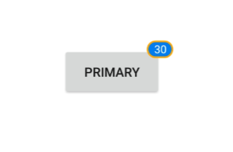
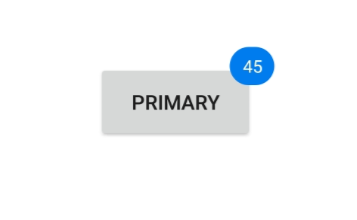
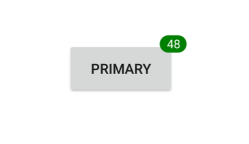

---

layout: post
title: Customization of Syncfusion Badge View control for .NET MAUI
description: This section explain font, border, Text customization in the Syncfusion SfBadgeView control in .NET MAUI platform
platform: Maui
control: SfBadgeView
documentation: ug

---

# Badge Customization in .NET MAUI Badge View (SfBadgeView)

The [`BadgeSettings`](https://help.syncfusion.com/cr/xamarin/Syncfusion.XForms.BadgeView.SfBadgeView.html#Syncfusion_XForms_BadgeView_SfBadgeView_BadgeSettings) property helps to customize the basic look and feel of the badge view. 
[`BadgeSettings`](https://help.syncfusion.com/cr/xamarin/Syncfusion.XForms.BadgeView.SfBadgeView.html#Syncfusion_XForms_BadgeView_SfBadgeView_BadgeSettings) contains the sub elements such as badge types, positions and colors. You can customize the background color, text color, border color, width, offset, and font attributes.

## Font customization

The font can be customized using the [`FontSize`](https://help.syncfusion.com/cr/xamarin/Syncfusion.XForms.BadgeView.BadgeSetting.html#Syncfusion_XForms_BadgeView_BadgeSetting_FontSize), [`FontAttributes`](https://help.syncfusion.com/cr/xamarin/Syncfusion.XForms.BadgeView.BadgeSetting.html#Syncfusion_XForms_BadgeView_BadgeSetting_FontAttributes), and [`FontFamily`](https://help.syncfusion.com/cr/xamarin/Syncfusion.XForms.BadgeView.BadgeSetting.html#Syncfusion_XForms_BadgeView_BadgeSetting_FontFamily) properties.





<badge:SfBadgeView BadgeText="48" HorizontalOptions="Center" VerticalOptions="Center">
        <badge:SfBadgeView.Content>
            <Button Text ="Primary" WidthRequest="120" HeightRequest="60" />
        </badge:SfBadgeView.Content>
        <badge:SfBadgeView.BadgeSettings>
            <badge:BadgeSetting FontSize="15" FontAttributes="Bold" FontFamily="serif">
         </badge:BadgeSetting>
        </badge:SfBadgeView.BadgeSettings>
</badge:SfBadgeView>





SfBadgeView sfBadgeView = new SfBadgeView();
sfBadgeView.HorizontalOptions = LayoutOptions.Center;
sfBadgeView.VerticalOptions = LayoutOptions.Center;
sfBadgeView.BadgeText = "48";
Button button = new Button();
button.Text = "Primary";
button.WidthRequest = 120;
button.HeightRequest = 60;
sfBadgeView.Content = button;
BadgeSettings badgeSetting = new BadgeSettings();
badgeSetting.FontAttributes = FontAttributes.Bold;
badgeSetting.FontSize = 15;
badgeSetting.FontFamily ="serif";
sfBadgeView.BadgeSettings = badgeSetting;
Content = sfBadgeView;
    




## Border customization

The border color and border width of the badge view can be customized using the [`Stroke`](https://help.syncfusion.com/cr/xamarin/Syncfusion.XForms.BadgeView.BadgeSetting.html#Syncfusion_XForms_BadgeView_BadgeSetting_Stroke) and [`BorderWidth`](https://help.syncfusion.com/cr/xamarin/Syncfusion.XForms.BadgeView.BadgeSetting.html#Syncfusion_XForms_BadgeView_BadgeSetting_StrokeWidth) properties, respectively.





<badge:SfBadgeView BadgeText="30" HorizontalOptions="Center" VerticalOptions="Center">
        <badge:SfBadgeView.Content>
            <Button Text ="Primary" WidthRequest="120" HeightRequest="60"/>
        </badge:SfBadgeView.Content>
        <badge:SfBadgeView.BadgeSettings>
            <badge:BadgeSetting Stroke="Orange" BorderWidth="2" />
        </badge:SfBadgeView.BadgeSettings>
</badge:SfBadgeView>
              




SfBadgeView sfBadgeView = new SfBadgeView();
sfBadgeView.BadgeText = "30";
sfBadgeView.HorizontalOptions = LayoutOptions.Center;
sfBadgeView.VerticalOptions = LayoutOptions.Center;
Button button = new Button();
button.Text = "Primary";
button.WidthRequest = 120;
button.HeightRequest = 60;
sfBadgeView.Content = button;
BadgeSettings badgeSetting = new BadgeSettings();
badgeSetting.Stroke = Color.Orange;
badgeSetting.BorderWidth = 2;
sfBadgeView.BadgeSettings = badgeSetting;
Content = sfBadgeView;
    




## Text customization

The text color and margin of badge view can be changed using the [`TextColor`](https://help.syncfusion.com/cr/xamarin/Syncfusion.XForms.BadgeView.BadgeSetting.html#Syncfusion_XForms_BadgeView_BadgeSetting_TextColor) and [`TextPadding`](https://help.syncfusion.com/cr/xamarin/Syncfusion.XForms.BadgeView.BadgeSetting.html#Syncfusion_XForms_BadgeView_BadgeSetting_TextPadding) properties, respectively.





<badge:SfBadgeView BadgeText="45" HorizontalOptions="Center" VerticalOptions="Center">
        <badge:SfBadgeView.Content>
            <Button Text ="Primary" WidthRequest="120" HeightRequest="60"/>
        </badge:SfBadgeView.Content>
        <badge:SfBadgeView.BadgeSettings>
            <badge:BadgeSetting TextColor="LightYellow" TextPadding="10"/>
        </badge:SfBadgeView.BadgeSettings>
</badge:SfBadgeView>    





SfBadgeView sfBadgeView = new SfBadgeView();
sfBadgeView.HorizontalOptions = LayoutOptions.Center;
sfBadgeView.VerticalOptions = LayoutOptions.Center;
sfBadgeView.BadgeText = "45";
Button button = new Button();
button.WidthRequest = 120;
button.HeightRequest = 60;
button.Text = "Primary";
sfBadgeView.Content = button;
BadgeSettings badgeSetting = new BadgeSettings();
badgeSetting.TextColor = Color.LightYellow;
badgeSetting.TextPadding = 10;
sfBadgeView.BadgeSettings = badgeSetting;
Content = sfBadgeView;
    




## Predefined styles

The colors of the badge can be customized using the [`BadgeType`](https://help.syncfusion.com/cr/xamarin/Syncfusion.XForms.BadgeView.BadgeSetting.html#Syncfusion_XForms_BadgeView_BadgeSetting_BadgeType) property. The badge supports the following eight different essential colors for various situations:

 * Dark
 * Error
 * Info
 * Light
 * Primary
 * Secondary
 * Success
 * Warning





<badge:SfBadgeView BadgeText="8" HorizontalOptions="Center" VerticalOptions="Center">
        <badge:SfBadgeView.Content>
            <Image Source="BadgeFacebook.png" HeightRequest="70" WidthRequest="60"/>
        </badge:SfBadgeView.Content>
        <badge:SfBadgeView.BadgeSettings>
            <badge:BadgeSetting Type="Error" Offset="-5,10"/>
        </badge:SfBadgeView.BadgeSettings>
</badge:SfBadgeView>





SfBadgeView sfBadgeView = new SfBadgeView();
sfBadgeView.HorizontalOptions = LayoutOptions.Center;
sfBadgeView.VerticalOptions = LayoutOptions.Center;
sfBadgeView.BadgeText = "8";
Image image = new Image();
image.Source = "BadgeFacebook.png";
image.HeightRequest = 70;
image.WidthRequest = 60;
sfBadgeView.Content = image;
BadgeSettings badgeSetting = new BadgeSettings();
badgeSetting.Type = BadgeType.Error;
badgeSetting.Offset = new Point(-5, 10);
sfBadgeView.BadgeSettings = badgeSetting;
Content = sfBadgeView;
    




## Badge background customization

Other than the predefined styles, the color of the badge can be customized using the [`BadgeType`](https://help.syncfusion.com/cr/xamarin/Syncfusion.XForms.BadgeView.BadgeSetting.html#Syncfusion_XForms_BadgeView_BadgeSetting_BadgeType) property which has to be set as `None`. Then the color of the badge view can be set using the [`Background`](https://help.syncfusion.com/cr/xamarin/Syncfusion.XForms.BadgeView.BadgeSetting.html#Syncfusion_XForms_BadgeView_BadgeSetting_BackgroundColor) property.





<badge:SfBadgeView BadgeText="48" HorizontalOptions="Center" VerticalOptions="Center" >
        <badge:SfBadgeView.Content>
            <Button Text ="Primary" WidthRequest="120" HeightRequest="60"/>
        </badge:SfBadgeView.Content>
        <badge:SfBadgeView.BadgeSettings>
            <badge:BadgeSetting Type="None" Background="Green" />
        </badge:SfBadgeView.BadgeSettings>
</badge:SfBadgeView>





SfBadgeView sfBadgeView = new SfBadgeView();
sfBadgeView.HorizontalOptions = LayoutOptions.Center;
sfBadgeView.VerticalOptions = LayoutOptions.Center;
sfBadgeView.BadgeText = "48";
Button button = new Button();
button.Text = "Primary";
button.HeightRequest = 60;
button.WidthRequest = 120;
sfBadgeView.Content = button;
BadgeSettings badgeSetting = new BadgeSettings();
badgeSetting.Type = BadgeType.None;
badgeSetting.Background = new SolidColorBrush(Colors.Green);
sfBadgeView.BadgeSettings = badgeSetting;
Content = sfBadgeView;
    




## Setting corner radius of the badge

The [`CornerRadius`](https://help.syncfusion.com/cr/xamarin/Syncfusion.XForms.BadgeView.BadgeSetting.html#Syncfusion_XForms_BadgeView_BadgeSetting_CornerRadius) property is used to reduce the radius of the corners.





<badge:SfBadgeView BadgeText="100" HorizontalOptions="Center" VerticalOptions="Center" >
        <badge:SfBadgeView.Content>
            <Button Text ="Primary" WidthRequest="120" HeightRequest="60"/>
        </badge:SfBadgeView.Content>
        <badge:SfBadgeView.BadgeSettings>
            <badge:BadgeSetting CornerRadius="5,5,5,5"/>
        </badge:SfBadgeView.BadgeSettings>
</badge:SfBadgeView>





SfBadgeView sfBadgeView = new SfBadgeView();
sfBadgeView.HorizontalOptions = LayoutOptions.Center;
sfBadgeView.VerticalOptions = LayoutOptions.Center;
sfBadgeView.BadgeText = "100";
Button button = new Button();
button.Text = "Primary";
button.HeightRequest = 60;
button.WidthRequest = 120;
sfBadgeView.Content = button;
BadgeSettings badgeSetting = new BadgeSettings();
badgeSetting.CornerRadius = new Microsoft.Maui.CornerRadius(5, 5, 5, 5);
sfBadgeView.BadgeSettings = badgeSetting;
Content = sfBadgeView;
    




