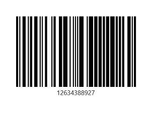
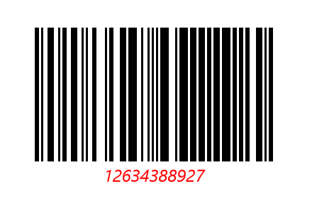
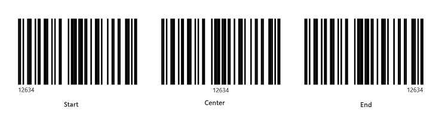
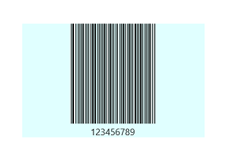
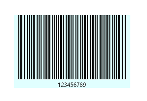
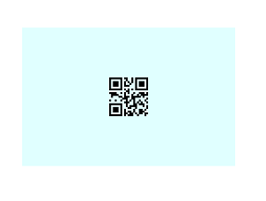
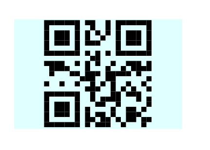
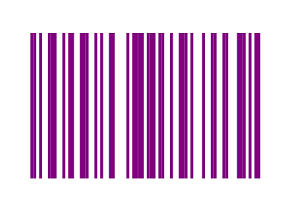
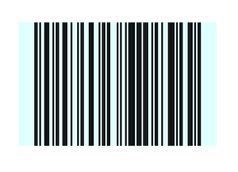

# Customization in .NET MAUI Barcodes (SfBarcodeGenerator)

## Text customization

### Displaying input value

The provided input value of the barcode can be displayed by enabling the [`ShowText`](https://help.syncfusion.com/cr/maui/Syncfusion.Maui.Barcode.SfBarcodeGenerator.html#Syncfusion_Maui_Barcode_SfBarcodeGenerator_ShowText) property. By default, the [`ShowText`](https://help.syncfusion.com/cr/maui/Syncfusion.Maui.Barcode.SfBarcodeGenerator.html#Syncfusion_Maui_Barcode_SfBarcodeGenerator_ShowText) is false.





        <barcode:SfBarcodeGenerator Value="12634388927" 
                                    HeightRequest="150"
                                    WidthRequest="300" 
                                    ShowText="True"/>





        SfBarcodeGenerator barcode = new SfBarcodeGenerator();
        barcode.HeightRequest = 150;
        barcode.WidthRequest = 300;
        barcode.Value = "12634388927";
        barcode.ShowText = true;
        this.Content = barcode;





### Text style customization

The style of the text can be customized using the [`TextStyle`](https://help.syncfusion.com/cr/maui/Syncfusion.Maui.Barcode.SfBarcodeGenerator.html#Syncfusion_Maui_Barcode_SfBarcodeGenerator_TextStyle) property of the barcode generator.





            <barcode:SfBarcodeGenerator Value="12634388927" 
                                        HeightRequest="150"
                                        WidthRequest="300" 
                                        ShowText="True">
                <barcode:SfBarcodeGenerator.TextStyle>
                    <barcode:BarcodeTextStyle FontAttributes="Italic" 
                                              FontSize="16" 
                                              FontFamily="Times" 
                                              TextColor="Red"/>
                </barcode:SfBarcodeGenerator.TextStyle>
            </barcode:SfBarcodeGenerator>





        SfBarcodeGenerator barcode = new SfBarcodeGenerator();
        barcode.HeightRequest = 150;
        barcode.WidthRequest = 300;
        barcode.Value = "12634388927";
        barcode.ShowText = true;
        barcode.TextStyle = new BarcodeTextStyle()
        {
            FontAttributes = FontAttributes.Italic,
            FontFamily = "Time",
            FontSize = 16,
            TextColor = Colors.Red
        };

        this.Content = barcode;





### Text spacing

The space between the text and the barcode can be controlled by using the [`TextSpacing`](https://help.syncfusion.com/cr/maui/Syncfusion.Maui.Barcode.SfBarcodeGenerator.html#Syncfusion_Maui_Barcode_SfBarcodeGenerator_TextSpacing) property of the barcode generator. By default, the value of [`TextSpacing`](https://help.syncfusion.com/cr/maui/Syncfusion.Maui.Barcode.SfBarcodeGenerator.html#Syncfusion_Maui_Barcode_SfBarcodeGenerator_TextSpacing) is 2.





            <barcode:SfBarcodeGenerator Value="12634388927" 
                                        HeightRequest="150"
                                        WidthRequest="300" 
                                        ShowText="True" 
                                        TextSpacing="25">
            </barcode:SfBarcodeGenerator>





        SfBarcodeGenerator barcode = new SfBarcodeGenerator();
        barcode.HeightRequest = 150;
        barcode.WidthRequest = 300;
        barcode.Value = "12634388927";
        barcode.ShowText = true;
        barcode.TextSpacing = 25;
        this.Content = barcode;





### Horizontal text alignment

The horizontal alignment of the text can be controlled by using the [`TextAlignment`](https://help.syncfusion.com/cr/maui/Syncfusion.Maui.Barcode.SfBarcodeGenerator.html#Syncfusion_Maui_Barcode_SfBarcodeGenerator_TextAlignment) property of the barcode generator. The displayed value can be positioned at `Start`, `Center`, or `End` of the control. The default value of [`TextAlignment`](https://help.syncfusion.com/cr/maui/Syncfusion.Maui.Barcode.SfBarcodeGenerator.html#Syncfusion_Maui_Barcode_SfBarcodeGenerator_TextAlignment) property is center.





       <barcode:SfBarcodeGenerator Value="12634" 
                                   HeightRequest="150"
                                   WidthRequest="240" 
                                   ShowText="True" 
                                   TextAlignment="End"/>





        SfBarcodeGenerator barcode = new SfBarcodeGenerator();
        barcode.HeightRequest = 150;
        barcode.WidthRequest = 240;
        barcode.Value = "12634";
        barcode.ShowText = true;
        barcode.TextAlignment = TextAlignment.End;
        this.Content = barcode;





## Bar customization

### Bar width customization

Both the one-dimensional and the two-dimensional symbology support the [`Module`](https://help.syncfusion.com/cr/maui/Syncfusion.Maui.Barcode.SymbologyBase.html#Syncfusion_Maui_Barcode_SymbologyBase_Module) property. This property is used to define the size of the smallest line or dot of the barcode.

If this property is not set for one-dimensional barcode, the size of the smallest bar line is determined based on the width available.

The following code sample shows the one-dimensional barcode with the [`Module`](https://help.syncfusion.com/cr/maui/Syncfusion.Maui.Barcode.SymbologyBase.html#Syncfusion_Maui_Barcode_SymbologyBase_Module) property,





            <barcode:SfBarcodeGenerator Value="123456789" 
                                        HeightRequest="150"
                                        WidthRequest="240" 
                                        ShowText="True" 
                                        BackgroundColor="LightCyan">
                <barcode:SfBarcodeGenerator.Symbology>
                    <barcode:Codabar Module="1"/>
                </barcode:SfBarcodeGenerator.Symbology>
            </barcode:SfBarcodeGenerator>





        SfBarcodeGenerator barcode = new SfBarcodeGenerator();
        barcode.HeightRequest = 150;
        barcode.WidthRequest = 240;
        barcode.Value = "123456789";
        barcode.ShowText = true;
        barcode.BackgroundColor = Colors.LightCyan;
        barcode.Symbology = new Codabar() { Module = 1 };
        this.Content = barcode;





N> In the image above, the smallest bar line width is 1 logical pixel.

The following code sample shows the one-dimensional barcode without the [`Module`](https://help.syncfusion.com/cr/maui/Syncfusion.Maui.Barcode.SymbologyBase.html#Syncfusion_Maui_Barcode_SymbologyBase_Module) property.





        <barcode:SfBarcodeGenerator Value="123456789" 
                                    HeightRequest="150"
                                    WidthRequest="240" 
                                    ShowText="True" 
                                    BackgroundColor="LightCyan" Margin="50,20">
            <barcode:SfBarcodeGenerator.Symbology>
                <barcode:Codabar />
            </barcode:SfBarcodeGenerator.Symbology>
        </barcode:SfBarcodeGenerator>





        SfBarcodeGenerator barcode = new SfBarcodeGenerator();
        barcode.HeightRequest = 150;
        barcode.WidthRequest = 240;
        barcode.Value = "123456789";
        barcode.ShowText = true;
        barcode.BackgroundColor = Colors.LightCyan;
        barcode.Symbology = new Codabar();
        this.Content = barcode;





N> In the image above, the smallest bar line width is calculated on the basis of the available width as a result of the total computed inputs(0’s and 1’s) divided by the available width.

If the [`Module`](https://help.syncfusion.com/cr/maui/Syncfusion.Maui.Barcode.SymbologyBase.html#Syncfusion_Maui_Barcode_SymbologyBase_Module) property is not set for two-dimensional barcode, the size of smallest dot is calculated based on the minimum of available width or height.

The following code sample shows the two-dimensional barcode with the [`Module`](https://help.syncfusion.com/cr/maui/Syncfusion.Maui.Barcode.SymbologyBase.html#Syncfusion_Maui_Barcode_SymbologyBase_Module) property,





            <barcode:SfBarcodeGenerator Value="123456789" 
                                        HeightRequest="150"
                                        WidthRequest="230"  
                                        BackgroundColor="LightCyan">
                <barcode:SfBarcodeGenerator.Symbology>
                    <barcode:QRCode Module="2"/>
                </barcode:SfBarcodeGenerator.Symbology>
            </barcode:SfBarcodeGenerator>





        SfBarcodeGenerator barcode = new SfBarcodeGenerator();
        barcode.HeightRequest = 150;
        barcode.WidthRequest = 230;
        barcode.Value = "123456789";
        barcode.BackgroundColor = Colors.LightCyan;
        barcode.Symbology = new QRCode() { Module = 2 };
        this.Content = barcode;





The following code sample shows the two-dimensional barcode without the [`Module`](https://help.syncfusion.com/cr/maui/Syncfusion.Maui.Barcode.SymbologyBase.html#Syncfusion_Maui_Barcode_SymbologyBase_Module) property,





            <barcode:SfBarcodeGenerator Value="123456789" 
                                        HeightRequest="150"
                                        WidthRequest="230"  
                                        BackgroundColor="LightCyan">
                <barcode:SfBarcodeGenerator.Symbology>
                    <barcode:QRCode />
                </barcode:SfBarcodeGenerator.Symbology>
            </barcode:SfBarcodeGenerator>





        SfBarcodeGenerator barcode = new SfBarcodeGenerator();
        barcode.HeightRequest = 150;
        barcode.WidthRequest = 230;
        barcode.Value = "123456789";
        barcode.BackgroundColor = Colors.LightCyan;
        barcode.Symbology = new QRCode();
        this.Content = barcode;





### Bar color customization

The bar color of the barcode can be customized by using the [`ForegroundColor`](https://help.syncfusion.com/cr/maui/Syncfusion.Maui.Barcode.SfBarcodeGenerator.html#Syncfusion_Maui_Barcode_SfBarcodeGenerator_ForegroundColor) property as shown in the following code sample.





            <barcode:SfBarcodeGenerator Value="12634" 
                                        HeightRequest="150"
                                        WidthRequest="240"
                                        ForegroundColor="Purple">
            </barcode:SfBarcodeGenerator>





        SfBarcodeGenerator barcode = new SfBarcodeGenerator();
        barcode.HeightRequest = 150;
        barcode.WidthRequest = 240;
        barcode.Value = "12634";
        barcode.ForegroundColor = Colors.Purple;
        this.Content = barcode;





### Background color customization

The background color of barcode can be customized by using the `BackgroundColor` property as shown in the following code sample.





            <barcode:SfBarcodeGenerator Value="123456789" 
                                        HeightRequest="150"
                                        WidthRequest="240"
                                        BackgroundColor="LightCyan">
            </barcode:SfBarcodeGenerator>





        SfBarcodeGenerator barcode = new SfBarcodeGenerator();
        barcode.HeightRequest = 150;
        barcode.WidthRequest = 240;
        barcode.Value = "123456789";
        barcode.BackgroundColor = Colors.LightCyan;
        this.Content = barcode;





