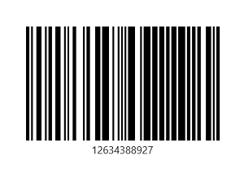
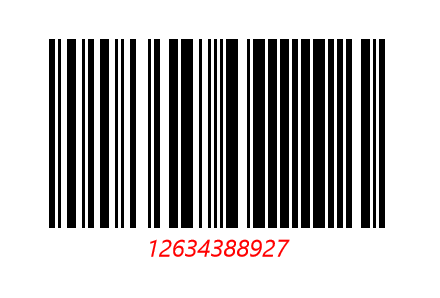
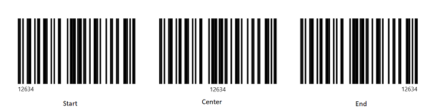
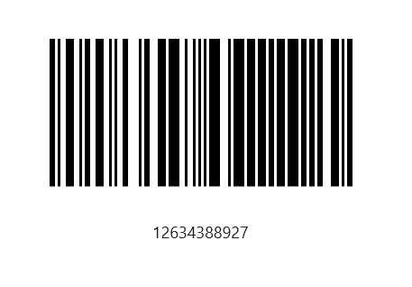
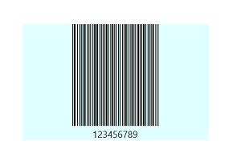
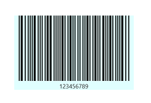
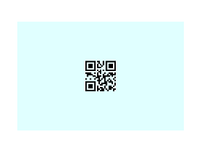
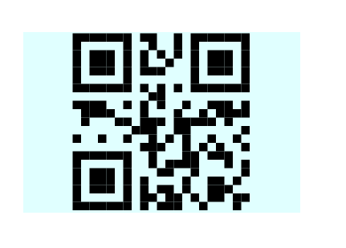
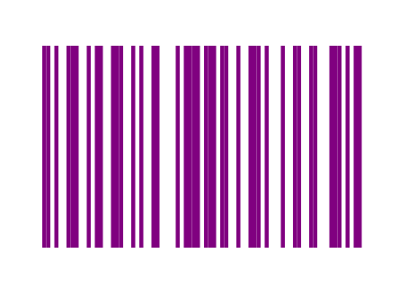
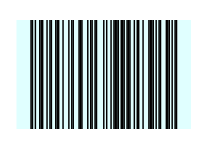

# Customization in .NET MAUI Barcode Generator

N> **Prerequisite:** Ensure that the required NuGet package is installed, the necessary namespaces are imported, and the **Barcode Generator** control is properly configured in your application. For detailed setup and configuration instructions, refer to the **[Getting Started](https://help.syncfusion.com/maui/barcode-generator/getting-started)** guide.

## Text customization

### Displaying input value

You can display the input value of the barcode by setting the [`ShowText`](https://help.syncfusion.com/cr/maui/Syncfusion.Maui.Barcode.SfBarcodeGenerator.html#Syncfusion_Maui_Barcode_SfBarcodeGenerator_ShowText) property to `true`. By default, [`ShowText`](https://help.syncfusion.com/cr/maui/Syncfusion.Maui.Barcode.SfBarcodeGenerator.html#Syncfusion_Maui_Barcode_SfBarcodeGenerator_ShowText) is `false`.





<barcode:SfBarcodeGenerator Value="12634388927" 
                            HeightRequest="150"
                            WidthRequest="300" 
                            ShowText="True">
</barcode:SfBarcodeGenerator>





SfBarcodeGenerator barcode = new SfBarcodeGenerator();
barcode.HeightRequest = 150;
barcode.WidthRequest = 300;
barcode.Value = "12634388927";
barcode.ShowText = true;
this.Content = barcode;





### Text style customization

The style of the text can be customized using the [`TextStyle`](https://help.syncfusion.com/cr/maui/Syncfusion.Maui.Barcode.SfBarcodeGenerator.html#Syncfusion_Maui_Barcode_SfBarcodeGenerator_TextStyle) property of the barcode generator. The `TextStyle` property accepts a [`BarcodeTextStyle`](https://help.syncfusion.com/cr/maui/Syncfusion.Maui.Barcode.BarcodeTextStyle.html) object, which provides the following properties:

- [`FontAttributes`](https://help.syncfusion.com/cr/maui/Syncfusion.Maui.Barcode.BarcodeTextStyle.html#Syncfusion_Maui_Barcode_BarcodeTextStyle_FontAttributes) — Gets or sets the font attributes.
- [`FontFamily`](https://help.syncfusion.com/cr/maui/Syncfusion.Maui.Barcode.BarcodeTextStyle.html#Syncfusion_Maui_Barcode_BarcodeTextStyle_FontFamily) — Gets or sets the font family.
- [`FontSize`](https://help.syncfusion.com/cr/maui/Syncfusion.Maui.Barcode.BarcodeTextStyle.html#Syncfusion_Maui_Barcode_BarcodeTextStyle_FontSize) — Gets or sets the font size.
- [`TextColor`](https://help.syncfusion.com/cr/maui/Syncfusion.Maui.Barcode.BarcodeTextStyle.html#Syncfusion_Maui_Barcode_BarcodeTextStyle_TextColor) — Gets or sets the text color.





<barcode:SfBarcodeGenerator Value="12634388927" 
                            HeightRequest="150"
                            WidthRequest="300" 
                            ShowText="True">
        <barcode:SfBarcodeGenerator.TextStyle>
                <barcode:BarcodeTextStyle FontAttributes="Italic" 
                                          FontSize="16" 
                                          FontFamily="Times" 
                                          TextColor="Red"/>
        </barcode:SfBarcodeGenerator.TextStyle>
</barcode:SfBarcodeGenerator>





SfBarcodeGenerator barcode = new SfBarcodeGenerator();
barcode.HeightRequest = 150;
barcode.WidthRequest = 300;
barcode.Value = "12634388927";
barcode.ShowText = true;
barcode.TextStyle = new BarcodeTextStyle()
{
     FontAttributes = FontAttributes.Italic,
     FontFamily = "Times",
     FontSize = 16,
     TextColor = Colors.Red
};

this.Content = barcode;





### Horizontal text alignment

Use the [`TextAlignment`](https://help.syncfusion.com/cr/maui/Syncfusion.Maui.Barcode.SfBarcodeGenerator.html#Syncfusion_Maui_Barcode_SfBarcodeGenerator_TextAlignment) property to control the horizontal alignment of the text. The displayed value can be positioned at `Start`, `Center`, or `End` of the control. The default value of the `TextAlignment` property is `Center`.





<barcode:SfBarcodeGenerator Value="12634" 
                            HeightRequest="150"
                            WidthRequest="240" 
                            ShowText="True" 
                            TextAlignment="End">
</barcode:SfBarcodeGenerator>





SfBarcodeGenerator barcode = new SfBarcodeGenerator();
barcode.HeightRequest = 150;
barcode.WidthRequest = 240;
barcode.Value = "12634";
barcode.ShowText = true;
barcode.TextAlignment = TextAlignment.End;
this.Content = barcode;





### Text spacing

Use the [`TextSpacing`](https://help.syncfusion.com/cr/maui/Syncfusion.Maui.Barcode.SfBarcodeGenerator.html#Syncfusion_Maui_Barcode_SfBarcodeGenerator_TextSpacing) property to set the space between the text and the barcode. The property accepts a `double` value and by default, [`TextSpacing`](https://help.syncfusion.com/cr/maui/Syncfusion.Maui.Barcode.SfBarcodeGenerator.html#Syncfusion_Maui_Barcode_SfBarcodeGenerator_TextSpacing) is `2` logical units.





<barcode:SfBarcodeGenerator Value="12634388927" 
                            HeightRequest="150"
                            WidthRequest="300" 
                            ShowText="True" 
                            TextSpacing="25">
</barcode:SfBarcodeGenerator>





SfBarcodeGenerator barcode = new SfBarcodeGenerator();
barcode.HeightRequest = 150;
barcode.WidthRequest = 300;
barcode.Value = "12634388927";
barcode.ShowText = true;
barcode.TextSpacing = 25;
this.Content = barcode;





## Bar customization

### Bar width customization

Both one-dimensional and two-dimensional symbologies support the [`Module`](https://help.syncfusion.com/cr/maui/Syncfusion.Maui.Barcode.SymbologyBase.html#Syncfusion_Maui_Barcode_SymbologyBase_Module) property. This property is used to define the size of the smallest bar line or module in the barcode. The `Module` property is available on all symbology classes derived from [`SymbologyBase`](https://help.syncfusion.com/cr/maui/Syncfusion.Maui.Barcode.SymbologyBase.html) and accepts a positive `double` value.

N> `SymbologyBase` is a public abstract base class. To use a barcode, instantiate one of its derived classes such as `Codabar`, `Code128`, `QRCode`, `DataMatrix`, or other available symbology types. For an introduction to symbologies and how to assign them, refer to the **[One-dimensional symbology](https://help.syncfusion.com/maui/barcode-generator/one-dimensional-symbology)** and **[Two-dimensional symbology](https://help.syncfusion.com/maui/barcode-generator/two-dimensional-symbology)** topics.

If this property is not set for a one-dimensional barcode, the size of the smallest bar line is determined based on the available width. If the [`Module`](https://help.syncfusion.com/cr/maui/Syncfusion.Maui.Barcode.SymbologyBase.html#Syncfusion_Maui_Barcode_SymbologyBase_Module) property is not set for a two-dimensional barcode, the size of the smallest module is calculated based on the minimum of the available width and height. When `Module` is not set, the barcode automatically scales to fit the available space while maintaining proper proportions for scanner readability.

The following code sample shows a one-dimensional barcode with the [`Module`](https://help.syncfusion.com/cr/maui/Syncfusion.Maui.Barcode.SymbologyBase.html#Syncfusion_Maui_Barcode_SymbologyBase_Module) property using the [`Codabar`](https://help.syncfusion.com/cr/maui/Syncfusion.Maui.Barcode.Codabar.html) symbology:





<barcode:SfBarcodeGenerator Value="123456789" 
                            HeightRequest="150"
                            WidthRequest="240" 
                            ShowText="True" 
                            BackgroundColor="LightCyan">
        <barcode:SfBarcodeGenerator.Symbology>
                <barcode:Codabar Module="1"/>
        </barcode:SfBarcodeGenerator.Symbology>
</barcode:SfBarcodeGenerator>





SfBarcodeGenerator barcode = new SfBarcodeGenerator();
barcode.HeightRequest = 150;
barcode.WidthRequest = 240;
barcode.Value = "123456789";
barcode.ShowText = true;
barcode.BackgroundColor = Colors.LightCyan;
barcode.Symbology = new Codabar() { Module = 1 };
this.Content = barcode;





N> In the image above, the smallest bar line width is 1 logical pixel.

The following code sample shows a one-dimensional barcode without the [`Module`](https://help.syncfusion.com/cr/maui/Syncfusion.Maui.Barcode.SymbologyBase.html#Syncfusion_Maui_Barcode_SymbologyBase_Module) property:





<barcode:SfBarcodeGenerator Value="123456789" 
                            HeightRequest="150"
                            WidthRequest="240" 
                            ShowText="True" 
                            BackgroundColor="LightCyan">
        <barcode:SfBarcodeGenerator.Symbology>
                <barcode:Codabar />
        </barcode:SfBarcodeGenerator.Symbology>
</barcode:SfBarcodeGenerator>





SfBarcodeGenerator barcode = new SfBarcodeGenerator();
barcode.HeightRequest = 150;
barcode.WidthRequest = 240;
barcode.Value = "123456789";
barcode.ShowText = true;
barcode.BackgroundColor = Colors.LightCyan;
barcode.Symbology = new Codabar();
this.Content = barcode;





The following code sample shows a two-dimensional barcode with the [`Module`](https://help.syncfusion.com/cr/maui/Syncfusion.Maui.Barcode.SymbologyBase.html#Syncfusion_Maui_Barcode_SymbologyBase_Module) property using the [`QRCode`](https://help.syncfusion.com/cr/maui/Syncfusion.Maui.Barcode.QRCode.html) symbology:





<barcode:SfBarcodeGenerator Value="123456789" 
                            HeightRequest="150"
                            WidthRequest="230"  
                            BackgroundColor="LightCyan">
        <barcode:SfBarcodeGenerator.Symbology>
                <barcode:QRCode Module="2"/>
        </barcode:SfBarcodeGenerator.Symbology>
</barcode:SfBarcodeGenerator>





SfBarcodeGenerator barcode = new SfBarcodeGenerator();
barcode.HeightRequest = 150;
barcode.WidthRequest = 230;
barcode.Value = "123456789";
barcode.BackgroundColor = Colors.LightCyan;
barcode.Symbology = new QRCode() { Module = 2 };
this.Content = barcode;





The following code sample shows a two-dimensional barcode without the [`Module`](https://help.syncfusion.com/cr/maui/Syncfusion.Maui.Barcode.SymbologyBase.html#Syncfusion_Maui_Barcode_SymbologyBase_Module) property:





<barcode:SfBarcodeGenerator Value="123456789" 
                            HeightRequest="150"
                            WidthRequest="230"  
                            BackgroundColor="LightCyan">
        <barcode:SfBarcodeGenerator.Symbology>
                <barcode:QRCode />
        </barcode:SfBarcodeGenerator.Symbology>
</barcode:SfBarcodeGenerator>





SfBarcodeGenerator barcode = new SfBarcodeGenerator();
barcode.HeightRequest = 150;
barcode.WidthRequest = 230;
barcode.Value = "123456789";
barcode.BackgroundColor = Colors.LightCyan;
barcode.Symbology = new QRCode();
this.Content = barcode;





### Bar color customization

Customize the color of the bars in the barcode using the [`ForegroundColor`](https://help.syncfusion.com/cr/maui/Syncfusion.Maui.Barcode.SfBarcodeGenerator.html#Syncfusion_Maui_Barcode_SfBarcodeGenerator_ForegroundColor) property. By default, [`ForegroundColor`](https://help.syncfusion.com/cr/maui/Syncfusion.Maui.Barcode.SfBarcodeGenerator.html#Syncfusion_Maui_Barcode_SfBarcodeGenerator_ForegroundColor) is `null`; when `null`, the bars render in black.





<barcode:SfBarcodeGenerator Value="12634" 
                            HeightRequest="150"
                            WidthRequest="240"
                            ForegroundColor="Purple">
</barcode:SfBarcodeGenerator>





SfBarcodeGenerator barcode = new SfBarcodeGenerator();
barcode.HeightRequest = 150;
barcode.WidthRequest = 240;
barcode.Value = "12634";
barcode.ForegroundColor = Colors.Purple;
this.Content = barcode;





### Background color customization

Customize the background color of the barcode using the [`BackgroundColor`](https://help.syncfusion.com/cr/maui/Syncfusion.Maui.Barcode.SfBarcodeGenerator.html#Syncfusion_Maui_Barcode_SfBarcodeGenerator_BackgroundColor) property. By default, [`BackgroundColor`](https://help.syncfusion.com/cr/maui/Syncfusion.Maui.Barcode.SfBarcodeGenerator.html#Syncfusion_Maui_Barcode_SfBarcodeGenerator_BackgroundColor) is `#FFFBFE`. The default bar color is black, so the control renders black bars on a near-white background by default.





<barcode:SfBarcodeGenerator Value="123456789" 
                            HeightRequest="150"
                            WidthRequest="240"
                            BackgroundColor="LightCyan">
</barcode:SfBarcodeGenerator>





SfBarcodeGenerator barcode = new SfBarcodeGenerator();
barcode.HeightRequest = 150;
barcode.WidthRequest = 240;
barcode.Value = "123456789";
barcode.BackgroundColor = Colors.LightCyan;
this.Content = barcode;





## Troubleshooting

- **Value not rendered or appears truncated:** Verify that the `Value` is valid for the assigned `Symbology`. Some symbologies restrict the supported character set and length; for example, `Codabar` accepts only digits and the start/stop characters `A`, `B`, `C`, and `D`. Refer to the **[One-dimensional symbology](https://help.syncfusion.com/maui/barcode-generator/one-dimensional-symbology)** and **[Two-dimensional symbology](https://help.syncfusion.com/maui/barcode-generator/two-dimensional-symbology)** topics for the supported input rules.
- **Barcode appears too small or too large:** Adjust the `Module` property on the assigned symbology, or increase the `WidthRequest` and `HeightRequest` of the `SfBarcodeGenerator`.
- **Colors do not appear:** Confirm that `ForegroundColor` and `BackgroundColor` are set to contrasting colors; setting both to the same value produces a blank barcode.
