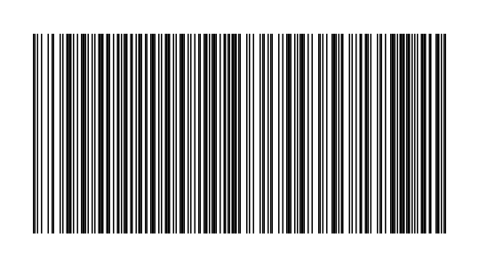
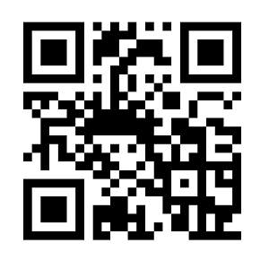
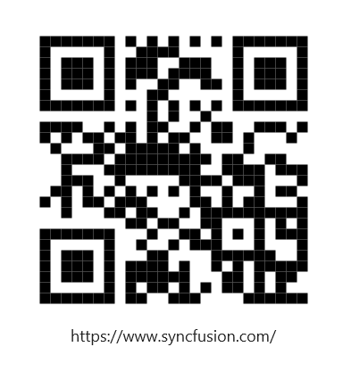

# Getting Started with .NET MAUI Barcode Generator

This section explains the steps required to add the [`.NET MAUI Barcode Generator`](https://help.syncfusion.com/cr/maui/Syncfusion.Maui.Barcode.html) control. This section explains the steps required to add the barcode and set its symbology. This section covers only basic features needed to get started with Syncfusion barcode generator control.

To get start quickly with our .NET MAUI Barcode Generator, you can check the below video.



## Adding a SfBarcodeGenerator reference

The Syncfusion .NET MAUI components are available on [nuget.org](https://www.nuget.org/). To add SfBarcodeGenerator to your project, open the NuGet package manager in Visual Studio, search for [Syncfusion.Maui.Barcode] and then install it.

### Register the handler

Syncfusion.Maui.Core nuget is a dependent package for all Syncfusion controls of .NET MAUI. In the MauiProgram.cs file, register the handler for Syncfusion core.



using Microsoft.Maui;
using Microsoft.Maui.Hosting;
using Microsoft.Maui.Controls.Compatibility;
using Microsoft.Maui.Controls.Hosting;
using Microsoft.Maui.Controls.Xaml;
using Syncfusion.Maui.Core.Hosting;

namespace GaugeMauiSample
{
    public static class MauiProgram
    {
        public static MauiApp CreateMauiApp()
        {
            var builder = MauiApp.CreateBuilder();
            builder
            .UseMauiApp<App>()
            .ConfigureSyncfusionCore()
            .ConfigureFonts(fonts =>
            {
                fonts.AddFont("OpenSans-Regular.ttf", "OpenSansRegular");
            });

            return builder.Build();
        }
    }
}



## Adding a namespace

Add the following namespace to add .NET MAUI Barcode Generator.





    xmlns:barcode="clr-namespace:Syncfusion.Maui.Barcode;assembly=Syncfusion.Maui.Barcode"





    using Syncfusion.Maui.Barcode;





## Initialize the SfBarcodeGenerator control





<barcode:SfBarcodeGenerator Value="http://www.syncfusion.com" 
                            HeightRequest="150"/>





SfBarcodeGenerator barcode = new SfBarcodeGenerator();
barcode.HeightRequest = 150;
barcode.Value = "http://www.syncfusion.com";
this.Content = barcode;





N> The default symbology of SfBarcodeGenerator is [`Code128`](https://help.syncfusion.com/cr/maui/Syncfusion.Maui.Barcode.Code128.html).

## Initialize QR Code symbology

You can set the required symbology type to the barcode generator based on input value by initializing the [`Symbology`](https://help.syncfusion.com/cr/maui/Syncfusion.Maui.Barcode.SfBarcodeGenerator.html#Syncfusion_Maui_Barcode_SfBarcodeGenerator_Symbology) property. In the following code sample, the QR code is set as the barcode symbology.





        <barcode:SfBarcodeGenerator Value="https://www.syncfusion.com/" 
                                    HeightRequest="350" 
                                    WidthRequest="350">
            <barcode:SfBarcodeGenerator.Symbology>
                <barcode:QRCode />
            </barcode:SfBarcodeGenerator.Symbology>
        </barcode:SfBarcodeGenerator>





SfBarcodeGenerator barcode = new SfBarcodeGenerator();
barcode.HeightRequest = 350;
barcode.WidthRequest = 350;
barcode.Value = "https://www.syncfusion.com/";
barcode.Symbology = new QRCode();
this.Content = barcode;





## Display input value

The provided input value can be displayed below the barcode by enabling the ShowText property of barcode as shown in the following code sample.





        <barcode:SfBarcodeGenerator Value="https://www.syncfusion.com/" 
                                    ShowText="True" 
                                    TextSpacing="15" 
                                    HeightRequest="350" 
                                    WidthRequest="350">
            <barcode:SfBarcodeGenerator.Symbology>
                <barcode:QRCode />
            </barcode:SfBarcodeGenerator.Symbology>
        </barcode:SfBarcodeGenerator>





SfBarcodeGenerator barcode = new SfBarcodeGenerator();
barcode.HeightRequest = 350;
barcode.WidthRequest = 350;
barcode.Value = "https://www.syncfusion.com/";
barcode.Symbology = new QRCode();
barcode.ShowText = true;
barcode.TextSpacing = 15;
this.Content = barcode;





N> You can refer to our [.NET MAUI Barcode Generator](https://www.syncfusion.com/maui-controls/maui-barcodes) feature tour page for its groundbreaking feature representations. You can also explore our [.NET MAUI Barcode Generator example](https://github.com/syncfusion/maui-demos/tree/master/MAUI/Barcode) that shows you how to render the Barcode Generator in .NET MAUI.
