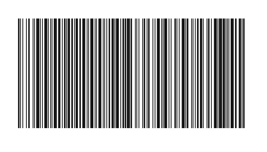

# Getting Started with .NET MAUI Barcode Generator

This section explains the steps required to add the [`.NET MAUI Barcode Generator`](https://help.syncfusion.com/cr/maui/Syncfusion.Maui.Barcode.html) control. This section explains the steps required to add the barcode and set its symbology. This section covers only basic features needed to get started with Syncfusion&reg; barcode generator control. Follow the steps below to add a .NET MAUI Barcode generator to your project.

To get start quickly with our .NET MAUI Barcode Generator, you can check the below video.






## Prerequisites

Before proceeding, ensure the following are set up:

1. Install [.NET 9 SDK](https://dotnet.microsoft.com/en-us/download/dotnet/9.0) or later.
2. Set up a .NET MAUI environment with Visual Studio 2022 v17.12 or later.

## Step 1: Create a new .NET MAUI project

1. Go to **File > New > Project** and choose the **.NET MAUI App** template.
2. Name the project and choose a location. Then click **Next**.
3. Select the .NET framework version and click **Create**.

## Step 2: Install the Syncfusion&reg; .NET MAUI Barcode NuGet package

1. In **Solution Explorer,** right-click the project and choose **Manage NuGet Packages.**
2. Search for [Syncfusion.Maui.Barcode](https://www.nuget.org/packages/Syncfusion.Maui.Barcode/) and install the latest version.
3. Ensure the necessary dependencies are installed correctly, and the project is restored.




## Prerequisites

Before proceeding, ensure the following are set up:

1. Install [.NET 9 SDK](https://dotnet.microsoft.com/en-us/download/dotnet/9.0) or later.
2. Set up a .NET MAUI environment with Visual Studio Code.
3. Ensure that the .NET MAUI workloads are installed and configured as described [here](https://learn.microsoft.com/en-us/dotnet/maui/get-started/installation?view=net-maui-9.0&tabs=visual-studio-code).

## Step 1: Create a new .NET MAUI project

1. Open the command palette by pressing `Ctrl+Shift+P` and type **.NET:New Project** and enter.
2. Choose the **.NET MAUI App** template.
3. Select the project location, type the project name and press **Enter**.
4. Then choose **Create project.**

## Step 2: Install the Syncfusion&reg; .NET MAUI Barcode NuGet package

1. Press <kbd>Ctrl</kbd> + <kbd>`</kbd> (backtick) to open the integrated terminal in Visual Studio Code.
2. Ensure you're in the project root directory where your .csproj file is located.
3. Run the command `dotnet add package Syncfusion.Maui.Barcode` to install the Syncfusion® .NET MAUI Barcode NuGet package.
4. To ensure all dependencies are installed, run `dotnet restore`.




## Prerequisites

Before proceeding, ensure the following are set up:

1. Install [.NET 9 SDK](https://dotnet.microsoft.com/en-us/download/dotnet/9.0) or later.
2. Set up a .NET MAUI environment with JetBrains Rider 2024.3 or later.
3. Make sure the MAUI workloads are installed and configured as described [here.](https://www.jetbrains.com/help/rider/MAUI.html#before-you-start)

## Step 1: Create a new .NET MAUI project

1. Go to **File > New Solution,** Select .NET (C#) and choose the .NET MAUI App template.
2. Enter the Project Name, Solution Name, and Location.
3. Select the .NET framework version and click Create.

## Step 2: Install the Syncfusion® MAUI Barcode NuGet package

1. In **Solution Explorer,** right-click the project and choose **Manage NuGet Packages.**
2. Search for [Syncfusion.Maui.Barcode](https://www.nuget.org/packages/Syncfusion.Maui.Barcode/) and install the latest version.
3. Ensure the necessary dependencies are installed correctly, and the project is restored. If not, Open the Terminal in Rider and manually run: `dotnet restore`




## Step 3: Register Syncfusion handler
 
Make sure to add the namespace.
 


using Syncfusion.Maui.Core.Hosting;


 
Register the Syncfusion core handler in your `CreateMauiApp` method of `MauiProgram.cs` file to use Syncfusion controls.
 


builder.ConfigureSyncfusionCore();



## Step 4: Import the Barcode Generator namespace

Add the following namespace in your XAML or C#.



xmlns:barcode="clr-namespace:Syncfusion.Maui.Barcode;assembly=Syncfusion.Maui.Barcode"


using Syncfusion.Maui.Barcode;



## Step 5: Add the Barcode Generator component 

Create an instance for the Barcode generator control, and add it as content.




<barcode:SfBarcodeGenerator HeightRequest="150"/>





SfBarcodeGenerator barcode = new SfBarcodeGenerator();
barcode.HeightRequest = 150;
this.Content = barcode;




The following screenshot illustrates the result of the above code.

You can download the Barcode Generator Getting Started sample from [GitHub](https://github.com/SyncfusionExamples/getting-started-with-the-dotnet-maui-barcode-generator)

N> The default symbology of SfBarcodeGenerator is [`Code128`](https://help.syncfusion.com/cr/maui/Syncfusion.Maui.Barcode.Code128.html).

N> You can refer to our [.NET MAUI Barcode Generator](https://www.syncfusion.com/maui-controls/maui-barcodes) feature tour page for its groundbreaking feature representations. You can also explore our [.NET MAUI Barcode Generator example](https://github.com/syncfusion/maui-demos/tree/master/MAUI/Barcode) that shows you how to render the Barcode Generator in .NET MAUI.
