# One-dimensional symbology in .NET MAUI Barcodes (SfBarcodeGenerator)

The one-dimensional barcode represents the data by varying the widths and spacings of the parallel lines. These barcode types are also known as linear barcode types. The Syncfusion .NET MAUI barcode generator supports the following one-dimensional barcode types:

* `Codabar`
* `Code39`
* `Code39Extended`
* `Code93`
* `UPCA`
* `UPCE`
* `EAN8`
* `EAN13`
* `Code128`
* `Code128A`
* `Code128B`
* `Code128C`

## Codabar

* `Codabar` is a discrete numeric symbology that is used in libraries, blood banks and a variety of other information processing applications.
* Encodes only numeric characters and some special characters such as dash (-), colon (:), slash (/), and plus (+).
* Each character has three bars and four spaces.
* Uses characters of A, B, C, D as start and stop characters.





    <barcode:SfBarcodeGenerator Value="123456789"
                                ShowText="True"
                                HeightRequest="150">
        <barcode:SfBarcodeGenerator.Symbology>
            <barcode:Codabar Module="2" />
        </barcode:SfBarcodeGenerator.Symbology>
    </barcode:SfBarcodeGenerator>





        SfBarcodeGenerator barcode = new SfBarcodeGenerator();
        barcode.HeightRequest = 150;
        barcode.Value = "123456789";
        barcode.Symbology = new Codabar() { Module = 2 };
        barcode.ShowText = true;
        this.Content = barcode;





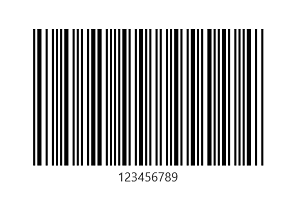

## Code39

`Code 39` is a discrete, variable-length symbology that encodes alphanumeric characters into a series of bars. Each barcode begins and ends with a special start and stop characters. Code 39 is self-checking, a check digit is not usually required for common use. For certain cases, applications requiring an extremely high level of accuracy of the checksum digit might be added.

* Allows character set of digits (0-9), upper case alphabets (A-Z), and symbols like space, minus (-), plus (+), period (.), dollar sign ($), slash (/), and percent (%).
* Each character is encoded with five bars and four spaces where three are wide and six are narrow.





    <barcode:SfBarcodeGenerator Value="CODE39"
                                ShowText="True"
                                HeightRequest="150">
        <barcode:SfBarcodeGenerator.Symbology>
            <barcode:Code39 Module="2" />
        </barcode:SfBarcodeGenerator.Symbology>
    </barcode:SfBarcodeGenerator>





    SfBarcodeGenerator barcode = new SfBarcodeGenerator();
    barcode.HeightRequest = 150;
    barcode.Value = "CODE39";
    barcode.Symbology = new Code39() { Module = 2 };
    barcode.ShowText = true;
    this.Content = barcode;





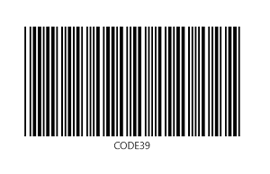

The `EnableCheckSum` property of `Code39` barcode allows to add the check digit along with the input value. The default value of `EnableCheckSum` property is true.

## Code39 Extended

* `Code39 Extended` symbology is an extended version of Code39 that supports all 128 ASCII characters set. So, it encodes lower case alphabets (a-z) as well as special characters.





    <barcode:SfBarcodeGenerator Value="051091"
                               ShowText="True"
                               HeightRequest="150">
        <barcode:SfBarcodeGenerator.Symbology>
            <barcode:Code39Extended Module="2" />
        </barcode:SfBarcodeGenerator.Symbology>
    </barcode:SfBarcodeGenerator>





    SfBarcodeGenerator barcode = new SfBarcodeGenerator();
    barcode.HeightRequest = 150;
    barcode.Value = "051091";
    barcode.Symbology = new Code39Extended() { Module = 2 };
    barcode.ShowText = true;
    this.Content = barcode;





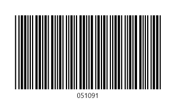

As like `Code39`, the `Code39 Extended` supports the `EnableCheckSum` property.

## Code93

`Code93` is designed to complement and enhance `Code39`. It represents the complete ASCII character set by using a combination of 2 characters. It is a continuous, variable-length symbology that produces a denser code.

* Encodes character set of upper case alphabets (A-Z), digits (0-9), and special characters such as asterisk (*), dash (-), dollar ($), percent (%), Space, dot (.), slash (/), plus (+) and so on.
* The asterisk (*) is not a true encoding character, but it is the start and stop symbol for `Code93` Symbology.





    <barcode:SfBarcodeGenerator Value="01234567"
                                ShowText="True"
                                HeightRequest="150">
        <barcode:SfBarcodeGenerator.Symbology>  
            <barcode:Code93 Module="2" />
        </barcode:SfBarcodeGenerator.Symbology>
    </barcode:SfBarcodeGenerator>





    SfBarcodeGenerator barcode = new SfBarcodeGenerator();
    barcode.HeightRequest = 150;
    barcode.Value = "01234567";
    barcode.Symbology = new Code93() { Module = 2 };
    barcode.ShowText = true;
    this.Content = barcode;





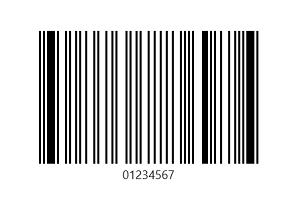

## Code128

`Code 128` is a highly efficient, high-density linear barcode symbology that allows the encoding of alphanumeric data. It is capable of encoding full ASCII character sets and extended character sets. This symbology contains the checksum digit for verification and the barcode can also be verified character-by-character for the parity of each data byte.

The `Code128` symbology encodes the input symbols supported by `Code128A`, `Code128B`, `Code128C`. The default symbology type of barcode generator is `Code128`.





    <barcode:SfBarcodeGenerator Value="CODE128"
                                ShowText="True"
                                HeightRequest="150">
        <barcode:SfBarcodeGenerator.Symbology>
                <barcode:Code128 Module="2" />
        </barcode:SfBarcodeGenerator.Symbology>
    </barcode:SfBarcodeGenerator>





    SfBarcodeGenerator barcode = new SfBarcodeGenerator();
    barcode.HeightRequest = 150;
    barcode.Value = "CODE128";
    barcode.Symbology = new Code128() { Module = 2 };
    barcode.ShowText = true;
    this.Content = barcode;





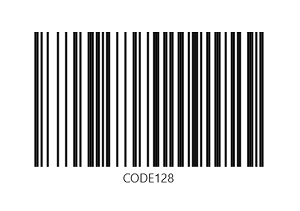

## Code128A

`Code128A` (or Chars Set A) includes all the standard upper case U.S. alphanumeric keyboard characters and punctuation characters, as well as the control characters (characters with ASCII values from 0 to 95 inclusive) and seven special characters.





    <barcode:SfBarcodeGenerator Value="CODE128A"
                                ShowText="True"
                                HeightRequest="150">
        <barcode:SfBarcodeGenerator.Symbology>
            <barcode:Code128A Module="2" />
        </barcode:SfBarcodeGenerator.Symbology>
    </barcode:SfBarcodeGenerator>





    SfBarcodeGenerator barcode = new SfBarcodeGenerator();
    barcode.HeightRequest = 150;
    barcode.Value = "CODE128A";
    barcode.Symbology = new Code128A();
    barcode.ShowText = true;
    this.Content = barcode;





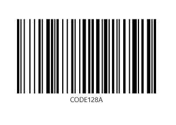

## Code128B

`Code128B` (or Chars Set B) includes all the standard upper case alphanumeric keyboard characters and punctuation characters, as well as the lower case alphabetic characters (characters with ASCII values from 32 to 127 inclusive) and seven special characters.





    <barcode:SfBarcodeGenerator Value="CODE128B"
                                ShowText="True"
                                HeightRequest="150">
        <barcode:SfBarcodeGenerator.Symbology>
            <barcode:Code128B Module="2" />
        </barcode:SfBarcodeGenerator.Symbology>
    </barcode:SfBarcodeGenerator>





    SfBarcodeGenerator barcode = new SfBarcodeGenerator();
    barcode.HeightRequest = 150;
    barcode.Value = "CODE128B";
    barcode.Symbology = new Code128B() { Module = 2 };
    barcode.ShowText = true;
    this.Content = barcode;





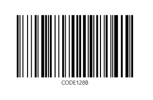

## Code128C

`Code128C` (or Chars Set C) includes a set of 100 digit pairs from 00 to 99 inclusive, as well as three special characters. This allows numeric data to be encoded as two data digits per symbol character effectively twice the density of standard data.





    <barcode:SfBarcodeGenerator Value="1234567890"
                                ShowText="True"
                                HeightRequest="150">
        <barcode:SfBarcodeGenerator.Symbology>
            <barcode:Code128C Module="2" />
        </barcode:SfBarcodeGenerator.Symbology>
    </barcode:SfBarcodeGenerator>





    SfBarcodeGenerator barcode = new SfBarcodeGenerator();
    barcode.HeightRequest = 150;
    barcode.Value = "1234567890";   
    barcode.Symbology = new Code128C() { Module = 2 };
    barcode.ShowText = true;
    this.Content = barcode;





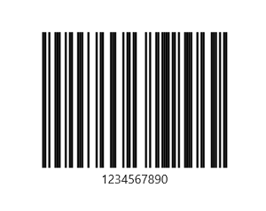

### Code 128 special characters

The last seven characters of Code Sets A and B (character values 96 - 102) and the last three characters of Code Set C (character values 100 - 102) are special non-data characters with no ASCII character equivalents that have a particular significance to the Barcode reading device.

## UPC-A

`UPC-A` symbology supports only numeric characters. It encodes 11 digits of provided numeric input (0 to 9) along with a check digit at its end, for a total of 12 digits of input data. If you give 11 numeric inputs, the check digit should automatically calculate at the end, and if you give 12 numeric inputs, the last digit should be check digit, otherwise it will not be accepted.

* This type is mainly used for worldwide retail.





    <barcode:SfBarcodeGenerator Value="72527273070"
                                ShowText="True"
                                HeightRequest="150">
       <barcode:SfBarcodeGenerator.Symbology>
            <barcode:UPCA Module="2" />
        </barcode:SfBarcodeGenerator.Symbology>
    </barcode:SfBarcodeGenerator>





    SfBarcodeGenerator barcode = new SfBarcodeGenerator();
    barcode.HeightRequest = 150;
    barcode.Value = "72527273070";
    barcode.Symbology = new UPCA() { Module = 2 };
    barcode.ShowText = true;
    this.Content = barcode;





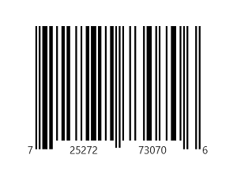

## UPC-E

As like `UPC-A`, the `UPC-E` symbology supports only numeric character. It is a zero suppressed version of `UPC-A` symbology where it uses only 6 digits of product code and does not use the middle guard. By default, the number system(0) will add at the front and check digit at the end along with 6 digits of the input product code.

* This type is mainly used on products with very small packaging details.





    <barcode:SfBarcodeGenerator Value="310194"
                                ShowText="True"
                                HeightRequest="150">
        <barcode:SfBarcodeGenerator.Symbology>
            <barcode:UPCE Module="2" />
        </barcode:SfBarcodeGenerator.Symbology>
    </barcode:SfBarcodeGenerator>





    SfBarcodeGenerator barcode = new SfBarcodeGenerator();
    barcode.HeightRequest = 150;
    barcode.Value = "310194";
    barcode.Symbology = new UPCE() { Module = 2 };
    barcode.ShowText = true;
    this.Content = barcode;





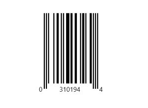

## EAN-13

The `EAN-13`  standard is based on the `UPC-A` standard.. As like `UPC-A`, it supports only the numeric character. It encodes the 12 digits of input data with the check digit at its end.

* This difference between the `UPCA` and `EAN13` is that number system used in the `EAN13` is 2 digits ranges from 00 to 99 whereas the number system used in `UPCA` is single digits range from 0 to 9.





    <barcode:SfBarcodeGenerator Value="9735940564824"
                                ShowText="True"
                                HeightRequest="150">
        <barcode:SfBarcodeGenerator.Symbology>
            <barcode:EAN13 Module="2" />
        </barcode:SfBarcodeGenerator.Symbology>
    </barcode:SfBarcodeGenerator>





    SfBarcodeGenerator barcode = new SfBarcodeGenerator();
    barcode.HeightRequest = 150;
    barcode.Value = "9735940564824";
    barcode.Symbology = new EAN13() { Module = 2 };
    barcode.ShowText = true;
    this.Content = barcode;





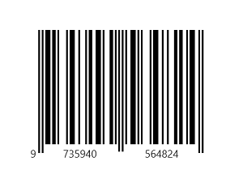

## EAN-8

`EAN8` is equivalent to the `UPCE` for small packaging details. It is shorter than the `EAN13` barcode and it is longer than `UPCE`.

As like `EAN13` and `UPCE`, it encodes 7 digits of numeric data with the check digit at its end.





    <barcode:SfBarcodeGenerator Value="11223344"
                                ShowText="True"
                                HeightRequest="150">
        <barcode:SfBarcodeGenerator.Symbology>
            <barcode:EAN8 Module="2" />
        </barcode:SfBarcodeGenerator.Symbology>
    </barcode:SfBarcodeGenerator>





    SfBarcodeGenerator barcode = new SfBarcodeGenerator();
    barcode.HeightRequest = 150;
    barcode.Value = "11223344";
    barcode.Symbology = new EAN8() { Module = 2 };
    barcode.ShowText = true;
    this.Content = barcode;





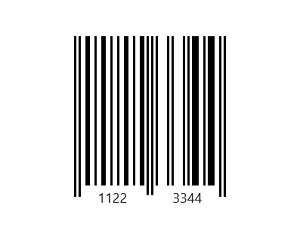

All the one-dimensional symbology supports the `Module` property. This property is used to define the size of the smallest line or dot of the barcode. If this property is not set, the size of the smallest line of the barcode is calculated based on the available size and total number of bars for the provided input value.
