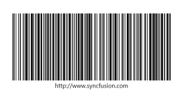
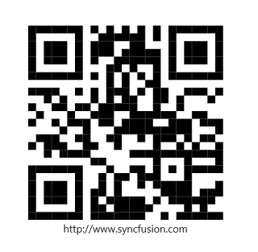

# .NET MAUI Barcode Generator Overview

The Syncfusion&reg; [.NET MAUI Barcode Generator](https://www.syncfusion.com/maui-controls/maui-barcodes) is a data visualization control used to generate and display data in a machine-readable format. It provides a perfect approach to encode text using supported symbology types.

## Key features

* **One-dimensional barcodes** - Barcode Generator supports different one-dimensional barcode symbologies such as [`Code128`](https://help.syncfusion.com/cr/maui/Syncfusion.Maui.Barcode.Code128.html), [`EAN8`](https://help.syncfusion.com/cr/maui/Syncfusion.Maui.Barcode.EAN8.html),[`EAN13`](https://help.syncfusion.com/cr/maui/Syncfusion.Maui.Barcode.EAN13.html), [`UPC-A`](https://help.syncfusion.com/cr/maui/Syncfusion.Maui.Barcode.UPCA.html), [`UPC-E`](https://help.syncfusion.com/cr/maui/Syncfusion.Maui.Barcode.UPCE.html), [`Code39`](https://help.syncfusion.com/cr/maui/Syncfusion.Maui.Barcode.Code39.html), [`Code39 Extended`](https://help.syncfusion.com/cr/maui/Syncfusion.Maui.Barcode.Code39Extended.html), [`Code93`](https://help.syncfusion.com/cr/maui/Syncfusion.Maui.Barcode.Code93.html), and [`Codabar`](https://help.syncfusion.com/cr/maui/Syncfusion.Maui.Barcode.Codabar.html).
* **Two-dimensional barcode** - Barcode Generator supports popular [`QR code`](https://help.syncfusion.com/cr/maui/Syncfusion.Maui.Barcode.QRCode.html) and [`Data Matrix`](https://help.syncfusion.com/cr/maui/Syncfusion.Maui.Barcode.DataMatrix.html).
* **Barcode customization** - Customize the visual appearance of barcodes using the `BackgroundColor` and [`ForegroundColor`](https://help.syncfusion.com/cr/maui/Syncfusion.Maui.Barcode.SfBarcodeGenerator.html#Syncfusion_Maui_Barcode_SfBarcodeGenerator_ForegroundColor) properties, and adjust the size of the smallest line or dot of the code using the [`Module`](https://help.syncfusion.com/cr/maui/Syncfusion.Maui.Barcode.SymbologyBase.html#Syncfusion_Maui_Barcode_SymbologyBase_Module) property.
* **Text customization** - Configure to display the barcode value and customize the position and style of the barcode text.

N> You can get the samples in the [GitHub](https://github.com/syncfusion/maui-demos) link.
