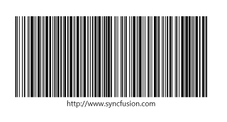
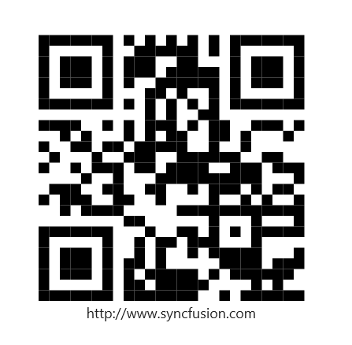

# .NET MAUI Barcode Generator Overview

The Syncfusion&reg; [.NET MAUI Barcode Generator](https://www.syncfusion.com/maui-controls/maui-barcodes) is a data visualization control used to generate and display data in a machine-readable format. It provides a perfect approach to encode text using supported symbology types.

## Business use cases

- Retail and billing systems that require barcode-based product identification and checkout processing.
- Inventory management applications that depend on efficient tracking of items using readable codes.
- Logistics and shipment systems that rely on barcode labeling for packages and deliveries.
- Ticketing and access control solutions that use QR codes or Data Matrix for validation and entry.

## Key features

* **One-dimensional barcodes** support multiple linear symbologies such as [`Code128`](https://help.syncfusion.com/cr/maui/Syncfusion.Maui.Barcode.Code128.html), [`EAN8`](https://help.syncfusion.com/cr/maui/Syncfusion.Maui.Barcode.EAN8.html),[`EAN13`](https://help.syncfusion.com/cr/maui/Syncfusion.Maui.Barcode.EAN13.html), [`UPC-A`](https://help.syncfusion.com/cr/maui/Syncfusion.Maui.Barcode.UPCA.html), [`UPC-E`](https://help.syncfusion.com/cr/maui/Syncfusion.Maui.Barcode.UPCE.html), [`Code39`](https://help.syncfusion.com/cr/maui/Syncfusion.Maui.Barcode.Code39.html), [`Code39 Extended`](https://help.syncfusion.com/cr/maui/Syncfusion.Maui.Barcode.Code39Extended.html), [`Code93`](https://help.syncfusion.com/cr/maui/Syncfusion.Maui.Barcode.Code93.html), and [`Codabar`](https://help.syncfusion.com/cr/maui/Syncfusion.Maui.Barcode.Codabar.html).
* **Two-dimensional barcode** include [`QR code`](https://help.syncfusion.com/cr/maui/Syncfusion.Maui.Barcode.QRCode.html) and [`Data Matrix`](https://help.syncfusion.com/cr/maui/Syncfusion.Maui.Barcode.DataMatrix.html) formats for compact and high-density data encoding.
* **Barcode customization** allows modifying properties such as `BackgroundColor`, [`ForegroundColor`](https://help.syncfusion.com/cr/maui/Syncfusion.Maui.Barcode.SfBarcodeGenerator.html#Syncfusion_Maui_Barcode_SfBarcodeGenerator_ForegroundColor), and [`Module`](https://help.syncfusion.com/cr/maui/Syncfusion.Maui.Barcode.SymbologyBase.html#Syncfusion_Maui_Barcode_SymbologyBase_Module) size for better readability.
* **Text customization** enables displaying encoded values with configurable position and styling.

## Globalization

The following table summarizes the globalization support available in this control.

 Partial Support   
 No Support  
 Not Applicable

<table>
<tr>
<th align="center">Control</th>
<th align="center">Localization</th>
<th align="center">RTL</th>
<th align="center">Time zone</th>
<th align="center">Screen reader</th>
<th align="center">Keyboard navigation</th>
</tr>
<tr>
<td><a href="/maui/barcode-generator/overview">Barcode Generator<a></td>
<td align="center"></td>
<td align="center"></td>
<td align="center"></td>
<td align="center"></td>
<td align="center"></td>
</tr> 
</table>

## Related controls

- [DataGrid](https://help.syncfusion.com/maui/datagrid/overview) for managing and displaying barcode-related data in tabular format.  
- [ListView](https://help.syncfusion.com/maui/listview/overview) for presenting barcode items in list-based layouts.
- [Treemap](https://help.syncfusion.com/maui/treemap/overview) for visualize barcode usage or distribution patterns in a hierarchical, comparative view.

## See Also

Explore further resources:

- [Getting Started](https://help.syncfusion.com/maui/barcode-generator/getting-started) shows how to begin using the Barcode Generator step by step.  
- [One Dimensional Symbology](https://help.syncfusion.com/maui/barcode-generator/one-dimensional-symbology) explains supported linear barcode types and usage.  
- [Customization](https://help.syncfusion.com/maui/barcode-generator/customization) shows how to customize barcode appearance and behavior.
- [UI Kit](https://www.syncfusion.com/demos/maui#maui-ui-control) provides interactive demos and ready-made UI examples.  

## Resources

<!-- Card 1 -->
<a href="https://www.syncfusion.com/maui-controls/maui-barcodes" class="form-card" target="_blank">
  

    <h3 class="form-title">Feature Tour</h3>
    

      Walk through highlights and core capabilities.
    

  

</a>
<!-- Card 2 -->
<a href="https://github.com/syncfusion/maui-demos/tree/master/MAUI/Barcode" class="form-card" target="_blank">
  

    <h3 class="form-title">Showcase Samples</h3>
    

      Explore sample scenarios for real apps.
    

  

</a>
<!-- Card 3 -->
<a href="https://www.syncfusion.com/tutorial-videos/maui/barcode" class="form-card" target="_blank">
  

    <h3 class="form-title">Tutorial Videos</h3>
    

      Step‑by‑step guidance through video tutorials.
    

  

</a>
<!-- Card 4 -->
<a href="https://support.syncfusion.com/kb/cross-platforms/category/76" class="form-card" target="_blank">
  

    <h3 class="form-title">Explore KB's</h3>
    

      Find quick solutions and step‑by‑step guidance.
    

  

</a>
<!-- Card 5 -->
<a href="https://www.syncfusion.com/blogs/category/net-maui" class="form-card" target="_blank">
  

    <h3 class="form-title">Explore Blogs</h3>
    

      Read insights, tutorials, and developer journeys.
    

  

</a>