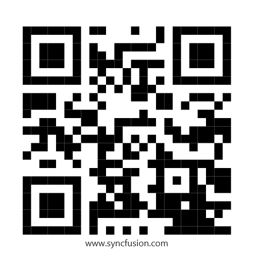
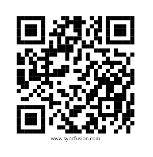
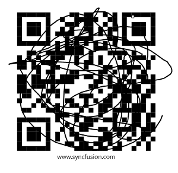
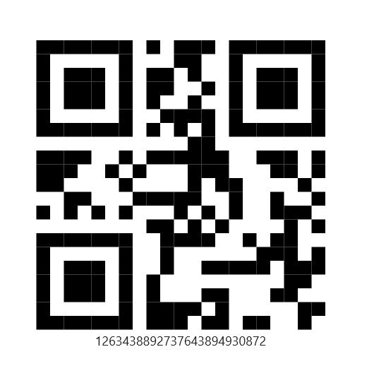
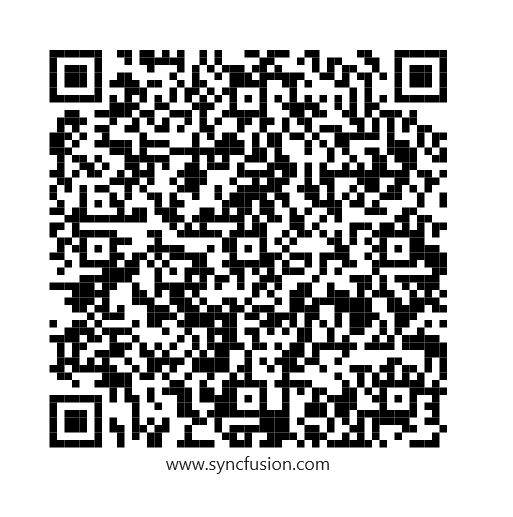
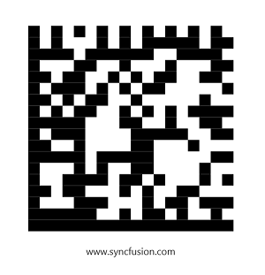

# Two-dimensional symbology in .NET MAUI Barcode Generator

The two-dimensional [.NET MAUI Barcode Generator](https://www.syncfusion.com/maui-controls/maui-barcodes) can represent more data per unit area compared to one-dimensional barcodes by using a two-dimensional layout. The barcode generator control supports the following two-dimensional symbology:

* [`QRCode`](https://help.syncfusion.com/cr/maui/Syncfusion.Maui.Barcode.QRCode.html)
* [`DataMatrix`](https://help.syncfusion.com/cr/maui/Syncfusion.Maui.Barcode.DataMatrix.html)

N> **Prerequisite:** Ensure that the required NuGet package is installed, the necessary namespaces are imported, and the **Barcode Generator** control is properly configured in your application. For detailed setup and configuration instructions, refer to the **[Getting Started](https://help.syncfusion.com/maui/barcode-generator/getting-started)** guide.

N> Like one-dimensional symbology, the two-dimensional symbology also supports the [`Module`](https://help.syncfusion.com/cr/maui/Syncfusion.Maui.Barcode.SymbologyBase.html#Syncfusion_Maui_Barcode_SymbologyBase_Module) property. The property is used to define the size of the smallest module or dot of the barcode. If this property is not set, the size of the smallest dot of the barcode is automatically calculated based on the available size.

## QR Code

A [`QR Code`](https://help.syncfusion.com/cr/maui/Syncfusion.Maui.Barcode.QRCode.html) is a two-dimensional barcode that consists of a grid of dark and light dots or blocks that form a square. The data encoded in the barcode can be numeric, alphanumeric, or Shift JIS characters.

* The QR code uses versions from 1 to 40. Version 1 measures 21 modules x 21 modules, Version 2 measures 25 modules x 25 modules, and so on. The number of modules increases in steps of 4 modules per side up to Version 40, which measures 177 modules x 177 modules.
* Each version has its own capacity. By default, the barcode control automatically sets the version according to the length of the input text.
* QR barcodes are designed for industrial uses and also commonly used in consumer advertising.





<barcode:SfBarcodeGenerator Value="www.syncfusion.com"
                            ShowText="True"
                            HeightRequest="300"
                            WidthRequest="300">
    <barcode:SfBarcodeGenerator.Symbology>
        <barcode:QRCode />
    </barcode:SfBarcodeGenerator.Symbology>
</barcode:SfBarcodeGenerator>





SfBarcodeGenerator barcode = new SfBarcodeGenerator();
barcode.HeightRequest = 300;
barcode.WidthRequest = 300;
barcode.Value = "www.syncfusion.com";
barcode.Symbology = new QRCode();
barcode.ShowText = true;
this.Content = barcode;





The data that can be stored in the QR code depends upon the following properties:

* [`Error correction level`](https://help.syncfusion.com/cr/maui/Syncfusion.Maui.Barcode.QRCode.html#Syncfusion_Maui_Barcode_QRCode_ErrorCorrectionLevel)
* [`Input mode`](https://help.syncfusion.com/cr/maui/Syncfusion.Maui.Barcode.QRCode.html#Syncfusion_Maui_Barcode_QRCode_InputMode)
* [`QR code version`](https://help.syncfusion.com/cr/maui/Syncfusion.Maui.Barcode.QRCodeVersion.html)

### Error correction level

The [`ErrorCorrectionLevel`](https://help.syncfusion.com/cr/maui/Syncfusion.Maui.Barcode.QRCode.html#Syncfusion_Maui_Barcode_QRCode_ErrorCorrectionLevel) property employs error correction to generate a series of error correction codewords that are added to the data codeword sequence in order to enable the symbol to withstand damage without loss of data. By default, its value is set as [`Auto`](https://help.syncfusion.com/cr/maui/Syncfusion.Maui.Barcode.ErrorCorrectionLevel.html#Syncfusion_Maui_Barcode_ErrorCorrectionLevel_Auto).

* `Low` - recovers up to 7% of data.
* `Medium` - recovers up to 15% of data.
* `Quartile` - recovers up to 25% of data.
* `High` - recovers up to 30% of data.
* `Auto` - calculates error correction level automatically based on [`InputMode`](https://help.syncfusion.com/cr/maui/Syncfusion.Maui.Barcode.QRCode.html#Syncfusion_Maui_Barcode_QRCode_InputMode) and [`CodeVersion`](https://help.syncfusion.com/cr/maui/Syncfusion.Maui.Barcode.QRCode.html#Syncfusion_Maui_Barcode_QRCode_CodeVersion).





<barcode:SfBarcodeGenerator Value="www.syncfusion.com"
                            ShowText="True"
                            HeightRequest="300" 
                            WidthRequest="300">
    <barcode:SfBarcodeGenerator.Symbology>
        <barcode:QRCode ErrorCorrectionLevel="High"/>          
    </barcode:SfBarcodeGenerator.Symbology>
</barcode:SfBarcodeGenerator>





SfBarcodeGenerator barcode = new SfBarcodeGenerator();
barcode.HeightRequest = 300;
barcode.WidthRequest = 300;
barcode.Value = "www.syncfusion.com";
barcode.Symbology = new QRCode() 
{ 
    ErrorCorrectionLevel = ErrorCorrectionLevel.High 
};

barcode.ShowText = true;
this.Content = barcode;





#### Damaged barcode recovery

The error correction level determines how much of the barcode can be damaged while still remaining readable. A higher error correction level allows recovery from greater levels of damage, but requires more space for error correction data. The following image demonstrates a QR code that has been partially damaged but can still be read based on the error correction level:

### Input mode

The [`InputMode`](https://help.syncfusion.com/cr/maui/Syncfusion.Maui.Barcode.QRCode.html#Syncfusion_Maui_Barcode_QRCode_InputMode) property allows you to select a specific set of input characters. You can select the most suitable input mode. By default, its value is set as [`Auto`](https://help.syncfusion.com/cr/maui/Syncfusion.Maui.Barcode.QRInputMode.html#Syncfusion_Maui_Barcode_QRInputMode_Auto).

* `Numeric` - supports digits from 0 to 9.
* `AlphaNumeric` - supports 0 to 9, A to Z, space, `$`, `%`, `*`, `+`, `-`, `.`, `/`, and `:`.
* `Binary` - supports Shift JIS characters.
* `Auto` - calculates input mode automatically based on [`CodeVersion`](https://help.syncfusion.com/cr/maui/Syncfusion.Maui.Barcode.QRCode.html#Syncfusion_Maui_Barcode_QRCode_CodeVersion) and [`ErrorCorrectionLevel`](https://help.syncfusion.com/cr/maui/Syncfusion.Maui.Barcode.QRCode.html#Syncfusion_Maui_Barcode_QRCode_ErrorCorrectionLevel).





<barcode:SfBarcodeGenerator Value="1263438892737643894930872"
                            ShowText="True"
                            HeightRequest="300"
                            WidthRequest="300">
    <barcode:SfBarcodeGenerator.Symbology>
        <barcode:QRCode InputMode="Numeric"/>
    </barcode:SfBarcodeGenerator.Symbology>
</barcode:SfBarcodeGenerator>





SfBarcodeGenerator barcode = new SfBarcodeGenerator();
barcode.HeightRequest = 300;
barcode.WidthRequest = 300;
barcode.Value = "1263438892737643894930872";
barcode.Symbology = new QRCode() 
{ 
    InputMode = QRInputMode.Numeric 
};

barcode.ShowText = true;
this.Content = barcode;





### QR code version

The [`CodeVersion`](https://help.syncfusion.com/cr/maui/Syncfusion.Maui.Barcode.QRCode.html#Syncfusion_Maui_Barcode_QRCode_CodeVersion) property allows you to set the QR code version from the [`QRCodeVersion`](https://help.syncfusion.com/cr/maui/Syncfusion.Maui.Barcode.QRCodeVersion.html) enumeration. By default, its value is set as `Auto`, which automatically selects the version based on the input length.





<barcode:SfBarcodeGenerator Value="www.syncfusion.com"
                            ShowText="True"
                            HeightRequest="300" 
                            WidthRequest="300">
    <barcode:SfBarcodeGenerator.Symbology>
        <barcode:QRCode CodeVersion="Version09"/>
    </barcode:SfBarcodeGenerator.Symbology>
</barcode:SfBarcodeGenerator>





SfBarcodeGenerator barcode = new SfBarcodeGenerator();
barcode.HeightRequest = 300;
barcode.WidthRequest = 300;
barcode.Value = "www.syncfusion.com";
barcode.Symbology = new QRCode() 
{ 
    CodeVersion = QRCodeVersion.Version09 
};

barcode.ShowText = true;
this.Content = barcode;





## Data Matrix

[`Data Matrix`](https://help.syncfusion.com/cr/maui/Syncfusion.Maui.Barcode.DataMatrix.html) barcode is a two-dimensional barcode that consists of a grid of dark and light dots or blocks forming a square or rectangular symbol. The data encoded in the barcode can either be numbers or alphanumeric characters. They are widely used in printed media such as labels and letters and can be read using a barcode reader or mobile phone.





<barcode:SfBarcodeGenerator Value="www.syncfusion.com"
                            ShowText="True"
                            HeightRequest="300" 
                            WidthRequest="300">
    <barcode:SfBarcodeGenerator.Symbology>
        <barcode:DataMatrix/>
    </barcode:SfBarcodeGenerator.Symbology>
</barcode:SfBarcodeGenerator>





SfBarcodeGenerator barcode = new SfBarcodeGenerator();
barcode.HeightRequest = 300;
barcode.WidthRequest = 300;
barcode.Value = "www.syncfusion.com";
barcode.Symbology = new DataMatrix();
barcode.ShowText = true;
this.Content = barcode;





### Data Matrix format

* **Length** - DataMatrix can store up to 2335 alphanumeric characters or 3116 numbers from the ASCII range.
* **Type** - DataMatrix supports the following data types:
  * [`Numeric`](https://help.syncfusion.com/cr/maui/Syncfusion.Maui.Barcode.QRInputMode.html#Syncfusion_Maui_Barcode_QRInputMode_Numeric)
  * [`AlphaNumeric`](https://help.syncfusion.com/cr/maui/Syncfusion.Maui.Barcode.QRInputMode.html#Syncfusion_Maui_Barcode_QRInputMode_AlphaNumeric)
  * [`Binary`](https://help.syncfusion.com/cr/maui/Syncfusion.Maui.Barcode.QRInputMode.html#Syncfusion_Maui_Barcode_QRInputMode_Binary)
* **Size** - The [`Size`](https://help.syncfusion.com/cr/maui/Syncfusion.Maui.Barcode.DataMatrix.html#Syncfusion_Maui_Barcode_DataMatrix_Size) depends upon the length and data type of the provided input values.

### Encoding methods

DataMatrix supports the following [`Encoding`](https://help.syncfusion.com/cr/maui/Syncfusion.Maui.Barcode.DataMatrix.html#Syncfusion_Maui_Barcode_DataMatrix_Encoding) types:

* [`Auto`](https://help.syncfusion.com/cr/maui/Syncfusion.Maui.Barcode.DataMatrixEncoding.html#Syncfusion_Maui_Barcode_DataMatrixEncoding_Auto) - Default. Selects the encoding automatically based on the input.
* [`ASCII`](https://help.syncfusion.com/cr/maui/Syncfusion.Maui.Barcode.DataMatrixEncoding.html#Syncfusion_Maui_Barcode_DataMatrixEncoding_ASCII) - The codeword is calculated as follows:
  * `Codeword = ASCII value + 1`
  * The ASCII value ranges from 0 to 127.
* [`ASCIINumeric`](https://help.syncfusion.com/cr/maui/Syncfusion.Maui.Barcode.DataMatrixEncoding.html#Syncfusion_Maui_Barcode_DataMatrixEncoding_ASCIINumeric) - The codeword is calculated as follows:
  * `Codeword = numerical value pair + 130`
  * The numerical value pair will be like 00, 01, 02, ... 99.
* [`Base256`](https://help.syncfusion.com/cr/maui/Syncfusion.Maui.Barcode.DataMatrixEncoding.html#Syncfusion_Maui_Barcode_DataMatrixEncoding_Base256) - The first codeword is calculated with the value 235, and the second codeword is calculated with `ASCII value - 127`. The `Base256` value ranges from 128 to 255.

By default, the encoding type is [`Auto`](https://help.syncfusion.com/cr/maui/Syncfusion.Maui.Barcode.DataMatrixEncoding.html#Syncfusion_Maui_Barcode_DataMatrixEncoding_Auto).





<barcode:SfBarcodeGenerator Value="www.syncfusion.com"
                            ShowText="True"
                            HeightRequest="300" 
                            WidthRequest="300">
    <barcode:SfBarcodeGenerator.Symbology>
        <barcode:DataMatrix Encoding="ASCII"/>
    </barcode:SfBarcodeGenerator.Symbology>
</barcode:SfBarcodeGenerator>





SfBarcodeGenerator barcode = new SfBarcodeGenerator();
barcode.HeightRequest = 300;
barcode.WidthRequest = 300;
barcode.Value = "www.syncfusion.com";
barcode.Symbology = new DataMatrix() 
{ 
    Encoding = DataMatrixEncoding.ASCII 
};
barcode.ShowText = true;
this.Content = barcode;




