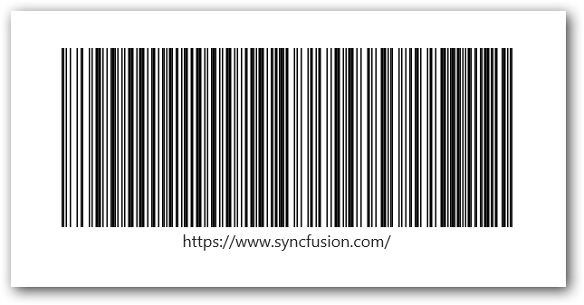
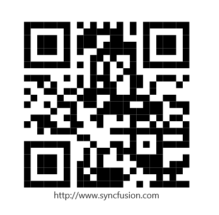

# .NET MAUI Barcode Generator Overview

The Syncfusion .NET MAUI Radial Barcode Generator is a data visualization control used to generate and display data in a machine-readable format. It provides a perfect approach to encode text using supported symbology types.

## Key Features

* **One-dimensional barcodes** - Barcode Generator supports different one-dimensional barcode symbologies such as `Code128`, `EAN8`, `EAN13`, `UPC-A`, `UPC-E`, `Code39`, `Code39 Extended`, `Code93`, and `Codabar`.
* **Two-dimensional barcode** - Barcode Generator supports popular `QR code` and `Data Matrix`.
* **Barcode customization** - Customize the visual appearance of barcodes using the backgroundColor and barColor properties and adjust the size of smallest line or dot of the code using the `module` property.
* **Text customization** - Configure to display the barcode value and customize the position and style of the barcode text.

N> You can get the samples in the [GitHub](https://github.com/syncfusion/maui-demos) link
