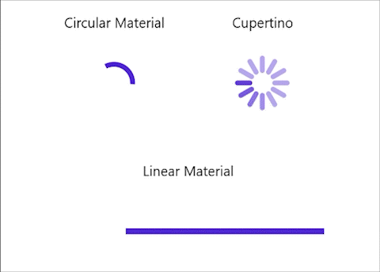

# Animation Type in .NET MAUI Busy Indicator (SfBusyIndicator)

## Animation Type in .NET MAUI BusyIndicator (SfBusyIndicator)

The `AnimationType` property for the SfBusyIndicator allows the users to set one of the animations from the built-in animations. The different types of animations are `CircularMaterial`, `LinearMaterial`, `Cupertino`.





    <?xml version="1.0" encoding="utf-8" ?>
    <ContentPage xmlns="http://schemas.microsoft.com/dotnet/2021/maui"
             xmlns:x="http://schemas.microsoft.com/winfx/2009/xaml"
             xmlns:core="clr-namespace:Syncfusion.Maui.Core;assembly=Syncfusion.Maui.Core"
             x:Class="BusyIndicatorSample.MainPage">

        <ContentPage.Content>
            <core:SfBusyIndicator x:Name="busyIndicator"
                                  IsRunning="True"
                                  AnimationType="CircularMaterial" />
        </ContentPage.Content>
    </ContentPage>





    using Syncfusion.Maui.Core;
    using Microsoft.Maui;
    using Microsoft.Maui.Controls;

    namespace BusyIndicatorSample
    {
       public partial class MainPage : ContentPage
       {
           public MainPage()
           {
               InitializeComponent();
               SfBusyIndicator busyIndicator = new SfBusyIndicator()
               {
                   IsRunning = true,
                   AnimationType = AnimationType.CircularMaterial;
               };
            this.Content = busyIndicator;
            }
       }
    }





The following gif image contains the types of animation in BusyIndicator.

