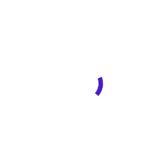
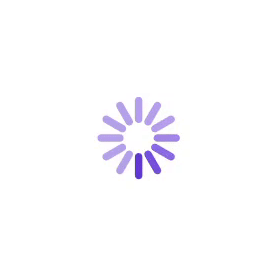
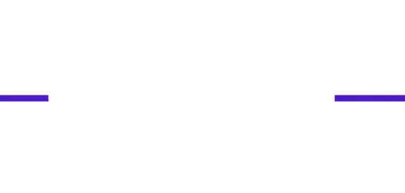
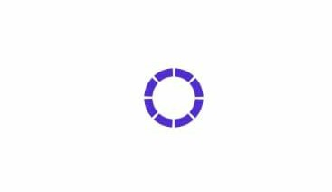
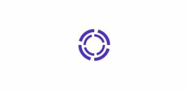
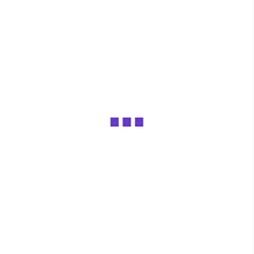

# Animation Type in .NET MAUI Busy Indicator (SfBusyIndicator)

The [AnimationType](https://help.syncfusion.com/cr/maui/Syncfusion.Maui.Core.SfBusyIndicator.html#Syncfusion_Maui_Core_SfBusyIndicator_AnimationType) property for the [.NET MAUI Busy Indicator](https://help.syncfusion.com/cr/maui/Syncfusion.Maui.Core.SfBusyIndicator.html) allows users to set one of the built-in animations. By default, the animation type is `CircularMaterial`. The different types of animations are [CircularMaterial](https://help.syncfusion.com/cr/maui/Syncfusion.Maui.Core.AnimationType.html#Syncfusion_Maui_Core_AnimationType_CircularMaterial), [Cupertino](https://help.syncfusion.com/cr/maui/Syncfusion.Maui.Core.AnimationType.html#Syncfusion_Maui_Core_AnimationType_Cupertino), [LinearMaterial](https://help.syncfusion.com/cr/maui/Syncfusion.Maui.Core.AnimationType.html#Syncfusion_Maui_Core_AnimationType_LinearMaterial), [SingleCircle](https://help.syncfusion.com/cr/maui/Syncfusion.Maui.Core.AnimationType.html#Syncfusion_Maui_Core_AnimationType_SingleCircle), [DoubleCircle](https://help.syncfusion.com/cr/maui/Syncfusion.Maui.Core.AnimationType.html#Syncfusion_Maui_Core_AnimationType_DoubleCircle), [Globe](https://help.syncfusion.com/cr/maui/Syncfusion.Maui.Core.AnimationType.html#Syncfusion_Maui_Core_AnimationType_Globe) and [HorizontalPulsingBox](https://help.syncfusion.com/cr/maui/Syncfusion.Maui.Core.AnimationType.html#Syncfusion_Maui_Core_AnimationType_HorizontalPulsingBox).

## Prerequisites

Before using the [`SfBusyIndicator`](https://help.syncfusion.com/cr/maui/Syncfusion.Maui.Core.SfBusyIndicator.html), ensure the following NuGet package is installed in your .NET MAUI project:

- `Syncfusion.Maui.Core`

For a step-by-step setup, refer to the [Getting Started](https://help.syncfusion.com/maui/busy-indicator/getting-started) documentation.

### CircularMaterial 

The CircularMaterial animation is one of the built-in animations in the [.NET MAUI Busy Indicator](https://help.syncfusion.com/cr/maui/Syncfusion.Maui.Core.SfBusyIndicator.html?tabs=tabid-1). It displays a circular material-style progress animation. Refer to the following code example where we set the animation type as [CircularMaterial](https://help.syncfusion.com/cr/maui/Syncfusion.Maui.Core.AnimationType.html#Syncfusion_Maui_Core_AnimationType_CircularMaterial).





<core:SfBusyIndicator x:Name="busyIndicator"
                      IsRunning="True"
                      AnimationType="CircularMaterial" />





SfBusyIndicator busyIndicator = new SfBusyIndicator()
{
    IsRunning = true,
    AnimationType = AnimationType.CircularMaterial,
};





The following gif image illustrates the result of the above code.

### Cupertino

The Cupertino animation is one of the built-in animations in the [.NET MAUI Busy Indicator](https://help.syncfusion.com/cr/maui/Syncfusion.Maui.Core.SfBusyIndicator.html?tabs=tabid-1). It displays an iOS-style activity indicator and is best suited for iOS targets. Refer to the following code example where we set the animation type as [Cupertino](https://help.syncfusion.com/cr/maui/Syncfusion.Maui.Core.AnimationType.html#Syncfusion_Maui_Core_AnimationType_Cupertino).





<core:SfBusyIndicator x:Name="busyIndicator"
                      IsRunning="True"
                      AnimationType="Cupertino" />





SfBusyIndicator busyIndicator = new SfBusyIndicator()
{
    IsRunning = true,
    AnimationType = AnimationType.Cupertino,
};





The following gif image illustrates the result of the above code.

### LinearMaterial

The LinearMaterial animation is one of the built-in animations in the [.NET MAUI Busy Indicator](https://help.syncfusion.com/cr/maui/Syncfusion.Maui.Core.SfBusyIndicator.html?tabs=tabid-1). It displays a horizontal material-style progress animation. Refer to the following code example where we set the animation type as [LinearMaterial](https://help.syncfusion.com/cr/maui/Syncfusion.Maui.Core.AnimationType.html#Syncfusion_Maui_Core_AnimationType_LinearMaterial).





<core:SfBusyIndicator x:Name="busyIndicator"
                      IsRunning="True"
                      AnimationType="LinearMaterial" />





SfBusyIndicator busyIndicator = new SfBusyIndicator()
{
    IsRunning = true,
    AnimationType = AnimationType.LinearMaterial,
};





The following gif image illustrates the result of the above code.

### SingleCircle

The SingleCircle animation is one of the built-in animations in the [.NET MAUI Busy Indicator](https://help.syncfusion.com/cr/maui/Syncfusion.Maui.Core.SfBusyIndicator.html?tabs=tabid-1). It displays a single rotating circle animation. Refer to the following code example where we set the animation type as [SingleCircle](https://help.syncfusion.com/cr/maui/Syncfusion.Maui.Core.AnimationType.html#Syncfusion_Maui_Core_AnimationType_SingleCircle).





<core:SfBusyIndicator x:Name="busyIndicator"
                      IsRunning="True"
                      AnimationType="SingleCircle" />





SfBusyIndicator busyIndicator = new SfBusyIndicator()
{
    IsRunning = true,
    AnimationType = AnimationType.SingleCircle,
};





The following gif image illustrates the result of the above code.

### DoubleCircle

The DoubleCircle animation is one of the built-in animations in the [.NET MAUI Busy Indicator](https://help.syncfusion.com/cr/maui/Syncfusion.Maui.Core.SfBusyIndicator.html?tabs=tabid-1). It displays two concentric rotating circles. Refer to the following code example where we set the animation type as [DoubleCircle](https://help.syncfusion.com/cr/maui/Syncfusion.Maui.Core.AnimationType.html#Syncfusion_Maui_Core_AnimationType_DoubleCircle).





<core:SfBusyIndicator x:Name="busyIndicator"
                      IsRunning="True"
                      AnimationType="DoubleCircle" />





SfBusyIndicator busyIndicator = new SfBusyIndicator()
{
    IsRunning = true,
    AnimationType = AnimationType.DoubleCircle,
};





The following gif image illustrates the result of the above code.

### Globe

The Globe animation is one of the built-in animations in the [.NET MAUI Busy Indicator](https://help.syncfusion.com/cr/maui/Syncfusion.Maui.Core.SfBusyIndicator.html?tabs=tabid-1). It displays a rotating globe-style animation. Refer to the following code example where we set the [AnimationType](https://help.syncfusion.com/cr/maui/Syncfusion.Maui.Core.SfBusyIndicator.html#Syncfusion_Maui_Core_SfBusyIndicator_AnimationType) as [Globe](https://help.syncfusion.com/cr/maui/Syncfusion.Maui.Core.AnimationType.html#Syncfusion_Maui_Core_AnimationType_Globe).





<core:SfBusyIndicator x:Name="busyIndicator"
                      IsRunning="True"
                      AnimationType="Globe" />





SfBusyIndicator busyIndicator = new SfBusyIndicator()
{
    IsRunning = true,
    AnimationType = AnimationType.Globe,
};





The following gif image illustrates the result of the above code.

### HorizontalPulsingBox

The HorizontalPulsingBox animation is one of the built-in animations in the [.NET MAUI Busy Indicator](https://help.syncfusion.com/cr/maui/Syncfusion.Maui.Core.SfBusyIndicator.html?tabs=tabid-1). It displays a row of horizontally pulsing boxes. Refer to the following code example where we set the [AnimationType](https://help.syncfusion.com/cr/maui/Syncfusion.Maui.Core.SfBusyIndicator.html#Syncfusion_Maui_Core_SfBusyIndicator_AnimationType) as [HorizontalPulsingBox](https://help.syncfusion.com/cr/maui/Syncfusion.Maui.Core.AnimationType.html#Syncfusion_Maui_Core_AnimationType_HorizontalPulsingBox).





<core:SfBusyIndicator x:Name="busyIndicator"
                      IsRunning="True"
                      AnimationType="HorizontalPulsingBox" />





SfBusyIndicator busyIndicator = new SfBusyIndicator()
{
    IsRunning = true,
    AnimationType = AnimationType.HorizontalPulsingBox,
};





The following gif image illustrates the result of the above code.

## See Also

- [Sizing in .NET MAUI Busy Indicator](https://help.syncfusion.com/maui/busy-indicator/sizing)
- [Animation duration in .NET MAUI Busy Indicator](https://help.syncfusion.com/maui/busy-indicator/duration)
- [Header in .NET MAUI Busy Indicator](https://help.syncfusion.com/maui/busy-indicator/set-header)