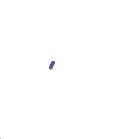
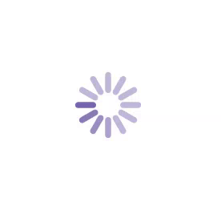
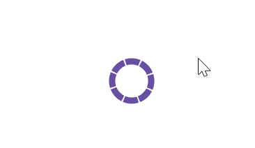

# Animation Type in .NET MAUI Busy Indicator (SfBusyIndicator)

## Animation Type in .NET MAUI Busy Indicator

The [AnimationType](https://help.syncfusion.com/cr/maui/Syncfusion.Maui.Core.SfBusyIndicator.html#Syncfusion_Maui_Core_SfBusyIndicator_AnimationType) property for the .NET MAUI Busy Indicator allows the users to set one of the animations from the built-in animations. The different types of animations are [CircularMaterial](https://help.syncfusion.com/cr/maui/Syncfusion.Maui.Core.AnimationType.html#Syncfusion_Maui_Core_AnimationType_CircularMaterial), [Cupertino](https://help.syncfusion.com/cr/maui/Syncfusion.Maui.Core.AnimationType.html#Syncfusion_Maui_Core_AnimationType_Cupertino), and [LinearMaterial.](https://help.syncfusion.com/cr/maui/Syncfusion.Maui.Core.AnimationType.html#Syncfusion_Maui_Core_AnimationType_LinearMaterial)

### Circular Material 

The CircularMaterial animation is an one of the built-in animations in [.NET MAUI Busy Indicator](https://help.syncfusion.com/cr/maui/Syncfusion.Maui.Core.SfBusyIndicator.html?tabs=tabid-1). Refer to the following code example. Here, we’ll set the animation type as [CircularMaterial.](https://help.syncfusion.com/cr/maui/Syncfusion.Maui.Core.AnimationType.html#Syncfusion_Maui_Core_AnimationType_CircularMaterial)





<core:SfBusyIndicator x:Name="busyIndicator"
                      IsRunning="True"
                      AnimationType="CircularMaterial" />





SfBusyIndicator busyIndicator = new SfBusyIndicator()
{
    IsRunning = true,
    AnimationType = AnimationType.CircularMaterial;
};





The following gif image illustrates the result of the above code.

### Cupertino

The Cupertino animation is an one of the built-in animations in [.NET MAUI Busy Indicator](https://help.syncfusion.com/cr/maui/Syncfusion.Maui.Core.SfBusyIndicator.html?tabs=tabid-1). Refer to the following code example. Here, we’ll set the animation type as [Cupertino](https://help.syncfusion.com/cr/maui/Syncfusion.Maui.Core.AnimationType.html#Syncfusion_Maui_Core_AnimationType_Cupertino).





<core:SfBusyIndicator x:Name="busyIndicator"
                      IsRunning="True"
                      AnimationType="Cupertino" />





SfBusyIndicator busyIndicator = new SfBusyIndicator()
{
    IsRunning = true,
    AnimationType = AnimationType.Cupertino;
};





The following gif image illustrates the result of the above code.

### Linear Material

The LinearMaterial animation is an one of the built-in animations in [.NET MAUI Busy Indicator](https://help.syncfusion.com/cr/maui/Syncfusion.Maui.Core.SfBusyIndicator.html?tabs=tabid-1). Refer to the following code example. Here, we’ll set the animation type as [LinearMaterial](https://help.syncfusion.com/cr/maui/Syncfusion.Maui.Core.AnimationType.html#Syncfusion_Maui_Core_AnimationType_LinearMaterial).





<core:SfBusyIndicator x:Name="busyIndicator"
                      IsRunning="True"
                      AnimationType="LinearMaterial" />





SfBusyIndicator busyIndicator = new SfBusyIndicator()
{
    IsRunning = true,
    AnimationType = AnimationType.LinearMaterial;
};





The following gif image illustrates the result of the above code.

### Single Circle

The SingleCircle animation is an one of the built-in animations in [.NET MAUI Busy Indicator](https://help.syncfusion.com/cr/maui/Syncfusion.Maui.Core.SfBusyIndicator.html?tabs=tabid-1). Refer to the following code example. Here, we’ll set the animation type as [SingleCircle.](https://help.syncfusion.com/cr/maui/Syncfusion.Maui.Core.AnimationType.html#Syncfusion_Maui_Core_AnimationType_SingleCircle)





<core:SfBusyIndicator x:Name="busyIndicator"
                      IsRunning="True"
                      AnimationType="SingleCircle" />





SfBusyIndicator busyIndicator = new SfBusyIndicator()
{
    IsRunning = true,
    AnimationType = AnimationType.SingleCircle;
};





The following gif image illustrates the result of the above code.

### Double Circle

The DoubleCircle animation is an one of the built-in animations in [.NET MAUI Busy Indicator](https://help.syncfusion.com/cr/maui/Syncfusion.Maui.Core.SfBusyIndicator.html?tabs=tabid-1). Refer to the following code example. Here, we’ll set the animation type as [DoubleCircle](https://help.syncfusion.com/cr/maui/Syncfusion.Maui.Core.AnimationType.html#Syncfusion_Maui_Core_AnimationType_DoubleCircle)





<core:SfBusyIndicator x:Name="busyIndicator"
                      IsRunning="True"
                      AnimationType="DoubleCircle" />





SfBusyIndicator busyIndicator = new SfBusyIndicator()
{
    IsRunning = true,
    AnimationType = AnimationType.DoubleCircle;
};





The following gif image illustrates the result of the above code.

### Globe

The Globe animation is one of the built-in animations in [.NET MAUI BusyIndicator](https://help.syncfusion.com/cr/maui/Syncfusion.Maui.Core.SfBusyIndicator.html?tabs=tabid-1). Refer to the following code example. Here, we’ll set the [AnimationType](https://help.syncfusion.com/cr/maui/Syncfusion.Maui.Core.SfBusyIndicator.html#Syncfusion_Maui_Core_SfBusyIndicator_AnimationType) as [Globe.](https://help.syncfusion.com/cr/maui/Syncfusion.Maui.Core.AnimationType.html#Syncfusion_Maui_Core_AnimationType_Globe)





    <core:SfBusyIndicator AnimationType="Globe" IsRunning="True"/>                        
                          




    SfBusyIndicator busyIndicator = new SfBusyIndicator()
    {
        AnimationType = AnimationType.Globe,
        IsRunning = true
    };





The following gif image illustrates the result of the above code.

### Horizontal Pulsing Box

The horizontal pulsing box animation is one of the built-in animations in [.NET MAUI BusyIndicator.](https://help.syncfusion.com/cr/maui/Syncfusion.Maui.Core.SfBusyIndicator.html?tabs=tabid-1) Refer to the following code example. Here, we’ll set the [AnimationType](https://help.syncfusion.com/cr/maui/Syncfusion.Maui.Core.SfBusyIndicator.html#Syncfusion_Maui_Core_SfBusyIndicator_AnimationType) as [HorizontalPulsingBox.](https://help.syncfusion.com/cr/maui/Syncfusion.Maui.Core.AnimationType.html#Syncfusion_Maui_Core_AnimationType_HorizontalPulsingBox)





    <core:SfBusyIndicator AnimationType="HorizontalPulsingBox" IsRunning="True"/>                        
                          




    SfBusyIndicator busyIndicator = new SfBusyIndicator()
    {
        AnimationType = AnimationType.HorizontalPulsingBox,
        IsRunning = true
    };





The following gif image illustrates the result of the above code.

