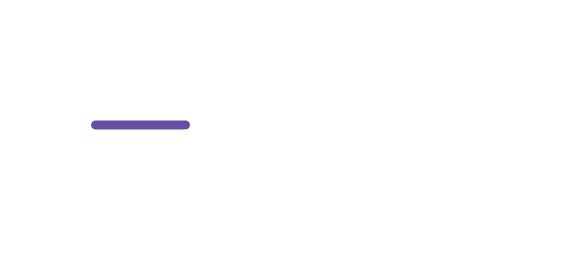

# Animation Type in .NET MAUI Busy Indicator (SfBusyIndicator)

## Animation Type in SfBusyIndicator

The `AnimationType` property for the SfBusyIndicator allows the users to set one of the animations from the built-in animations. The different types of animations are `CircularMaterial,` `Cupertino,` and `LinearMaterial.`

### Circular Material 

The CircularMaterial animation is an one of the built-in animations in SfBusyIndicator. Refer to the following code example. Here, we’ll set the animation type as `CircularMaterial`.





<core:SfBusyIndicator x:Name="busyIndicator"
                      IsRunning="True"
                      AnimationType="CircularMaterial" />





SfBusyIndicator busyIndicator = new SfBusyIndicator()
{
    IsRunning = true,
    AnimationType = AnimationType.CircularMaterial;
};





The following gif image illustrates the result of the above code.

### Cupertino

The Cupertino animation is an one of the built-in animations in SfBusyIndicator. Refer to the following code example. Here, we’ll set the animation type as `Cupertino`.





<core:SfBusyIndicator x:Name="busyIndicator"
                      IsRunning="True"
                      AnimationType="Cupertino" />





SfBusyIndicator busyIndicator = new SfBusyIndicator()
{
    IsRunning = true,
    AnimationType = AnimationType.Cupertino;
};





The following gif image illustrates the result of the above code.

### Linear Material

The LinearMaterial animation is an one of the built-in animations in SfBusyIndicator. Refer to the following code example. Here, we’ll set the animation type as `LinearMaterial`.





<core:SfBusyIndicator x:Name="busyIndicator"
                      IsRunning="True"
                      AnimationType="LinearMaterial" />





SfBusyIndicator busyIndicator = new SfBusyIndicator()
{
    IsRunning = true,
    AnimationType = AnimationType.LinearMaterial;
};





The following gif image illustrates the result of the above code.

