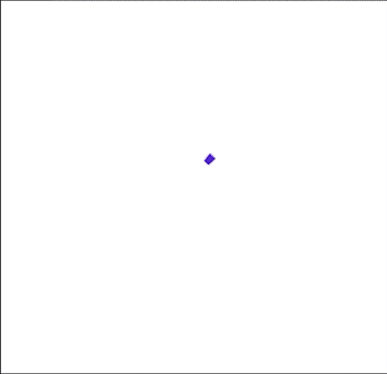

# Animation Duration in .NET MAUI Busy Indicator (SfBusyIndicator)

The [DurationFactor](https://help.syncfusion.com/cr/maui/Syncfusion.Maui.Core.SfBusyIndicator.html#Syncfusion_Maui_Core_SfBusyIndicator_DurationFactor) property of the [.NET MAUI Busy Indicator](https://help.syncfusion.com/cr/maui/Syncfusion.Maui.Core.SfBusyIndicator.html?tabs=tabid-1) is used to set the animation speed depending on a given value. A smaller duration value accelerates the animation speed. The default value is 0.5, and it ranges from 0 to 1.





<core:SfBusyIndicator x:Name="busyIndicator"
                      IsRunning="True"
                      AnimationType="CircularMaterial"
                      DurationFactor="0.2" />





SfBusyIndicator busyIndicator = new SfBusyIndicator()
{
    IsRunning = true,
    AnimationType = AnimationType.CircularMaterial;
    DurationFactor= 0.2
};





The following screenshot illustrates the result of the above code.

