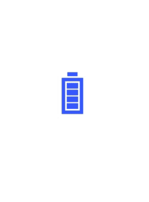

# Animation Duration in .NET MAUI Busy Indicator (SfBusyIndicator)

## Animation Duration in .NET MAUI BusyIndicator (SfBusyIndicator)

The `Duration` property of SfBusyIndicator indicates timeline for completing one animation cycle. Setting smaller duration value accelerates animation speed.





<?xml version="1.0" encoding="utf-8" ?>
<ContentPage xmlns="http://schemas.microsoft.com/dotnet/2021/maui"
             xmlns:x="http://schemas.microsoft.com/winfx/2009/xaml"
             xmlns:core="clr-namespace:Syncfusion.Maui.Core;assembly=Syncfusion.Maui.Core"
             x:Class="BusyIndicatorSample.MainPage">

    <ContentPage.Content>
        <core:SfBusyIndicator x:Name="busyindicator"
                              AnimationType="Cupertino"
                              Title="Cupertino"
                              IsRunning="True"
							  TextColor="Blue"/>
    </ContentPage.Content>
</ContentPage>





using Syncfusion.Maui.Core;
using Microsoft.Maui;
using Microsoft.Maui.Controls;

namespace BusyIndicatorSample
{
    public partial class MainPage : ContentPage
    {
        public MainPage()
        {
            InitializeComponent();
            SfBusyIndicator busyIndicator = new SfBusyIndicator()
            {
                AnimationType = AnimationTypes.Battery,
                ViewBoxWidth = 100,
                ViewBoxHeight = 100,
                Duration = 0.5f
            };

            this.Content = busyIndicator;
        }
    }
}
    




