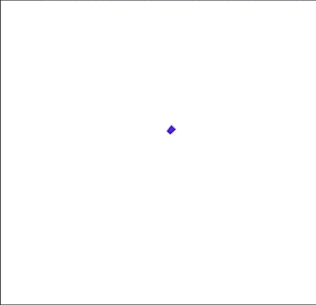

# Animation Duration in .NET MAUI Busy Indicator (SfBusyIndicator)

The [DurationFactor](https://help.syncfusion.com/cr/maui/Syncfusion.Maui.Core.SfBusyIndicator.html#Syncfusion_Maui_Core_SfBusyIndicator_DurationFactor) property of the [.NET MAUI Busy Indicator](https://help.syncfusion.com/cr/maui/Syncfusion.Maui.Core.SfBusyIndicator.html?tabs=tabid-1) controls the animation speed. **Type:** `double`. The default value is `0.5`, and the valid range is `0` to `1` (where `0` is the fastest and `1` is the slowest).

> **Prerequisites:** Add the `Syncfusion.Maui.Core` NuGet package to your .NET MAUI project. Refer to the [Getting Started](Getting-Started.md) documentation to set up the control.

N> Ensure that the following namespace is added in your XAML page for using SfBusyIndicator.





xmlns:core="clr-namespace:Syncfusion.Maui.Core;assembly=Syncfusion.Maui.Core"





using Syncfusion.Maui.Core;









<core:SfBusyIndicator x:Name="busyIndicator"
                      IsRunning="True"
                      AnimationType="CircularMaterial"
                      DurationFactor="0.2" />





SfBusyIndicator busyIndicator = new SfBusyIndicator()
{
    IsRunning = true,
    AnimationType = AnimationType.CircularMaterial,
    DurationFactor = 0.2,
};
this.Content = busyIndicator;





The following gif image illustrates the result of the above code.

### Using DurationFactor with other animation types

The `DurationFactor` property works with any of the built-in animation types. The following example demonstrates it with the `Globe` animation.





<core:SfBusyIndicator x:Name="busyIndicator"
                      IsRunning="True"
                      AnimationType="Globe"
                      DurationFactor="0.8" />





SfBusyIndicator busyIndicator = new SfBusyIndicator()
{
    IsRunning = true,
    AnimationType = AnimationType.Globe,
    DurationFactor = 0.8,
};
this.Content = busyIndicator;



