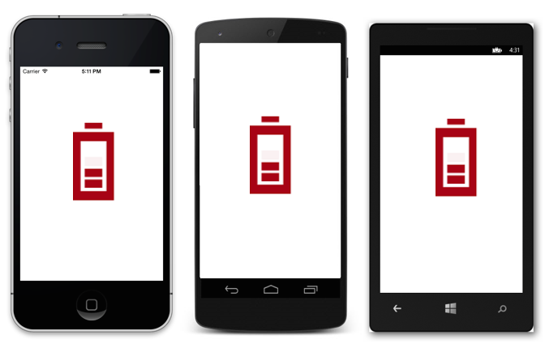

# Getting Started with .NET MAUI Busy Indicator (SfBusyIndicator)

## Getting started with .NET MAUI Busy Indicator(SfBusyIndicator)

This section explains you the steps to configure a SfBusyIndicator control in a real-time scenario and also provides a walk-through on some of the customization features available in SfBusyIndicator control.

## Adding a SfEffectsView reference

Syncfusion .NET MAUI controls are available in [Nuget.org](https://www.nuget.org/). To add [SfBusyIndicatorView](https://help.syncfusion.com/cr/maui/Syncfusion.Maui.Core.SfBusyIndicator.html?tabs=tabid-1) to your project, open the NuGet package manager in Visual Studio, search for [Syncfusion.Maui.Core](https://www.nuget.org/packages/Syncfusion.Maui.Core/) and then install it.

## Handler registration 

 In the MauiProgram.cs file, register the handler for Syncfusion core.


   
    using Microsoft.Maui;
    using Microsoft.Maui.Hosting;
    using Microsoft.Maui.Controls.Compatibility;
    using Microsoft.Maui.Controls.Hosting;
    using Microsoft.Maui.Controls.Xaml;
   `using Syncfusion.Maui.Core.Hosting;`

    namespace EffectsViewMauiSample
    {
      public static class MauiProgram
      {
        public static MauiApp CreateMauiApp()
        {
            var builder = MauiApp.CreateBuilder();
            builder
            .UseMauiApp<App>()
			.`ConfigureSyncfusionCore()` 
            .ConfigureFonts(fonts =>
            {
                fonts.AddFont("OpenSans-Regular.ttf", "OpenSansRegular");
            });

            return builder.Build();
         }
       
      }

    }     

 

## Create a Simple BusyIndicator

The SfBusyIndicator control is configured entirely in C# code or by using XAML markup. The following steps explain on how to create a SfBusyIndicator and configure its elements,

### Adding a SfBusyIndicator control

Step 1: Add the NuGet to the project as discussed in the above reference section. 

Step 2: Add the namespace as shown in the following code sample.





    xmlns:core="clr-namespace:Syncfusion.Maui.Core;assembly=Syncfusion.Maui.Core"
	




    using Syncfusion.Maui.Core;





Step 3: Set the control to content in `ContentPage`.





    <ContentPage.Content> 
         <core:SfBusyIndicator /> 
    </ContentPage.Content>  





    using Syncfusion.Maui.Core;

    namespace EffectsViewMauiSample   
    {  
    public partial class MainPage : ContentPage                  
    {   
    
       SfEffectsView effectsView;

        public MainPage()   
        {   
            InitializeComponent();       
            busyIndicator = new SfBusyIndicator(); 
            this.Content = busyIndicator;  
        }  
    }  
    
    }  





## Setting Animation Type

SfBusyIndicator provides 15 predefined animation types like Ball, Battery, Globe and so on. User can select any one of the animation types using `AnimationType`property.

Following example depicts the battery type animation for SfBusyIndicator. 





<?xml version="1.0" encoding="utf-8" ?>
<ContentPage xmlns="http://schemas.microsoft.com/dotnet/2021/maui"
             xmlns:x="http://schemas.microsoft.com/winfx/2009/xaml"
             xmlns:core="clr-namespace:Syncfusion.Maui.Core;assembly=Syncfusion.Maui.Core"
             x:Class="BusyIndicatorSample.MainPage">

    <ContentPage.Content>
        <core:SfBusyIndicator x:Name="busyindicator"
                              AnimationType="Cupertino"
                              Title="Cupertino"
                              IsRunning="True"
							  TextColor="Blue"
							  />
    </ContentPage.Content>
</ContentPage>





using Syncfusion.Maui.Core;
using Microsoft.Maui;
using Microsoft.Maui.Controls;

namespace BusyIndicatorSample
{
    public partial class MainPage : ContentPage
    {
        public MainPage()
        {
            InitializeComponent();
            SfBusyIndicator busyIndicator = new SfBusyIndicator()
            {
                AnimationType = AnimationType.Cupertino,
                Title = "Cupertino",
                IsRunning = "true",
                TextColor = Colors.Blue
            };

            this.Content = busyIndicator;
        }
    }
}





You can find the complete getting started sample from this [link.](https://github.com/SyncfusionExamples/xamarin.forms-busyindicator)