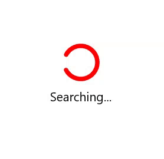

# Indicator color and Background in .NET MAUI Busy Indicator

## Indicator color in .NET MAUI Busy Indicator 

[.NET MAUI Busy Indicator](https://help.syncfusion.com/cr/maui/Syncfusion.Maui.Core.SfBusyIndicator.html?tabs=tabid-1) provides an option to customize the color of the indicator. This can be done using the [IndicatorColor](https://help.syncfusion.com/cr/maui/Syncfusion.Maui.Core.SfBusyIndicator.html#Syncfusion_Maui_Core_SfBusyIndicator_IndicatorColor) property.





    
<core:SfBusyIndicator x:Name="busyindicator"
                      IsRunning="True"
                      AnimationType="CircularMaterial"
                      Title="Searching..."
                      IndicatorColor="Red"/>           
 




SfBusyIndicator busyIndicator = new SfBusyIndicator()
{
    IsRunning = true,
    AnimationType = AnimationType.CircularMaterial,
    Title = "Searching...",
    IndicatorColor = Colors.Red
};





The following gif image illustrates the result of the above code.

## Overlay Background in SfBusyIndicator

[.NET MAUI Busy Indicator](https://help.syncfusion.com/cr/maui/Syncfusion.Maui.Core.SfBusyIndicator.html) provides an option to customize the overlay background. This can be done using the [OverlayFill](https://help.syncfusion.com/cr/maui/Syncfusion.Maui.Core.SfBusyIndicator.html#Syncfusion_Maui_Core_SfBusyIndicator_OverlayFill)  property.





<core:SfBusyIndicator x:Name="busyindicator"
                      IsRunning="True"
                      AnimationType="CircularMaterial"
                      Title="Searching..."
                      TextColor="White"
                      IndicatorColor="White"
                      OverlayFill="#512BD4" />       





SfBusyIndicator busyIndicator = new SfBusyIndicator()
{
    IsRunning = true,
    AnimationType = AnimationType.CircularMaterial,
    Title = "Searching...",
    TextColor = Colors.White,
    IndicatorColor = Colors.White,
    OverlayFill = Color.FromArgb("#512BD4")
};
 




The following gif image illustrates the result of the above code.

The [OverlayFill](https://help.syncfusion.com/cr/maui/Syncfusion.Maui.Core.SfBusyIndicator.html#Syncfusion_Maui_Core_SfBusyIndicator_OverlayFill) property type is `Brush`, so you can set Gradients as background.





<core:SfBusyIndicator IsRunning="True" 
                      AnimationType = "CircularMaterial"
                      IndicatorColor="#e64c93" 
                      Title="Searching...">
    <core:SfBusyIndicator.OverlayFill>
        <RadialGradientBrush>
            <GradientStop Color="#44e64c93"
                Offset="0.1" />
            <GradientStop Color="#AA9d40db"
                Offset="1.0" />
        </RadialGradientBrush>
    </core:SfBusyIndicator.OverlayFill>
</core:SfBusyIndicator>  




  
SfBusyIndicator busyIndicator = new SfBusyIndicator()
{
    IsRunning = true,
    AnimationType = AnimationType.CircularMaterial,
    Title = "Searching...",
    IndicatorColor = Color.FromArgb("#e64c93"),
    OverlayFill = new RadialGradientBrush()
    {
        GradientStops = new GradientStopCollection()
                            {
                                new GradientStop(){Color= Color.FromArgb("#44e64c93"),Offset= 0.1f},
                                new GradientStop(){ Color = Color.FromArgb("#AA9d40db"), Offset = 1.0f }
                            }
    }

};





The following gif image illustrates the result of the above code.

