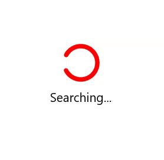

# Indicator Color and Background in .NET MAUI Busy Indicator

## Prerequisites

Before using the [`SfBusyIndicator`](https://help.syncfusion.com/cr/maui/Syncfusion.Maui.Core.SfBusyIndicator.html), ensure the following NuGet package is installed in your .NET MAUI project:

- `Syncfusion.Maui.Core`

For a step-by-step setup, refer to the [Getting Started](https://help.syncfusion.com/maui/busy-indicator/getting-started) documentation.

The .NET MAUI Busy Indicator lets you customize the indicator color and the overlay background. This section covers the [IndicatorColor](https://help.syncfusion.com/cr/maui/Syncfusion.Maui.Core.SfBusyIndicator.html#Syncfusion_Maui_Core_SfBusyIndicator_IndicatorColor) and [OverlayFill](https://help.syncfusion.com/cr/maui/Syncfusion.Maui.Core.SfBusyIndicator.html#Syncfusion_Maui_Core_SfBusyIndicator_OverlayFill) properties.

## IndicatorColor

The `.NET MAUI Busy Indicator` lets you customize the indicator's color using the [IndicatorColor](https://help.syncfusion.com/cr/maui/Syncfusion.Maui.Core.SfBusyIndicator.html#Syncfusion_Maui_Core_SfBusyIndicator_IndicatorColor) property. **Type:** `Color`. The default value is the system accent color.





<core:SfBusyIndicator x:Name="busyindicator"
                      IsRunning="True"
                      AnimationType="CircularMaterial"
                      Title="Searching..."
                      IndicatorColor="Red" />




SfBusyIndicator busyIndicator = new SfBusyIndicator()
{
    IsRunning = true,
    AnimationType = AnimationType.CircularMaterial,
    Title = "Searching...",
    IndicatorColor = Colors.Red,
};
this.Content = busyIndicator;





The following gif image illustrates the result of the above code.

## Overlay background

The [.NET MAUI Busy Indicator](https://help.syncfusion.com/cr/maui/Syncfusion.Maui.Core.SfBusyIndicator.html) also lets you customize the overlay background using the [OverlayFill](https://help.syncfusion.com/cr/maui/Syncfusion.Maui.Core.SfBusyIndicator.html#Syncfusion_Maui_Core_SfBusyIndicator_OverlayFill) property. **Type:** `Brush`. You can set it with a flat `Color` for a solid background or with a `Brush` (such as `RadialGradientBrush`) to apply gradients.





<core:SfBusyIndicator x:Name="busyindicator"
                      IsRunning="True"
                      AnimationType="CircularMaterial"
                      Title="Searching..."
                      TextColor="White"
                      IndicatorColor="White"
                      OverlayFill="#512BD4" />





SfBusyIndicator busyIndicator = new SfBusyIndicator()
{
    IsRunning = true,
    AnimationType = AnimationType.CircularMaterial,
    Title = "Searching...",
    TextColor = Colors.White,
    IndicatorColor = Colors.White,
    OverlayFill = new SolidColorBrush(Color.FromArgb("#512BD4")),
};
this.Content = busyIndicator;
 




The following gif image illustrates the result of the above code.

### Using a gradient brush

The `OverlayFill` property is of type `Brush`, which allows you to apply gradients to the background. The following example uses a `RadialGradientBrush`.





<core:SfBusyIndicator IsRunning="True"
                      AnimationType="CircularMaterial"
                      IndicatorColor="#e64c93"
                      Title="Searching...">
    <core:SfBusyIndicator.OverlayFill>
        <RadialGradientBrush>
            <GradientStop Color="#44e64c93"
                          Offset="0.1" />
            <GradientStop Color="#AA9d40db"
                          Offset="1.0" />
        </RadialGradientBrush>
    </core:SfBusyIndicator.OverlayFill>
</core:SfBusyIndicator>





SfBusyIndicator busyIndicator = new SfBusyIndicator()
{
    IsRunning = true,
    AnimationType = AnimationType.CircularMaterial,
    Title = "Searching...",
    IndicatorColor = Color.FromArgb("#e64c93"),
    OverlayFill = new RadialGradientBrush()
    {
        GradientStops = new GradientStopCollection()
        {
            new GradientStop() { Color = Color.FromArgb("#44e64c93"), Offset = 0.1f },
            new GradientStop() { Color = Color.FromArgb("#AA9d40db"), Offset = 1.0f },
        }
    },
};
this.Content = busyIndicator;





The following gif image illustrates the result of the above code.

