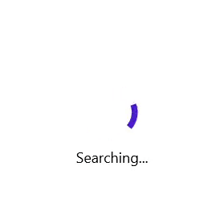

# .NET MAUI Busy Indicator (SfBusyIndicator) Overview

The Busy Indicator control for .NET MAUI provides an indication of the app loading, data processing etc. It can be customized in terms of Indicator size, color, speed and more.

## Key features

* Comes with three different animation types [Circular Material, Linear Material and Cupertino].
* Supports customizing the indicator color, and overlay background.
* The animation duration can be customized.
* Size of the indicator can be customized.
* Supports displaying a title with font customizations.

