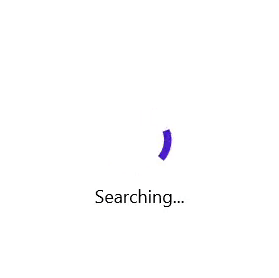

# .NET MAUI Busy Indicator (SfBusyIndicator) Overview

The .NET MAUI Busy Indicator control provides an indication of app loading, data processing, and more. It can be customized in terms of indicator size, color, speed and additional options.

## Business use cases

- Data-driven applications that require **loading indicators during API calls or data fetching operations**.  
- Dashboard and analytics apps that need to show **processing states while updating or refreshing data**.  
- Mobile and desktop applications that require **feedback during navigation or long-running actions**.  
- E-commerce and business apps that display **loading states during transactions or content updates**.  

## Key features

- **Multiple animation types** provide seven built-in styles such as Circular Material, Linear Material, Cupertino, Single Circle, Double Circle, Globe, and Horizontal Pulsing Box.  
- **Appearance customization** allows modifying the indicator color and overlay background to match application themes.  
- **Animation duration control** enables adjusting the speed of animations based on UI requirements.  
- **Flexible sizing** allows configuring the indicator size to fit different layouts and screen sizes.  
- **Title display support** allows showing text with customizable font settings to provide additional context.

    

## Related controls

- **[Button](https://help.syncfusion.com/maui/button/overview)** for triggering actions that require loading feedback.  
- **[DataGrid](https://help.syncfusion.com/maui/datagrid/overview)** for showing loading states while handling large datasets.  

## Next step

Explore further resources:

- [Getting Started](https://help.syncfusion.com/maui/busy-indicator/getting-started) - step-by-step guide to begin using the Busy Indicator.  
- [Indicator Color & Customization](https://help.syncfusion.com/maui/busy-indicator/indicatorcolor) - personalize indicator color and styles to fit your app theme. 
- [Animation Type](https://help.syncfusion.com/maui/busy-indicator/animationtype) - explore different animation types and behaviors. 

## Learnings

<!-- Card 1 -->
<a href="https://www.syncfusion.com/blogs/category/net-maui" class="form-card" target="_blank">
  

    <h3 class="form-title">Explore Blogs</h3>
    

      Read insights, tutorials, and developer journeys.
    

  

</a>
<!-- Card 2 -->
<a href="https://support.syncfusion.com/kb/cross-platforms/category/76" class="form-card" target="_blank">
  

    <h3 class="form-title">Explore KB's</h3>
    

      Find quick solutions and step‑by‑step guidance.
    

  

</a>
<!-- Card 3 -->
<a href="https://www.syncfusion.com/maui-controls/maui-busy-indicator" class="form-card" target="_blank">
  

    <h3 class="form-title">Feature Tour</h3>
    

      Walk through highlights and core capabilities.
    

  

</a>
<!-- Card 4 -->
<a href="https://github.com/syncfusion/maui-demos/tree/master/MAUI/BusyIndicator" class="form-card" target="_blank">
  

    <h3 class="form-title">Showcase Samples</h3>
    

      Explore sample scenarios for real apps.
    

  

</a>
<!-- Card 5 -->
<a href="https://www.syncfusion.com/tutorial-videos/maui/busy-indicator" class="form-card" target="_blank">
  

    <h3 class="form-title">Tutorial Videos</h3>
    

      Step‑by‑step guidance through video tutorials.
    

  

</a>
