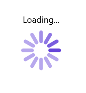
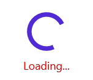
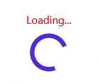
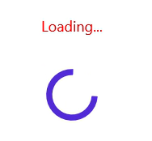

# Set Header in .NET MAUI Busy Indicator (SfBusyIndicator)

## Set Header in .NET MAUI Busy Indicator

The Syncfusion .NET MAUI Busy Indicator provides a feature to display a title with font customizations.

## Title

[.NET MAUI Busy Indicator](https://help.syncfusion.com/cr/maui/Syncfusion.Maui.Core.SfBusyIndicator.html?tabs=tabid-1) provides option to set the text that indicates the information related to loading. This can be done using [Title](https://help.syncfusion.com/cr/maui/Syncfusion.Maui.Core.SfBusyIndicator.html#Syncfusion_Maui_Core_SfBusyIndicator_Title) property.





<core:SfBusyIndicator x:Name="busyindicator"
                      IsRunning="True"
                      AnimationType="CircularMaterial"
                      Title="Loading..." />





SfBusyIndicator busyIndicator = new SfBusyIndicator()
{
    IsRunning = true,
    AnimationType = AnimationType.CircularMaterial,
    Title = "Loading...",
};





The following screenshot illustrates the result of the above code.

## Text Color

[.NET MAUI Busy Indicator](https://help.syncfusion.com/cr/maui/Syncfusion.Maui.Core.SfBusyIndicator.html?tabs=tabid-1) provides options to change the color of the text. The color of the text can be changed using the [TextColor](https://help.syncfusion.com/cr/maui/Syncfusion.Maui.Core.SfBusyIndicator.html#Syncfusion_Maui_Core_SfBusyIndicator_TextColor) property.




  
<core:SfBusyIndicator x:Name="busyindicator"
                      IsRunning="True"
                      AnimationType="CircularMaterial"
                      Title="Loading..."
                      TextColor = "Red" />           
       



   
SfBusyIndicator busyIndicator = new SfBusyIndicator()
{
    IsRunning = true,
    AnimationType = AnimationType.CircularMaterial,
    Title = "Loading...",
    TextColor = Colors.Red
};





The following screenshot illustrates the result of the above code.

## Title Placement

[.NET MAUI Busy Indicator](https://help.syncfusion.com/cr/maui/Syncfusion.Maui.Core.SfBusyIndicator.html?tabs=tabid-1)   provides options to set the [Title](https://help.syncfusion.com/cr/maui/Syncfusion.Maui.Core.SfBusyIndicator.html#Syncfusion_Maui_Core_SfBusyIndicator_Title) at the top or bottom of the Busy Indicator. The [Title](https://help.syncfusion.com/cr/maui/Syncfusion.Maui.Core.SfBusyIndicator.html#Syncfusion_Maui_Core_SfBusyIndicator_Title) can be set using the [TitlePlacement](https://help.syncfusion.com/cr/maui/Syncfusion.Maui.Core.SfBusyIndicator.html#Syncfusion_Maui_Core_SfBusyIndicator_TitlePlacement)  property. When the [Title](https://help.syncfusion.com/cr/maui/Syncfusion.Maui.Core.SfBusyIndicator.html#Syncfusion_Maui_Core_SfBusyIndicator_Title) is not needed, set the [TitlePlacement](https://help.syncfusion.com/cr/maui/Syncfusion.Maui.Core.SfBusyIndicator.html#Syncfusion_Maui_Core_SfBusyIndicator_TitlePlacement)  property of SfBusyIndicator to None.





<core:SfBusyIndicator x:Name="busyindicator"
                      IsRunning="True"
                      AnimationType="CircularMaterial"
                      Title="Loading..."
                      TextColor = "Red" 
                      TitlePlacement="Top"/>           




  
SfBusyIndicator busyIndicator = new SfBusyIndicator()
{
    IsRunning = true,
    AnimationType = AnimationType.CircularMaterial,
    Title = "Loading...",
    TextColor = Colors.Red,
    TitlePlacement = BusyIndicatorTitlePlacement.Top
};





The following screenshot illustrates the result of the above code.

## Title Spacing

[.NET MAUI Busy Indicator](https://help.syncfusion.com/cr/maui/Syncfusion.Maui.Core.SfBusyIndicator.html?tabs=tabid-1) provides options to set the space between the indicator and the title. The space can be set using the [TitleSpacing](https://help.syncfusion.com/cr/maui/Syncfusion.Maui.Core.SfBusyIndicator.html#Syncfusion_Maui_Core_SfBusyIndicator_TitleSpacing) property.





<core:SfBusyIndicator x:Name="busyindicator"
                      IsRunning="True"
                      AnimationType="CircularMaterial"
                      Title="Loading..."
                      TextColor = "Red" 
                      TitlePlacement="Top"
                      TitleSpacing="20"/>           





    
SfBusyIndicator busyIndicator = new SfBusyIndicator()
{
    IsRunning = true,
    AnimationType = AnimationType.CircularMaterial,
    Title = "Loading...",
    TextColor = Colors.Red,
    TitlePlacement = BusyIndicatorTitlePlacement.Top,
    TitleSpacing = 20
};





The following screenshot illustrates the result of the above code.

## Font customization

[.NET MAUI Busy Indicator](https://help.syncfusion.com/cr/maui/Syncfusion.Maui.Core.SfBusyIndicator.html) provides options to customize the title text. The title text can be customized using the [FontSize](https://help.syncfusion.com/cr/maui/Syncfusion.Maui.Core.SfBusyIndicator.html#Syncfusion_Maui_Core_SfBusyIndicator_FontSize), [FontAttributes](https://help.syncfusion.com/cr/maui/Syncfusion.Maui.Core.SfBusyIndicator.html#Syncfusion_Maui_Core_SfBusyIndicator_FontAttributes), and [FontFamily](https://help.syncfusion.com/cr/maui/Syncfusion.Maui.Core.SfBusyIndicator.html#Syncfusion_Maui_Core_SfBusyIndicator_FontFamily) properties.





<core:SfBusyIndicator x:Name="busyindicator"
                      IsRunning="True"
                      AnimationType="CircularMaterial"
                      Title="Loading..."
                      TextColor = "Red" 
                      FontSize = "16"
                      FontAttributes="Bold"
                      FontFamily="serif" />           
 




SfBusyIndicator busyIndicator = new SfBusyIndicator()
{
    IsRunning = true,
    AnimationType = AnimationType.CircularMaterial,
    Title = "Loading...",
    TextColor = Colors.Red,
    FontSize = 16,
    FontAttributes=FontAttributes.Bold,
    FontFamily="serif"
};





The following screenshot illustrates the result of the above code.

## FontAutoScalingEnabled

The `FontAutoScalingEnabled` property is used to automatically scale the control's font size based on the operating system's text size. The default value of `FontAutoScalingEnabled` property is `false`.





<core:SfBusyIndicator FontAutoScalingEnabled="True"/>





    
SfBusyIndicator busyIndicator = new SfBusyIndicator()
{
    FontAutoScalingEnabled = true,
};



