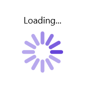
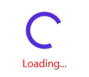
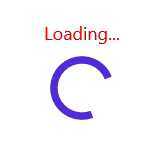
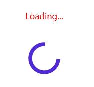

# Set Header in .NET MAUI Busy Indicator (SfBusyIndicator)

The Syncfusion® .NET MAUI Busy Indicator lets you display a title and customize its font. This section covers the title, its color, placement, spacing, and font customization.

> **Prerequisites:** Add the `Syncfusion.Maui.Core` NuGet package to your .NET MAUI project. Refer to the [Getting Started](Getting-Started.md) documentation to set up the control.

N> Ensure that the following namespace is added in your XAML page for using SfBusyIndicator.





xmlns:core="clr-namespace:Syncfusion.Maui.Core;assembly=Syncfusion.Maui.Core"





using Syncfusion.Maui.Core;





## Title

The [.NET MAUI Busy Indicator](https://help.syncfusion.com/cr/maui/Syncfusion.Maui.Core.SfBusyIndicator.html?tabs=tabid-1) lets you set text that describes the loading state using the [Title](https://help.syncfusion.com/cr/maui/Syncfusion.Maui.Core.SfBusyIndicator.html#Syncfusion_Maui_Core_SfBusyIndicator_Title) property. **Type:** `string`. The default value is an empty string.





<core:SfBusyIndicator x:Name="busyindicator"
                      IsRunning="True"
                      AnimationType="CircularMaterial"
                      Title="Loading..." />





SfBusyIndicator busyIndicator = new SfBusyIndicator()
{
    IsRunning = true,
    AnimationType = AnimationType.CircularMaterial,
    Title = "Loading...",
};
this.Content = busyIndicator;





The following gif image illustrates the result of the above code.

## TextColor

The [.NET MAUI Busy Indicator](https://help.syncfusion.com/cr/maui/Syncfusion.Maui.Core.SfBusyIndicator.html?tabs=tabid-1) lets you change the color of the title text using the [TextColor](https://help.syncfusion.com/cr/maui/Syncfusion.Maui.Core.SfBusyIndicator.html#Syncfusion_Maui_Core_SfBusyIndicator_TextColor) property. **Type:** `Color`. The default value is the system text color.





<core:SfBusyIndicator x:Name="busyindicator"
                      IsRunning="True"
                      AnimationType="CircularMaterial"
                      Title="Loading..."
                      TextColor="Red" />





SfBusyIndicator busyIndicator = new SfBusyIndicator()
{
    IsRunning = true,
    AnimationType = AnimationType.CircularMaterial,
    Title = "Loading...",
    TextColor = Colors.Red,
};
this.Content = busyIndicator;





The following gif image illustrates the result of the above code.

## TitlePlacement

The [.NET MAUI Busy Indicator](https://help.syncfusion.com/cr/maui/Syncfusion.Maui.Core.SfBusyIndicator.html?tabs=tabid-1) provides options to set the [Title](https://help.syncfusion.com/cr/maui/Syncfusion.Maui.Core.SfBusyIndicator.html#Syncfusion_Maui_Core_SfBusyIndicator_Title) at the top or bottom of the Busy Indicator using the [TitlePlacement](https://help.syncfusion.com/cr/maui/Syncfusion.Maui.Core.SfBusyIndicator.html#Syncfusion_Maui_Core_SfBusyIndicator_TitlePlacement) property. **Type:** `BusyIndicatorTitlePlacement`. The valid values are `Top`, `Bottom`, and `None` (to omit the title). The default value is `Bottom`.





<core:SfBusyIndicator x:Name="busyindicator"
                      IsRunning="True"
                      AnimationType="CircularMaterial"
                      Title="Loading..."
                      TextColor="Red"
                      TitlePlacement="Top" />





SfBusyIndicator busyIndicator = new SfBusyIndicator()
{
    IsRunning = true,
    AnimationType = AnimationType.CircularMaterial,
    Title = "Loading...",
    TextColor = Colors.Red,
    TitlePlacement = BusyIndicatorTitlePlacement.Top,
};
this.Content = busyIndicator;





The following gif image illustrates the result of the above code.

## TitleSpacing

You can set the space between the indicator and the title using the [TitleSpacing](https://help.syncfusion.com/cr/maui/Syncfusion.Maui.Core.SfBusyIndicator.html#Syncfusion_Maui_Core_SfBusyIndicator_TitleSpacing) property. **Type:** `double`. The value is in device-independent units. The default value is `10`.





<core:SfBusyIndicator x:Name="busyindicator"
                      IsRunning="True"
                      AnimationType="CircularMaterial"
                      Title="Loading..."
                      TextColor="Red"
                      TitlePlacement="Top"
                      TitleSpacing="20" />





SfBusyIndicator busyIndicator = new SfBusyIndicator()
{
    IsRunning = true,
    AnimationType = AnimationType.CircularMaterial,
    Title = "Loading...",
    TextColor = Colors.Red,
    TitlePlacement = BusyIndicatorTitlePlacement.Top,
    TitleSpacing = 20,
};
this.Content = busyIndicator;





The following gif image illustrates the result of the above code.

## Font customization

The [.NET MAUI Busy Indicator](https://help.syncfusion.com/cr/maui/Syncfusion.Maui.Core.SfBusyIndicator.html) lets you customize the title text using the [FontSize](https://help.syncfusion.com/cr/maui/Syncfusion.Maui.Core.SfBusyIndicator.html#Syncfusion_Maui_Core_SfBusyIndicator_FontSize) (`double`), [FontAttributes](https://help.syncfusion.com/cr/maui/Syncfusion.Maui.Core.SfBusyIndicator.html#Syncfusion_Maui_Core_SfBusyIndicator_FontAttributes) (`FontAttributes` enum), and [FontFamily](https://help.syncfusion.com/cr/maui/Syncfusion.Maui.Core.SfBusyIndicator.html#Syncfusion_Maui_Core_SfBusyIndicator_FontFamily) (`string`) properties.





<core:SfBusyIndicator x:Name="busyindicator"
                      IsRunning="True"
                      AnimationType="CircularMaterial"
                      Title="Loading..."
                      TextColor="Red"
                      FontSize="16"
                      FontAttributes="Bold"
                      FontFamily="serif" />





SfBusyIndicator busyIndicator = new SfBusyIndicator()
{
    IsRunning = true,
    AnimationType = AnimationType.CircularMaterial,
    Title = "Loading...",
    TextColor = Colors.Red,
    FontSize = 16,
    FontAttributes = FontAttributes.Bold,
    FontFamily = "serif",
};
this.Content = busyIndicator;





The following gif image illustrates the result of the above code.

## FontAutoScalingEnabled

The `FontAutoScalingEnabled` property automatically scales the Busy Indicator's title font size based on the operating system's text size. The default value of the `FontAutoScalingEnabled` property is `false`.





<core:SfBusyIndicator x:Name="busyindicator"
                      IsRunning="True"
                      AnimationType="CircularMaterial"
                      Title="Loading..."
                      FontAutoScalingEnabled="True" />





SfBusyIndicator busyIndicator = new SfBusyIndicator()
{
    IsRunning = true,
    AnimationType = AnimationType.CircularMaterial,
    Title = "Loading...",
    FontAutoScalingEnabled = true,
};
this.Content = busyIndicator;



