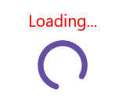

# Set Header in .NET MAUI Busy Indicator (SfBusyIndicator)

## Set Header in SfBusyIndicator

The Syncfusion Busy Indicator provides a feature to display a title with font customizations.

## Title

SfBusyIndicator provides option to set the text that indicates the information related to loading. This can be done using `Title` property.





<core:SfBusyIndicator x:Name="busyindicator"
                      IsRunning="True"
                      AnimationType="CircularMaterial"
                      Title="Loading..." />





SfBusyIndicator busyIndicator = new SfBusyIndicator()
{
    IsRunning = true,
    AnimationType = AnimationType.CircularMaterial,
    Title = "Loading...",
};





The following screenshot illustrates the result of the above code.

## Text Color

SfBusyIndicator provides options to change the color of the text. The color of the text can be changed using the `TextColor` property.




  
<core:SfBusyIndicator x:Name="busyindicator"
                      IsRunning="True"
                      AnimationType="CircularMaterial"
                      Title="Loading..."
                      TextColor = "Red" />           
       



   
SfBusyIndicator busyIndicator = new SfBusyIndicator()
{
    IsRunning = true,
    AnimationType = AnimationType.CircularMaterial,
    Title = "Loading...",
    TextColor = Colors.Red
};





The following screenshot illustrates the result of the above code.

## Title Placement

SfBusyIndicator provides options to set the `Title` at the top or bottom of the Busy Indicator. The `Title` can be set using the `TitlePlacement` property. When the `Title` is not needed, set the `TitlePlacement` property of SfBusyIndicator to None.





<core:SfBusyIndicator x:Name="busyindicator"
                      IsRunning="True"
                      AnimationType="CircularMaterial"
                      Title="Loading..."
                      TextColor = "Red" 
                      TitlePlacement="Top"/>           




  
SfBusyIndicator busyIndicator = new SfBusyIndicator()
{
    IsRunning = true,
    AnimationType = AnimationType.CircularMaterial,
    Title = "Loading...",
    TextColor = Colors.Red,
    TitlePlacement = BusyIndicatorTitlePlacement.Top
};





The following screenshot illustrates the result of the above code.

## Title Spacing

SfBusyIndicator provides options to set the space between the indicator and the title. The space can be set using the `TitleSpacing` property.





<core:SfBusyIndicator x:Name="busyindicator"
                      IsRunning="True"
                      AnimationType="CircularMaterial"
                      Title="Loading..."
                      TextColor = "Red" 
                      TitlePlacement="Top"
                      TitleSpacing="20"/>           





    
SfBusyIndicator busyIndicator = new SfBusyIndicator()
{
    IsRunning = true,
    AnimationType = AnimationType.CircularMaterial,
    Title = "Loading...",
    TextColor = Colors.Red,
    TitlePlacement = BusyIndicatorTitlePlacement.Top,
    TitleSpacing = 20
};





The following screenshot illustrates the result of the above code.

## Font customization

SfBusyIndicator provides options to customize the title text. The title text can be customized using the `FontSize,` `FontAttributes,` and `FontFamily` properties.





<core:SfBusyIndicator x:Name="busyindicator"
                      IsRunning="True"
                      AnimationType="CircularMaterial"
                      Title="Loading..."
                      TextColor = "Red" 
                      FontSize = "16"
                      FontAttributes="Bold"
                      FontFamily="serif" />           
 




SfBusyIndicator busyIndicator = new SfBusyIndicator()
{
    IsRunning = true,
    AnimationType = AnimationType.CircularMaterial,
    Title = "Loading...",
    TextColor = Colors.Red,
    FontSize = 16,
    FontAttributes=FontAttributes.Bold,
    FontFamily="serif"
};





The following screenshot illustrates the result of the above code.

.png)

