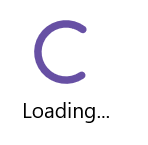
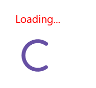

# Set Header in .NET MAUI Busy Indicator (SfBusyIndicator)

## Overview

The Syncfusion® .NET MAUI Busy Indicator provides a feature to display a title with customizable fonts.

## Title

The [.NET MAUI Busy Indicator](https://help.syncfusion.com/cr/maui/Syncfusion.Maui.Core.SfBusyIndicator.html?tabs=tabid-1) allows you to set text that indicates loading-related information using the [Title](https://help.syncfusion.com/cr/maui/Syncfusion.Maui.Core.SfBusyIndicator.html#Syncfusion_Maui_Core_SfBusyIndicator_Title) property.





<core:SfBusyIndicator x:Name="busyindicator"
                      IsRunning="True"
                      AnimationType="CircularMaterial"
                      Title="Loading..." />





SfBusyIndicator busyIndicator = new SfBusyIndicator()
{
    IsRunning = true,
    AnimationType = AnimationType.CircularMaterial,
    Title = "Loading...",
};





The following screenshot illustrates the result of the above code.

## Text Color

The [.NET MAUI Busy Indicator](https://help.syncfusion.com/cr/maui/Syncfusion.Maui.Core.SfBusyIndicator.html?tabs=tabid-1) allows you to change the color of the title text using the [TextColor](https://help.syncfusion.com/cr/maui/Syncfusion.Maui.Core.SfBusyIndicator.html#Syncfusion_Maui_Core_SfBusyIndicator_TextColor) property.




  
<core:SfBusyIndicator x:Name="busyindicator"
                      IsRunning="True"
                      AnimationType="CircularMaterial"
                      Title="Loading..."
                      TextColor = "Red" />           
       



   
SfBusyIndicator busyIndicator = new SfBusyIndicator()
{
    IsRunning = true,
    AnimationType = AnimationType.CircularMaterial,
    Title = "Loading...",
    TextColor = Colors.Red
};





The following screenshot illustrates the result of the above code.

## Title Placement

The [.NET MAUI Busy Indicator](https://help.syncfusion.com/cr/maui/Syncfusion.Maui.Core.SfBusyIndicator.html?tabs=tabid-1) provides options to set the [Title](https://help.syncfusion.com/cr/maui/Syncfusion.Maui.Core.SfBusyIndicator.html#Syncfusion_Maui_Core_SfBusyIndicator_Title) at the top or bottom of the Busy Indicator using the [TitlePlacement](https://help.syncfusion.com/cr/maui/Syncfusion.Maui.Core.SfBusyIndicator.html#Syncfusion_Maui_Core_SfBusyIndicator_TitlePlacement) property. To omit the title, set the [TitlePlacement](https://help.syncfusion.com/cr/maui/Syncfusion.Maui.Core.SfBusyIndicator.html#Syncfusion_Maui_Core_SfBusyIndicator_TitlePlacement) property to `None`.





<core:SfBusyIndicator x:Name="busyindicator"
                      IsRunning="True"
                      AnimationType="CircularMaterial"
                      Title="Loading..."
                      TextColor = "Red" 
                      TitlePlacement="Top"/>           




  
SfBusyIndicator busyIndicator = new SfBusyIndicator()
{
    IsRunning = true,
    AnimationType = AnimationType.CircularMaterial,
    Title = "Loading...",
    TextColor = Colors.Red,
    TitlePlacement = BusyIndicatorTitlePlacement.Top
};





The following screenshot illustrates the result of the above code.

## Title Spacing

You can set the space between the indicator and the title using the [TitleSpacing](https://help.syncfusion.com/cr/maui/Syncfusion.Maui.Core.SfBusyIndicator.html#Syncfusion_Maui_Core_SfBusyIndicator_TitleSpacing) property.





<core:SfBusyIndicator x:Name="busyindicator"
                      IsRunning="True"
                      AnimationType="CircularMaterial"
                      Title="Loading..."
                      TextColor = "Red" 
                      TitlePlacement="Top"
                      TitleSpacing="20"/>           





    
SfBusyIndicator busyIndicator = new SfBusyIndicator()
{
    IsRunning = true,
    AnimationType = AnimationType.CircularMaterial,
    Title = "Loading...",
    TextColor = Colors.Red,
    TitlePlacement = BusyIndicatorTitlePlacement.Top,
    TitleSpacing = 20
};





The following screenshot illustrates the result of the above code.

## Font Customization

The [.NET MAUI Busy Indicator](https://help.syncfusion.com/cr/maui/Syncfusion.Maui.Core.SfBusyIndicator.html) allows customization of the title text using properties such as [FontSize](https://help.syncfusion.com/cr/maui/Syncfusion.Maui.Core.SfBusyIndicator.html#Syncfusion_Maui_Core_SfBusyIndicator_FontSize), [FontAttributes](https://help.syncfusion.com/cr/maui/Syncfusion.Maui.Core.SfBusyIndicator.html#Syncfusion_Maui_Core_SfBusyIndicator_FontAttributes), and [FontFamily](https://help.syncfusion.com/cr/maui/Syncfusion.Maui.Core.SfBusyIndicator.html#Syncfusion_Maui_Core_SfBusyIndicator_FontFamily) properties.





<core:SfBusyIndicator x:Name="busyindicator"
                      IsRunning="True"
                      AnimationType="CircularMaterial"
                      Title="Loading..."
                      TextColor = "Red" 
                      FontSize = "16"
                      FontAttributes="Bold"
                      FontFamily="serif" />           
 




SfBusyIndicator busyIndicator = new SfBusyIndicator()
{
    IsRunning = true,
    AnimationType = AnimationType.CircularMaterial,
    Title = "Loading...",
    TextColor = Colors.Red,
    FontSize = 16,
    FontAttributes=FontAttributes.Bold,
    FontFamily="serif"
};





The following screenshot illustrates the result of the above code.

## Font Auto Scaling Enabled

The `FontAutoScalingEnabled` property automatically scales the Busy Indicator's title font size based on the operating system's text size. The default value of the `FontAutoScalingEnabled` property is `false`.





<core:SfBusyIndicator FontAutoScalingEnabled="True"/>





    
SfBusyIndicator busyIndicator = new SfBusyIndicator()
{
    FontAutoScalingEnabled = true
};



