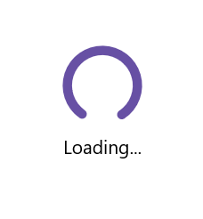

# Sizing in .NET MAUI Busy Indicator (SfBusyIndicator)

## Sizing in .NET MAUI Busy Indicator

The [.NET MAUI Busy Indicator](https://help.syncfusion.com/cr/maui/Syncfusion.Maui.Core.SfBusyIndicator.html) offers an option to customize the drawing size of the indicator. [SizeFactor](https://help.syncfusion.com/cr/maui/Syncfusion.Maui.Core.SfBusyIndicator.html#Syncfusion_Maui_Core_SfBusyIndicator_SizeFactor) property can be used to set the height and width of the Indicator. Its default value is 0.5 and ranges from 0 to 1.





<core:SfBusyIndicator x:Name="busyindicator"
                      IsRunning="True"
                      AnimationType="CircularMaterial"
                      Title="Loading..."                            
                      SizeFactor="0.7"/>           





SfBusyIndicator busyIndicator = new SfBusyIndicator()
{
    IsRunning = true,
    AnimationType = AnimationType.CircularMaterial,
    Title = "Loading...",
    SizeFactor = 0.7
};





The following screenshot illustrates the result of the above code.

