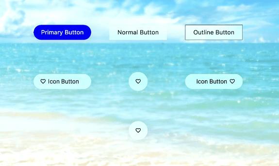

# Liquid Glass Effect in .NET MAUI Buttons (SfButton)

The Liquid Glass Effect introduces a modern, translucent design with adaptive color tinting and light refraction, creating a sleek, glass like user experience that remains clear and accessible. This section explains how to enable and customize the effect in the Syncfusion® .NET MAUI Buttons (SfButton) control.

## Apply liquid glass effect

Follow these steps to enable and configure the Liquid Glass Effect in the Buttons control:

### Step 1: Enable the liquid glass effect on Buttons

Set the `EnableLiquidGlassEffect` property to `true` in the `SfButton` control to apply the Liquid Glass Effect. When enabled, the effect is also applied to its dependent controls and provides responsive interaction for a smooth and engaging user experience.

### Step 3: Customize the background

To achieve a glass like background in the Buttons, set the `Background` property to `Transparent`. The background will then be treated as a tinted color, ensuring a consistent glass effect across the controls.

The following code snippet demonstrates how to apply the Liquid Glass Effect to the `SfButton` control:



    <Grid>
    <Image Source="Wallpaper.png" Aspect="AspectFill">
        <buttons:SfButton
            x:Name="GlassButton"
            Text="GlassButton"
            EnableLiquidGlassEffect="True"
            Background="Transparent"
            WidthRequest="180"
            CornerRadius="24"
            HeightRequest="48" />
    </Grid>




using Syncfusion.Maui.Buttons;

    var grid = new Grid();
    var image = new Image
    {
        Source = "Wallpaper.png",
        Aspect = Aspect.AspectFill
    };
    grid.Children.Add(image);
    var glassButton = new SfButton
    {
        Text = "GlassButton",
        Background = Colors.Transparent,
        WidthRequest = 180,
        HeightRequest = 48,
        CornerRadius = 24,
        EnableLiquidGlassEffect = true
    };
    grid.Children.Add(GlassButton);

    this.Content = grid;




The following screenshot illustrates SfButton with the glass effect enabled.

N>
This feature is supported only on .NET 10 along with iOS 26 and macOS 26 