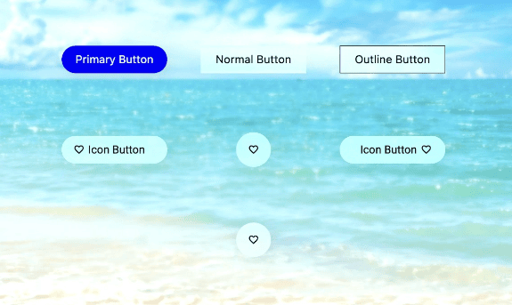

# Liquid Glass Effect in .NET MAUI Buttons (SfButton)

N> The Liquid Glass Effect is supported only on .NET 10, iOS 26+, and macOS 26+ (with Xcode 26). It is not currently supported on Android or Windows.

The Liquid Glass Effect introduces a modern, translucent design with adaptive color tinting and light refraction, creating a sleek, glass-like user experience that remains clear and accessible. This page explains how to enable and customize the effect in the Syncfusion® .NET MAUI Buttons (SfButton) control.

## Prerequisites

Before using the [SfButton](https://help.syncfusion.com/cr/maui/Syncfusion.Maui.Buttons.SfButton.html), ensure the following NuGet package is installed in your .NET MAUI project:

- `Syncfusion.Maui.Buttons`

For a step-by-step setup, refer to the [Getting Started](https://help.syncfusion.com/maui/button/getting-started) documentation.

## Apply Liquid Glass Effect

Follow these steps to enable and configure the Liquid Glass Effect in `SfButton`:

### Step 1: Provide a background image

Place a background image behind the button so the Liquid Glass Effect has something to refract and tint. In the example below, the image and the button are both children of a `Grid`.

### Step 2: Enable the Liquid Glass Effect on the button

Set the [`EnableLiquidGlassEffect`](https://help.syncfusion.com/cr/maui/Syncfusion.Maui.Buttons.SfButton.html#Syncfusion_Maui_Buttons_SfButton_EnableLiquidGlassEffect) property to `true` on `SfButton` to apply the effect. When enabled, the button renders as a translucent surface and provides responsive interaction for a smooth and engaging user experience.

### Step 3: Customize the background

To achieve a glass-like background, set the [`Background`](https://help.syncfusion.com/cr/maui/Syncfusion.Maui.Buttons.SfButton.html#Syncfusion_Maui_Buttons_SfButton_Background) property to `Transparent` (in XAML, the string `"Transparent"`; in C#, the `Colors.Transparent` brush). The background is then treated as a tinted color, ensuring a consistent Liquid Glass effect across the controls.

## Code Example

The following code snippet demonstrates how to apply the Liquid Glass Effect to the `SfButton` control.




<Grid>
    <Image Source="Wallpaper.png" Aspect="AspectFill" />
    <buttons:SfButton
             x:Name="GlassButton"
             Text="GlassButton"
             EnableLiquidGlassEffect="True"
             Background="Transparent"
             WidthRequest="180"
             HeightRequest="48"
             CornerRadius="24" />
</Grid>




using Microsoft.Maui.Controls;
using Syncfusion.Maui.Buttons;

namespace LiquidGlassSample;

public partial class MainPage : ContentPage
{
    public MainPage()
    {
        var grid = new Grid();
        var image = new Image
        {
            Source = "Wallpaper.png",
            Aspect = Aspect.AspectFill
        };
        grid.Children.Add(image);

        var glassButton = new SfButton
        {
            Text = "GlassButton",
            Background = Colors.Transparent,
            WidthRequest = 180,
            HeightRequest = 48,
            CornerRadius = 24,
            EnableLiquidGlassEffect = true
        };
        grid.Children.Add(glassButton);

        Content = grid;
    }
}




The following screenshot illustrates `SfButton` with the Liquid Glass effect enabled.

## Compatibility

| Platform | Minimum version | Notes |
|----------|----------------|-------|
| .NET MAUI | .NET 10 | Required for the Liquid Glass API. |
| iOS | iOS 26+ | Requires Xcode 26. |
| macOS (Mac Catalyst) | macOS 26+ | Requires Xcode 26. |
| Android | Not supported | No current support. |
| Windows | Not supported | No current support. |

## Troubleshooting

| Issue | Possible cause | Fix |
|------|---------------|-----|
| The button looks opaque (no translucency). | `EnableLiquidGlassEffect` is not set to `true`, or the project targets a framework earlier than .NET 10. | Set `EnableLiquidGlassEffect="True"` and confirm the project targets `net10.0-*`. |
| The Liquid Glass effect is invisible. | There is no image or color behind the button to refract. | Place a colored view or image as a sibling of the button in the same `Grid` so the button has something to tint. |
| Build error: `EnableLiquidGlassEffect` does not exist. | The `Syncfusion.Maui.Buttons` package version does not support Liquid Glass. | Update the NuGet package to the latest version that targets .NET 10. |
| The effect does not appear on Android or Windows. | The Liquid Glass Effect is not supported on these platforms. | No fix available; use the standard `Background` customization on those platforms (see [Customization](https://help.syncfusion.com/maui/button/customization)). |

## See Also

- [Customization](https://help.syncfusion.com/maui/button/customization)
- [Getting Started](https://help.syncfusion.com/maui/button/getting-started)
- [.NET MAUI Liquid Glass UI Overview](../Liquid-Glass-UI/)
- [Apple Human Interface Guidelines: Liquid Glass](https://developer.apple.com/design/human-interface-guidelines/) 