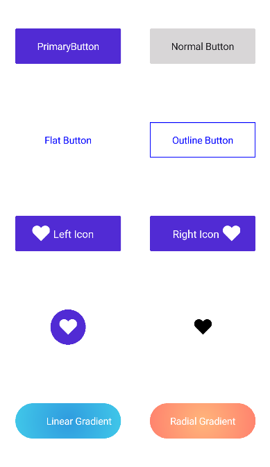

> **Notice**: After **Volume 1 2025 (Mid-March 2025)**, updates, bug fixes, and feature enhancements for this control will no longer be available in the Syncfusion® package. Please switch to the **Syncfusion® Toolkit for .NET MAUI** for continued support. For a smooth transition, please refer to this [migration document](https://help.syncfusion.com/maui-toolkit/migration).

# .NET MAUI Button (SfButton) Overview

The .NET MAUI Button is a customizable button control that allows for UI customization. You can set icons, background images, and corner edge radii, and customize the appearance for different visual states using the Visual State Manager.

## Key Features

- Easily customize the button to be an outline, flat, circle, or icon button.
- Display an image as the background for the control.
- Display custom content within the button control.

