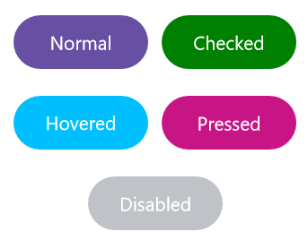

# Visual States in .NET MAUI Button (SfButton)

The visual of the Button can be customized using `VisualStates`. The [SfButton](https://help.syncfusion.com/cr/maui/Syncfusion.Maui.Buttons.SfButton.html) control contains the following five visual states:

* Normal
* Hovered
* Pressed
* Checked
* Disabled

N> The visual states [Checked](https://help.syncfusion.com/cr/maui/Syncfusion.Maui.Buttons.SfButton.html#Syncfusion_Maui_Buttons_SfButton_IsChecked) and Unchecked are only updated when enabling the [IsCheckable](https://help.syncfusion.com/cr/maui/Syncfusion.Maui.Buttons.SfButton.html#Syncfusion_Maui_Buttons_SfButton_IsCheckable) property in the SfButton.




  <buttons:SfButton x:Name="button"
                    Text="SfButton" 
                    HeightRequest = "50"
                    WidthRequest="200"
                    TextColor="White"
                    IsEnabled = "True"
                    IsCheckable = "True"
                    IsChecked = "True">
    <VisualStateManager.VisualStateGroups>
        <VisualStateGroup x:Name="CommonStates">
            <VisualState x:Name="Normal">
                <VisualState.Setters>
                    <Setter Property="Background" Value="Orange"/>
                </VisualState.Setters>
            </VisualState>
            <VisualState x:Name="Checked">
                <VisualState.Setters>
                    <Setter Property="Background" Value="Green"/>
                </VisualState.Setters>
            </VisualState>
            <VisualState x:Name="Hovered">
                <VisualState.Setters>
                    <Setter Property="Background" Value="DeepSkyBlue"/>
                </VisualState.Setters>
            </VisualState>
            <VisualState x:Name="Pressed">
                <VisualState.Setters>
                    <Setter Property="Background" Value="MediumVioletRed"/>
                </VisualState.Setters>
            </VisualState>
            <VisualState x:Name="Disabled">
                <VisualState.Setters>
                    <Setter Property="Background" Value="#BFC3C7"/>
                </VisualState.Setters>
            </VisualState>
        </VisualStateGroup>
    </VisualStateManager.VisualStateGroups>
</buttons:SfButton>




    SfButton button = new SfButton
    {
        Text = "SfButton",
        HeightRequest = 50,
        WidthRequest = 200,
        TextColor = Colors.White,
        IsEnabled = true,
        IsCheckable = true,
        IsChecked = true,
    };

    VisualStateGroupList visualStateGroupList = new VisualStateGroupList();

    VisualStateGroup commonStateGroup = new VisualStateGroup();
    VisualState normalState = new VisualState
    {
        Name = "Normal"
    };
    normalState.Setters.Add(new Setter { Property = SfButton.BackgroundProperty, Value = Colors.Orange });

    VisualState checkedState = new VisualState
    {
        Name = "Checked"
    };
    checkedState.Setters.Add(new Setter { Property = SfButton.BackgroundProperty, Value = Colors.Green });

    VisualState hoveredState = new VisualState
    {
        Name = "Hovered"
    };
    hoveredState.Setters.Add(new Setter { Property = SfButton.BackgroundProperty, Value = Colors.DeepSkyBlue });

    VisualState pressedState = new VisualState
    {
        Name = "Pressed"
    };
    pressedState.Setters.Add(new Setter { Property = SfButton.BackgroundProperty, Value = Colors.MediumVioletRed });

    VisualState disabledState = new VisualState
    {
        Name = "Disabled"
    };
    disabledState.Setters.Add(new Setter { Property = SfButton.BackgroundProperty, Value = Color.FromRgba("#BFC3C7") });

    commonStateGroup.States.Add(normalState);
    commonStateGroup.States.Add(checkedState);
    commonStateGroup.States.Add(hoveredState);
    commonStateGroup.States.Add(pressedState);
    commonStateGroup.States.Add(disabledState);
    visualStateGroupList.Add(commonStateGroup);

    VisualStateManager.SetVisualStateGroups(button, visualStateGroupList);

    this.Content = button;
	



