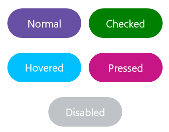

# Visual States in .NET MAUI Button (SfButton)

Visual states let you change the appearance of [`SfButton`](https://help.syncfusion.com/cr/maui/Syncfusion.Maui.Buttons.SfButton.html) in response to user interaction. Use them to apply different colors, borders, or other properties for each state without writing code-behind handlers.

`SfButton` supports the following visual states through the [`VisualStateManager`](https://learn.microsoft.com/en-us/dotnet/maui/user-interface/visual-states?view=net-maui-10.0):

* `Normal` - The default resting state of the button.
* `Hovered` - The pointer is over the button (desktop platforms).
* `Pressed` - The button is being tapped or clicked.
* `Checked` - The button is in the checked state. Only applied when [`IsCheckable`](https://help.syncfusion.com/cr/maui/Syncfusion.Maui.Buttons.SfButton.html#Syncfusion_Maui_Buttons_SfButton_IsCheckable) is `true`.
* `Unchecked` - The button is in the unchecked state. Only applied when `IsCheckable` is `true`.
* `Disabled` - The button is disabled (`IsEnabled` is `false`).

N> The `Checked` and `Unchecked` states are only applied when the `IsCheckable` property is set to `true`. The [`IsChecked`](https://help.syncfusion.com/cr/maui/Syncfusion.Maui.Buttons.SfButton.html#Syncfusion_Maui_Buttons_SfButton_IsChecked) property controls the current check state. Listen for the `CheckedChanged` event to react to state changes.

## Prerequisites

Before using the [SfButton](https://help.syncfusion.com/cr/maui/Syncfusion.Maui.Buttons.SfButton.html), ensure the following NuGet package is installed in your .NET MAUI project:

- `Syncfusion.Maui.Buttons`

For a step-by-step setup, refer to the [Getting Started](https://help.syncfusion.com/maui/button/getting-started) documentation.

## Commonly Customized Properties per State

The following `SfButton` properties are commonly set inside a `VisualState`'s `<Setter>`:

* `Background` - the background color or brush of the button.
* `TextColor` - the color of the button text.
* `Stroke` and `StrokeThickness` - the border color and thickness.
* `CornerRadius` - the rounded corners of the button.
* `Opacity` and `Scale` - visual emphasis for pressed/hovered states.

## Code Example

The following XAML and C# samples set the `Background` of the button for each of the five core visual states. The `CommonStates` group is used; `Focused` is omitted because it shares the same visual treatment as `Normal` by default.




<buttons:SfButton x:Name="button"
                  Text="SfButton"
                  HeightRequest="50"
                  WidthRequest="200"
                  TextColor="White"
                  IsEnabled="True"
                  IsCheckable="True"
                  IsChecked="True">
    <VisualStateManager.VisualStateGroups>
        <VisualStateGroup x:Name="CommonStates">
            <VisualState x:Name="Normal">
                <VisualState.Setters>
                    <Setter Property="Background" Value="#6A4C9C" />
                </VisualState.Setters>
            </VisualState>
            <VisualState x:Name="Checked">
                <VisualState.Setters>
                    <Setter Property="Background" Value="#008000" />
                </VisualState.Setters>
            </VisualState>
            <VisualState x:Name="Hovered">
                <VisualState.Setters>
                    <Setter Property="Background" Value="DeepSkyBlue" />
                </VisualState.Setters>
            </VisualState>
            <VisualState x:Name="Pressed">
                <VisualState.Setters>
                    <Setter Property="Background" Value="MediumVioletRed" />
                </VisualState.Setters>
            </VisualState>
            <VisualState x:Name="Disabled">
                <VisualState.Setters>
                    <Setter Property="Background" Value="#BFC3C7" />
                </VisualState.Setters>
            </VisualState>
        </VisualStateGroup>
    </VisualStateManager.VisualStateGroups>
</buttons:SfButton>




InitializeComponent();
SfButton button = new SfButton
{
    Text = "SfButton",
    HeightRequest = 50,
    WidthRequest = 200,
    TextColor = Colors.White,
    IsEnabled = true,
    IsCheckable = true,
    IsChecked = true,
};
VisualStateGroupList visualStateGroupList = new VisualStateGroupList();
VisualStateGroup commonStateGroup = new VisualStateGroup();

VisualState normalState = new VisualState { Name = "Normal" };
normalState.Setters.Add(new Setter
{
    Property = SfButton.BackgroundProperty,
    Value = Color.FromArgb("#6A4C9C")
});

VisualState checkedState = new VisualState { Name = "Checked" };
checkedState.Setters.Add(new Setter
{
    Property = SfButton.BackgroundProperty,
    Value = Colors.Green
});

VisualState hoveredState = new VisualState { Name = "Hovered" };
hoveredState.Setters.Add(new Setter
{
    Property = SfButton.BackgroundProperty,
    Value = Colors.DeepSkyBlue
});

VisualState pressedState = new VisualState { Name = "Pressed" };
pressedState.Setters.Add(new Setter
{
    Property = SfButton.BackgroundProperty,
    Value = Colors.MediumVioletRed
});

VisualState disabledState = new VisualState { Name = "Disabled" };
disabledState.Setters.Add(new Setter
{
    Property = SfButton.BackgroundProperty,
    Value = Color.FromArgb("#BFC3C7")
});

commonStateGroup.States.Add(normalState);
commonStateGroup.States.Add(checkedState);
commonStateGroup.States.Add(hoveredState);
commonStateGroup.States.Add(pressedState);
commonStateGroup.States.Add(disabledState);
visualStateGroupList.Add(commonStateGroup);
VisualStateManager.SetVisualStateGroups(button, visualStateGroupList);
Content = button;




The following image shows the `SfButton` with the visual states applied:

## Compatibility

| Platform | Notes |
|----------|-------|
| .NET MAUI | Requires .NET MAUI 7.0 or later for `VisualStateManager` with `CommonStates`. |
| iOS, macOS, Android, Windows | Visual states are supported on all .NET MAUI target platforms. |

N> The `Hovered` state is only triggered on platforms that report a pointer (desktop platforms such as Windows and macOS Catalyst). On touch-only platforms the button transitions directly between `Normal` and `Pressed`.

## Interaction with Other Features

- **Liquid Glass Effect** - Visual state setters may be overridden by the [Liquid Glass Effect](https://help.syncfusion.com/maui/button/liquidglasssupport) when it is enabled. Place Liquid Glass and Visual States in mutually exclusive scenarios or test carefully.
- **Right-to-Left** - Visual states work in both `LeftToRight` and `RightToLeft` flow directions. See [Right-to-Left](https://help.syncfusion.com/maui/button/right-to-left) for details.
- **Command and Clicked event** - Visual states are pure visual effects; they do not change whether the `Command`/`Clicked` event fires. See [Events](https://help.syncfusion.com/maui/button/events) and [Customization > Command](https://help.syncfusion.com/maui/button/customization#command).

## Troubleshooting

| Issue | Possible cause | Fix |
|------|---------------|-----|
| The `Checked` state is never applied. | `IsCheckable` is `false` (the default). | Set `IsCheckable="True"` on the button. |
| The `Hovered` state never fires on Android or iOS. | The platform does not report a hover (touch-only). | This is expected. Add a `Pressed` style instead for emphasis. |
| The `Disabled` state does not appear. | `IsEnabled` is not set to `false`; the visual state is only applied when the control is disabled. | Toggle `IsEnabled` to `false` (or use `IsEnabled="{Binding IsButtonEnabled}"` in MVVM). |
| Build error: `Setter` cannot resolve `BackgroundProperty`. | Missing `using Syncfusion.Maui.Buttons;` directive. | Add the `using` directive at the top of the file. |
| C# visual state setters apply but the button does not update at runtime. | The `VisualStateGroupList` was not attached via `VisualStateManager.SetVisualStateGroups`. | Call `VisualStateManager.SetVisualStateGroups(button, visualStateGroupList)` after building the groups. |

## See Also

- [Customization](https://help.syncfusion.com/maui/button/customization)
- [Right-to-Left](https://help.syncfusion.com/maui/button/right-to-left)
- [Liquid Glass Effect](https://help.syncfusion.com/maui/button/liquidglasssupport)