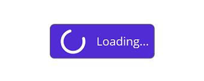

# Add a Custom View to the Button

Customize the appearance of the button by adding a custom view to the [`Content`](https://help.syncfusion.com/cr/maui/Syncfusion.Maui.Buttons.SfButton.html#Syncfusion_Maui_Buttons_SfButton_Content) property. The following code sample demonstrates how to apply a busy indicator control as a custom view for a button.




xmlns:busy="clr-namespace:Syncfusion.Maui.Core;assembly=Syncfusion.Maui.Core"

. . .

<ContentPage.Content>
    <VerticalStackLayout>
        <buttons:SfButton  CornerRadius="10" Text="SfButton" Background="#4125BC">
            <buttons:SfButton.Content>
                <DataTemplate>
                    <HorizontalStackLayout Spacing = "8" Padding="5">
                        <ActivityIndicator Color = "White" IsRunning="True"/>
                        <Label Text = "Loading..." VerticalOptions="Center" TextColor="White"/>
                    </HorizontalStackLayout>
                </DataTemplate>
            </buttons:SfButton.Content>
        </buttons:SfButton>
    </VerticalStackLayout>
</ContentPage.Content>




using Syncfusion.Maui.Core;

. . . 

var customTemplate = new DataTemplate(() =>
{
    var activityIndicator = new ActivityIndicator
    {
        Color = Colors.White,
        IsRunning = true
    };
    var label = new Label
    {
        Text = "Loading...",
        TextColor = Colors.White,
        VerticalOptions = LayoutOptions.Center
    };
    var stackLayout = new HorizontalStackLayout
    {
        Spacing = 8,
        Padding = new Thickness(5)
    };
    stackLayout.Children.Add(activityIndicator);
    stackLayout.Children.Add(label);
    return stackLayout;
});
SfButton button = new SfButton
{
    Text = "SfButton",
    Background = Color.FromArgb("#4125BC"),
    CornerRadius= 10,
    Content = customTemplate
};

Content = new VerticalStackLayout
{
    Children = { button }
};




