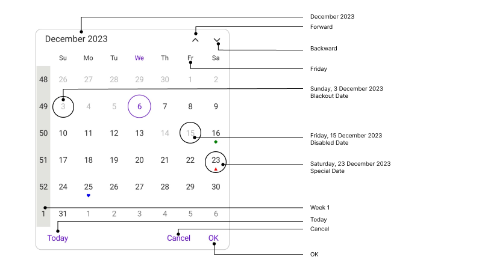
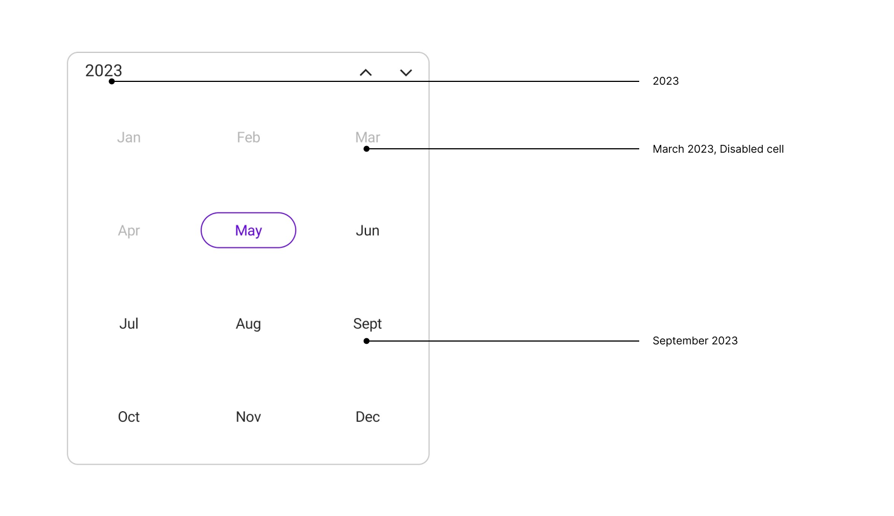

# Accessibility in .NET Maui SfCalendar

Enhance .NET MAUI Calendar's accessibility with a user-friendly design, ensuring inclusive features for seamless navigation and usability for all users. Please find the table of elements along with their formats and examples.

## Month View

<table>
<tr>
<th>Element</th>
<th>Format</th>
<th>Example</th>
</tr>
<tr>
<td>Header</td>
<td>MMMM yyyy</td>
<td>May 2023</td>
</tr>
<tr>
<td>Header – More than one month in view while number week lesser than 6</td>
<td>MMMM – MMMM yyyy</td>
<td>November – December 2023</td>
</tr>
<tr>
<td>Left arrow</td>
<td>string</td>
<td>Backward</td>
</tr>
<tr>
<td>Right arrow</td>
<td>string</td>
<td>Forward</td>
</tr>
<tr>
<td>Today button</td>
<td>string</td>
<td>Today</td>
</tr>
<tr>
<td>Ok button</td>
<td>string</td>
<td>Ok</td>
</tr>
<tr>
<td>Cancel button</td>
<td>string</td>
<td>Cancel</td>
</tr>
<tr>
<td>Month Header</td>
<td>EEE</td>
<td>Monday</td>
</tr>
<tr>
<td>Week Number</td>
<td>Week, Week number</td>
<td>Week 26</td>
</tr>
<tr>
<td>MonthCell</td>
<td>dddd dd/MMMM/yyyy</td>
<td>Tuesday 27/May/2023</td>
</tr>
<tr>
<td>Disabled Cells</td>
<td>EEE, dd/MMMM/yyyy, Disabled date</td>
<td>Friday, 31 January 2023, Disabled date</td>
</tr>
<tr>
<td>Blackout date</td>
<td>EEE, dd/MMMM/yyyy, Blackout date</td>
<td>Monday, 13 May 2023, Blackout date</td>
</tr>
<tr>
<td>Special date</td>
<td>EEE, dd/MMMM/yyyy, Special date</td>
<td>Monday, 25 May 2023, Special date</td>
</tr>
</table>

## Year View

<table>
<tr>
<th>Element</th>
<th>Format</th>
<th>Example</th>
</tr>
<tr>
<td>Header</td>
<td>yyyy</td>
<td>2023</td>
</tr>
<tr>
<td>Year Cell</td>
<td>MMMM yyyy</td>
<td>January 2023</td>
</tr>
<tr>
<td>Disabled cell</td>
<td>MMMM yyyy, Disabled cell</td>
<td>December 2019, Disabled cell</td>
</tr>
</table>

## Decade View

<table>
<tr>
<th>Element</th>
<th>Format</th>
<th>Example</th>
</tr>
<tr>
<td>Header</td>
<td>yyyy - yyyy</td>
<td>2020 – 2029</td>
</tr>
<tr>
<td>Decade Cell</td>
<td>yyyy</td>
<td>2023</td>
</tr>
<tr>
<td>Disabled cell</td>
<td>yyyy, Disabled cell</td>
<td>2019 Disabled cell</td>
</tr>
</table>

## Century View

<table>
<tr>
<th>Element</th>
<th>Format</th>
<th>Example</th>
</tr>
<tr>
<td>Header</td>
<td>yyyy - yyyy</td>
<td>2000 – 2099</td>
</tr>
<tr>
<td>Century Cell</td>
<td>yyyy</td>
<td>2070 – 2079</td>
</tr>
<tr>
<td>Disabled cell</td>
<td>yyyy - yyyy</td>
<td>2010 to 2019, Disabled cell</td>
</tr>
</table>

## Keyboard
`SfCalendar` supports selection using keyboard interactions.

### Selection
<table>
<tr>
<th>
Key
</th>
<th>
Description
</th>
</tr>
<tr>
<td>
DownArrow
</td>
<td>
Moves selection to the date directly below the currently selected date on next row.
</td>
</tr>
<tr>
<td>
UpArrow
</td>
<td>
Moves selection to the date directly above the currently selected date on previous row.
</td>
</tr>
<tr>
<td>
RightArrow
</td>
<td>
Moves the selection to the next date of the date currently selected.
</td>
</tr>
<tr>
<td>
LeftArrow
</td>
<td>
Moves the selection to the previous date of the date currently selected.
</td>
</tr>
</table>

### Selection with shift key combinations
<table>
<tr>
<th>
Key combinations
</th>
<th>
Description
</th>
</tr>
<tr>
<td>
Shift + DownArrow
</td>
<td>
If the SelectionMode is Multiple, the date directly below the last selected date on the next row will be selected along with the currently selected dates. 
If the SelectionMode is RangeSelection and selecting dates using the keyboard, the range will be extended to the date directly below the last selected date.
</td>
</tr>
<tr>
<td>
Shift + UpArrow
</td>
<td>
If the SelectionMode is Multiple, the date directly above the last selected date on the previous row will be selected along with the currently selected dates.
If the SelectionMode is RangeSelection and selecting dates using the keyboard, the range will be extended to the date directly above the last selected date.
</td>
</tr>
<tr>
<td>
Shift + RightArrow
</td>
<td>
If the SelectionMode is Multiple, the next date of the last selected date will be selected along with the currently selected dates. 
If the SelectionMode is RangeSelection and selecting dates using the keyboard, the range will be extended to the next date of the last selected date.
</td>
</tr>
<tr>
<td>
Shift + LeftArrow
</td>
<td>
If the SelectionMode is Multiple, the previous date of the last selected date will be selected along with the currently selected dates.
If the SelectionMode is RangeSelection and selecting dates using the keyboard, the range will be extended to the previous date of the last selected date.
</td>
</tr>
</table>

### View navigations
<table>
<tr>
<th>
Key combinations
</th>
<th>
Description
</th>
</tr>
<tr>
<td>
Ctrl + UpArrow
</td>
<td>
View mode changes in the order of Month, Year, Decade, and Century.
</td>
</tr>
<tr>
<td>
Ctrl + DownArrow
</td>
<td>
View mode changes in the order of Month, Century, Decade, and Year.
</td>
</tr>
<tr>
<td>
Ctrl + LeftArrow
</td>
<td>
Navigate to the prev view.
</td>
</tr>
<tr>
<td>
Ctrl + RightArrow
</td>
<td>
Navigate to the next view.
</td>
</tr>
</table>