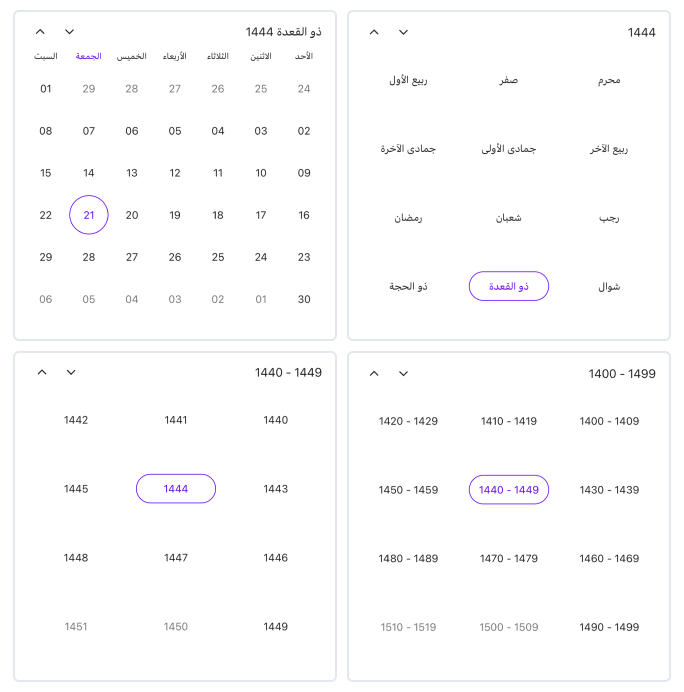

# Calendar identifier in .NET MAUI Calendar (SfCalendar)
The [.NET MAUI Calendar](https://help.syncfusion.com/cr/maui/Syncfusion.Maui.Calendar.SfCalendar.html) supports Calendar Identifier to display the different types of calendars based on various cultures and regions. The supported identifiers are Gregorian, Hijri, Korean, Persian, Taiwan, ThaiBuddhist, and UmAlQura. Change the calendar identifier using the [Identifier](https://help.syncfusion.com/cr/maui/Syncfusion.Maui.Calendar.SfCalendar.html#Syncfusion_Maui_Calendar_SfCalendar_Identifier) property in the SfCalendar.

<table>
<tr>
<th>Supported Calendars</th>
<th>Unsupported Calendars</th>
</tr>
<tr>

<td>
* GregorianCalendar 
* HijriCalendar 
* KoreanCalendar 
* PersianCalendar 
* TaiwanCalendar 
* ThaiCalendar 
* UmAlQuraCalendar 
</td>

<td>
* Gezer Calendar 
* Haida Calendar 
* Igbo calendar 
* Islamic calendar 
* Javanese calendar 
* Maramataka (Maori lunar calendar) 
* Nepal Sambat 
* HebrewCalendar 
* JulianCalendar 
* JapaneseCalendar 
* Yoruba calendar 
</td>
</tr>
</table>

N>
* The Flow Direction will be updated based on the calendar identifier. All the DateTime values, such as DisplayDate, MinimumDate, MaximumDate, SelectedDate, SelectedDates, SelectedDateRange, SelectableDayPredicate, and SpecialDayPredicate, can be given in two ways.
* The DateTime instance without specifying calendar identifier. The calendar will handle the DateTime value for the specified calendar identifier.
* When a DateTime instance has a calendar identifier, the calendar handles it directly.
* View header will show full week day name for all the calendar identifiers except `Gregorian Calendar` while the text format is "ddddd".




<calendar:SfCalendar x:Name="calendar"
					   Identifier="Hijri">
</calendar:SfCalendar>




SfCalendar calendar = new SfCalendar();
calendar.Identifier = CalendarIdentifier.Hijri;
this.Content = calendar;




### DateTime values in Calendar identifiers
All the DateTime properties of the calendar can be given in two ways when the calendar identifier is specified other than the [GregorianCalendar](https://help.syncfusion.com/cr/maui/Syncfusion.Maui.Calendar.CalendarIdentifier.html#Syncfusion_Maui_Calendar_CalendarIdentifier_Gregorian).

* Create a display date value by declaring the calendar identifier and respective calendar identifier date.




<calendar:SfCalendar x:Name="calendar" />




this.calendar.Identifier = CalendarIdentifier.Hijri;
this.calendar.DisplayDate = new DateTime(1444, 11, 21, 0, 0, 0, new HijriCalendar());




* Create a display date value by declaring the local system date. In this case, the system date will be converted to the respective calendar identifier date.




<calendar:SfCalendar x:Name="calendar" />




this.calendar.Identifier = CalendarIdentifier.Hijri;
this.calendar.DisplayDate = new DateTime(2023, 6, 9);




