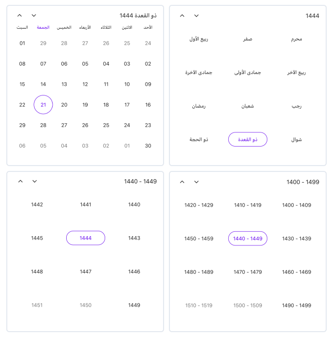

# Calendar identifier in .NET MAUI Calendar (SfCalendar)
The [.NET MAUI Calendar](https://help.syncfusion.com/cr/maui/Syncfusion.Maui.Calendar.SfCalendar.html) supports Calendar Identifier to display the different types of calendars based on various cultures and regions. The supported identifiers are Gregorian, Hijri, Korean, Persian, Taiwan, ThaiBuddhist, and UmAlQura. Change the calendar identifier using the [Identifier](https://help.syncfusion.com/cr/maui/Syncfusion.Maui.Calendar.SfCalendar.html#Syncfusion_Maui_Calendar_SfCalendar_Identifier) property in the SfCalendar.

<table>
<tr>
<th>Supported Calendars</th>
<th>UnSupported Calendars</th>
</tr>
<tr>

<td>
* GregorianCalendar 
* HijriCalendar 
* KoreanCalendar 
* PersianCalendar 
* TaiwanCalendar 
* ThaiCalendar 
* UmAlQuraCalendar 
</td>

<td>
* Gezer Calendar 
* Haida Calendar 
* Igbo calendar 
* Islamic calendar 
* Javanese calendar 
* Maramataka (Maori lunar calendar) 
* Nepal Sambat 
* HebrewCalendar 
* JulianCalendar 
* JapaneseCalendar 
* Yoruba calendar 
</td>
</tr>
</table>

N>
* The Flow Direction will be updated based on the calendar identifier. All the DateTime values, such as DisplayDate, MinimumDate, MaximumDate, SelectedDate, SelectedDates, SelectedDateRange, SelectableDayPredicate, and SpecialDayPredicate, can be given in two ways.
* When a `DateTime` instance is created without specifying a calendar identifier, the calendar handles the value for the specified calendar identifier.
* When a `DateTime` instance has a calendar identifier, the calendar handles it directly.
* The view header shows the full weekday name for all the calendar identifiers except `Gregorian Calendar` when the text format is "ddddd".




<ContentPage
    . . .
    xmlns:calendar="clr-namespace:Syncfusion.Maui.Calendar;assembly=Syncfusion.Maui.Calendar">

    <calendar:SfCalendar x:Name="calendar"
                         Identifier="Hijri" />

</ContentPage>




using Syncfusion.Maui.Calendar;
. . .

SfCalendar calendar = new SfCalendar();
calendar.Identifier = CalendarIdentifier.Hijri;
this.Content = calendar;




### DateTime values in Calendar identifiers
All the DateTime properties of the calendar can be given in two ways when the calendar identifier is specified other than the [GregorianCalendar](https://help.syncfusion.com/cr/maui/Syncfusion.Maui.Calendar.CalendarIdentifier.html#Syncfusion_Maui_Calendar_CalendarIdentifier_Gregorian).

* Create a display date value by declaring the calendar identifier and the respective calendar identifier date.




<ContentPage
    . . .
    xmlns:calendar="clr-namespace:Syncfusion.Maui.Calendar;assembly=Syncfusion.Maui.Calendar">

    <calendar:SfCalendar x:Name="calendar" />

</ContentPage>




using Syncfusion.Maui.Calendar;
. . .

this.calendar.Identifier = CalendarIdentifier.Hijri;
this.calendar.DisplayDate = new DateTime(1444, 11, 21, 0, 0, 0, new HijriCalendar());




* Create a display date value by declaring the local system date. In this case, the system date is converted to the respective calendar identifier date.




<ContentPage
    . . .
    xmlns:calendar="clr-namespace:Syncfusion.Maui.Calendar;assembly=Syncfusion.Maui.Calendar">

    <calendar:SfCalendar x:Name="calendar" />

</ContentPage>




using Syncfusion.Maui.Calendar;
. . .

this.calendar.Identifier = CalendarIdentifier.Hijri;
this.calendar.DisplayDate = new DateTime(2023, 6, 9);




