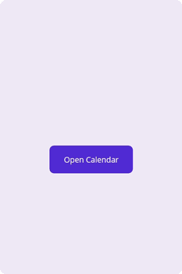

# Calendar mode in .NET MAUI Calendar (SfCalendar)

The Calendar mode is specified in the calendar property enumeration, which is used to display the calendar based on the modes. It offers three modes: [Default](https://help.syncfusion.com/cr/maui/Syncfusion.Maui.Calendar.CalendarMode.html#Syncfusion_Maui_Calendar_CalendarMode_Default), [Dialog](https://help.syncfusion.com/cr/maui/Syncfusion.Maui.Calendar.CalendarMode.html#Syncfusion_Maui_Calendar_CalendarMode_Dialog), and [RelativeDialog](https://help.syncfusion.com/cr/maui/Syncfusion.Maui.Calendar.CalendarMode.html#Syncfusion_Maui_Calendar_CalendarMode_RelativeDialog). The default calendar mode in the [SfCalendar](https://help.syncfusion.com/cr/maui/Syncfusion.Maui.Calendar.SfCalendar.html) is [Default](https://help.syncfusion.com/cr/maui/Syncfusion.Maui.Calendar.CalendarMode.html#Syncfusion_Maui_Calendar_CalendarMode_Default).

## Dialog Mode

The dialog mode is used to display the calendar in a pop-up by setting the [Mode](https://help.syncfusion.com/cr/maui/Syncfusion.Maui.Calendar.SfCalendar.html#Syncfusion_Maui_Calendar_SfCalendar_Mode) property to [Dialog](https://help.syncfusion.com/cr/maui/Syncfusion.Maui.Calendar.CalendarMode.html#Syncfusion_Maui_Calendar_CalendarMode_Dialog) in [SfCalendar](https://help.syncfusion.com/cr/maui/Syncfusion.Maui.Calendar.SfCalendar.html).





<calendar:SfCalendar x:Name="calendar"
                     Mode="Dialog"/>





SfCalendar calendar = new SfCalendar()
{
    Mode = CalendarMode.Dialog
};

this.Content = calendar;





The Calendar can be opened programmatically by setting the [IsOpen](https://help.syncfusion.com/cr/maui/Syncfusion.Maui.Calendar.SfCalendar.html#Syncfusion_Maui_Calendar_SfCalendar_IsOpen) property to `true` of [SfCalendar](https://help.syncfusion.com/cr/maui/Syncfusion.Maui.Calendar.SfCalendar.html). By default, the [IsOpen](https://help.syncfusion.com/cr/maui/Syncfusion.Maui.Calendar.SfCalendar.html#Syncfusion_Maui_Calendar_SfCalendar_IsOpen) property is `false`.

N> This property is automatically changed to `false` when you close the dialog by clicking outside of it.





<Grid>
    <calendar:SfCalendar x:Name="calendar"
                         Mode="Dialog"/>
    <Button Text="Open Calendar" 
            x:Name="calendarButton"
            Clicked="Button_Clicked"
            HorizontalOptions="Center"
            VerticalOptions="Center"
            HeightRequest="50" 
            WidthRequest="150">
    </Button>
</Grid>





private void Button_Clicked(object sender, System.EventArgs e)
{
    this.calendar.IsOpen = true;
}





## Relative Dialog Mode

The relative dialog mode displays the calendar in a pop-up by setting the [Mode](https://help.syncfusion.com/cr/maui/Syncfusion.Maui.Calendar.SfCalendar.html#Syncfusion_Maui_Calendar_SfCalendar_Mode) property to [RelativeDialog](https://help.syncfusion.com/cr/maui/Syncfusion.Maui.Calendar.CalendarMode.html#Syncfusion_Maui_Calendar_CalendarMode_RelativeDialog). It is used to align the calendar in a specific position. You can set the position by using the [RelativePosition](https://help.syncfusion.com/cr/maui/Syncfusion.Maui.Calendar.SfCalendar.html#Syncfusion_Maui_Calendar_SfCalendar_RelativePosition) property in the [SfCalendar](https://help.syncfusion.com/cr/maui/Syncfusion.Maui.Calendar.SfCalendar.html).

### Relative position

The [RelativePosition](https://help.syncfusion.com/cr/maui/Syncfusion.Maui.Calendar.SfCalendar.html#Syncfusion_Maui_Calendar_SfCalendar_RelativePosition) is specified in the calendar property enumeration, which is used to align the calendar in a specific position. It provides eight positions such as [AlignTop](https://help.syncfusion.com/cr/maui/Syncfusion.Maui.Calendar.CalendarRelativePosition.html#Syncfusion_Maui_Calendar_CalendarRelativePosition_AlignTop), [AlignToLeftOf](https://help.syncfusion.com/cr/maui/Syncfusion.Maui.Calendar.CalendarRelativePosition.html#Syncfusion_Maui_Calendar_CalendarRelativePosition_AlignToLeftOf), [AlignToRightOf](https://help.syncfusion.com/cr/maui/Syncfusion.Maui.Calendar.CalendarRelativePosition.html#Syncfusion_Maui_Calendar_CalendarRelativePosition_AlignToRightOf), [AlignBottom](https://help.syncfusion.com/cr/maui/Syncfusion.Maui.Calendar.CalendarRelativePosition.html#Syncfusion_Maui_Calendar_CalendarRelativePosition_AlignBottom), [AlignTopLeft](https://help.syncfusion.com/cr/maui/Syncfusion.Maui.Calendar.CalendarRelativePosition.html#Syncfusion_Maui_Calendar_CalendarRelativePosition_AlignTopLeft), [AlignTopRight](https://help.syncfusion.com/cr/maui/Syncfusion.Maui.Calendar.CalendarRelativePosition.html#Syncfusion_Maui_Calendar_CalendarRelativePosition_AlignTopRight), [AlignBottomLeft](https://help.syncfusion.com/cr/maui/Syncfusion.Maui.Calendar.CalendarRelativePosition.html#Syncfusion_Maui_Calendar_CalendarRelativePosition_AlignBottomLeft), and [AlignBottomRight](https://help.syncfusion.com/cr/maui/Syncfusion.Maui.Calendar.CalendarRelativePosition.html#Syncfusion_Maui_Calendar_CalendarRelativePosition_AlignBottomRight). The default relative position in the [SfCalendar](https://help.syncfusion.com/cr/maui/Syncfusion.Maui.Calendar.SfCalendar.html) is [AlignTop](https://help.syncfusion.com/cr/maui/Syncfusion.Maui.Calendar.CalendarRelativePosition.html#Syncfusion_Maui_Calendar_CalendarRelativePosition_AlignTop).

The Calendar can be opened programmatically by setting the [IsOpen](https://help.syncfusion.com/cr/maui/Syncfusion.Maui.Calendar.SfCalendar.html#Syncfusion_Maui_Calendar_SfCalendar_IsOpen) property to `true` of [SfCalendar](https://help.syncfusion.com/cr/maui/Syncfusion.Maui.Calendar.SfCalendar.html). By default, the [IsOpen](https://help.syncfusion.com/cr/maui/Syncfusion.Maui.Calendar.SfCalendar.html#Syncfusion_Maui_Calendar_SfCalendar_IsOpen) property is `false`.

N> This property is automatically changed to `false` when you close the dialog by clicking outside of it.





<Grid>
    <calendar:SfCalendar x:Name="calendar" 
                         Mode="RelativeDialog"
                         RelativePosition="AlignTopLeft">
    </calendar:SfCalendar>
    <Button Text="Open calendar" 
            x:Name="calendarButton"
            Clicked="Button_Clicked"
            HorizontalOptions="Center"
            VerticalOptions="Center"
            HeightRequest="50" 
            WidthRequest="150">
    </Button>
</Grid>





private void Button_Clicked(object sender, System.EventArgs e)
{
    this.calendar.IsOpen = true;
}

 
 


### Custom Popup Size

SfCalendar allows the display of the Popup to render at any desired size by setting the [PopupWidth] and [PopupHeight] properties.





<calendar:SfCalendar x:Name="calendar" 
                         Mode="Dialog"
                         PopupWidth="300"
                         PopupHeight=400/>





this.calendar.PopupWidth = 300;
this.calendar.PopupHeight = 400;

 



    
